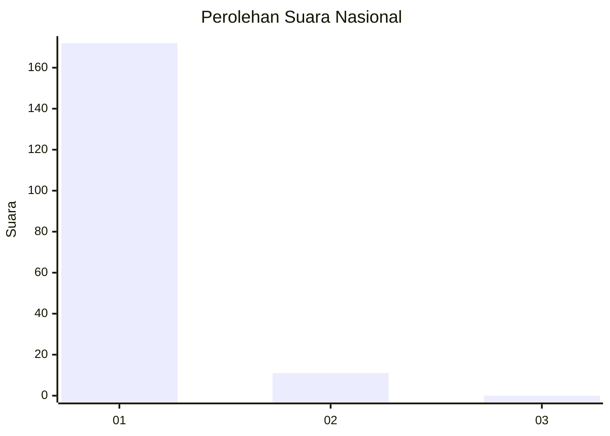
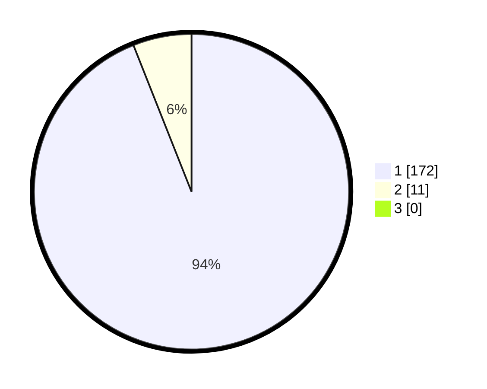

# Hasil

## Grafik

## Tabel

| No. | Nama Paslon    | Suara | Suara (raw) | Persentase |
|:--- |:-------------- | -----:| -----------:| ----------:|
| 1   | ANIES MUHAIMIN | 172   | [172][p-1]  | 93,99      |
| 2   | PRABOWO GIBRAN | 11    | [11][p-2]   | 6,01       |
| 3   | GANJAR MAHFUD  | 0     | [0][p-3]    | 0,00       |

[p-1]: https://github.com/gigit-pemilu/pemilu-2024/blob/main/pilpres/hitung-suara/sub/11-aceh/sub/03-aceh-timur/sub/03-idi-rayeuk/sub/2061-dama-pulo/sub/002-tps/sub/paslon-1.txt
[p-2]: https://github.com/gigit-pemilu/pemilu-2024/blob/main/pilpres/hitung-suara/sub/11-aceh/sub/03-aceh-timur/sub/03-idi-rayeuk/sub/2061-dama-pulo/sub/002-tps/sub/paslon-2.txt
[p-3]: https://github.com/gigit-pemilu/pemilu-2024/blob/main/pilpres/hitung-suara/sub/11-aceh/sub/03-aceh-timur/sub/03-idi-rayeuk/sub/2061-dama-pulo/sub/002-tps/sub/paslon-3.txt

## Foto C Plano

https://sirekap-obj-formc.kpu.go.id/4b3f/pemilu/ppwp/11/03/03/20/61/1103032061002-20240215-003126--ba392a56-e8ae-4a3b-878a-5c97d89d5d74.jpg

https://sirekap-obj-formc.kpu.go.id/4b3f/pemilu/ppwp/11/03/03/20/61/1103032061002-20240215-003413--c4aeb2bf-974c-429e-9391-217784988629.jpg

https://sirekap-obj-formc.kpu.go.id/4b3f/pemilu/ppwp/11/03/03/20/61/1103032061002-20240215-003733--c3f7c54b-a967-4011-8574-c62aa416955e.jpg

## Metadata

| Key        | Value               |
| ---------- | ------------------- |
| Time Stamp | 2024-02-24 22:31:28 |

