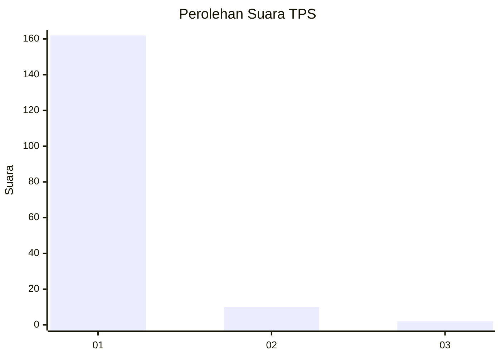
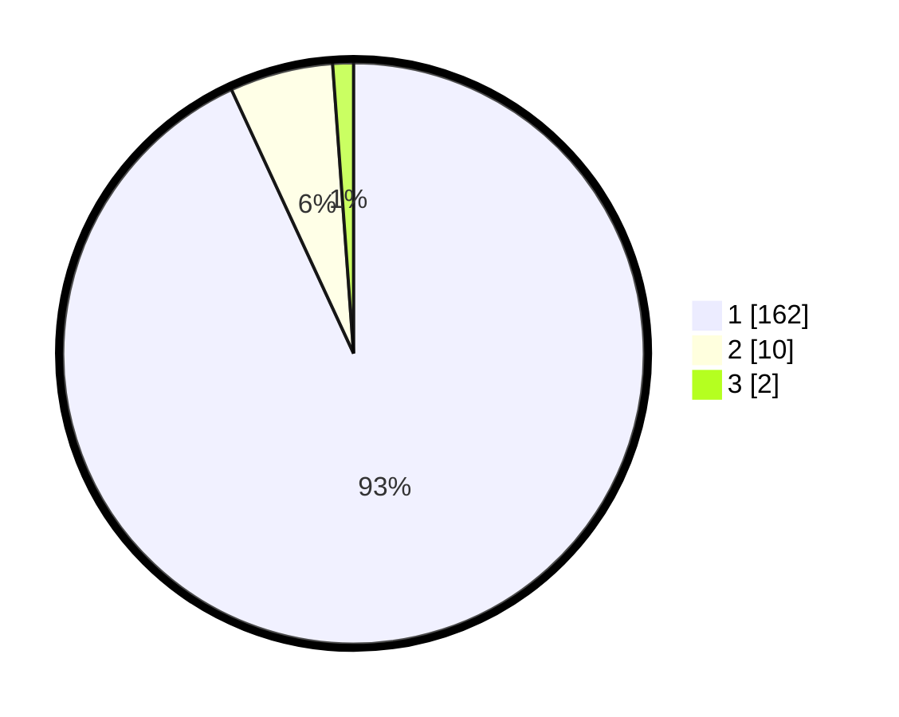

# Hasil

## Grafik

## Tabel

| No. | Nama Paslon    | Suara | Suara (raw) | Persentase |
|:--- |:-------------- | -----:| -----------:| ----------:|
| 1   | ANIES MUHAIMIN | 162   | [162][p-1]  | 93,10      |
| 2   | PRABOWO GIBRAN | 10    | [10][p-2]   | 5,75       |
| 3   | GANJAR MAHFUD  | 2     | [2][p-3]    | 1,15       |

[p-1]: https://github.com/gigit-pemilu/pemilu-2024-11-aceh/blob/main/pilpres/hitung-suara/sub/11-aceh/sub/03-aceh-timur/sub/03-idi-rayeuk/sub/2062-gureb-blang/sub/001-tps/sub/paslon-1.txt
[p-2]: https://github.com/gigit-pemilu/pemilu-2024-11-aceh/blob/main/pilpres/hitung-suara/sub/11-aceh/sub/03-aceh-timur/sub/03-idi-rayeuk/sub/2062-gureb-blang/sub/001-tps/sub/paslon-2.txt
[p-3]: https://github.com/gigit-pemilu/pemilu-2024-11-aceh/blob/main/pilpres/hitung-suara/sub/11-aceh/sub/03-aceh-timur/sub/03-idi-rayeuk/sub/2062-gureb-blang/sub/001-tps/sub/paslon-3.txt

## Foto C Plano

https://sirekap-obj-formc.kpu.go.id/fbaa/pemilu/ppwp/11/03/03/20/62/1103032062001-20240215-082725--8ae38be0-c8ab-4407-865a-9dd49f82ea83.jpg

https://sirekap-obj-formc.kpu.go.id/fbaa/pemilu/ppwp/11/03/03/20/62/1103032062001-20240215-082948--8c451906-b61d-47e7-ae55-787564827370.jpg

https://sirekap-obj-formc.kpu.go.id/fbaa/pemilu/ppwp/11/03/03/20/62/1103032062001-20240215-083154--ef72b1e9-ebf0-40cc-baae-698d9763e955.jpg

## Metadata

| Key        | Value               |
| ---------- | ------------------- |
| Time Stamp | 2024-02-25 14:00:00 |

