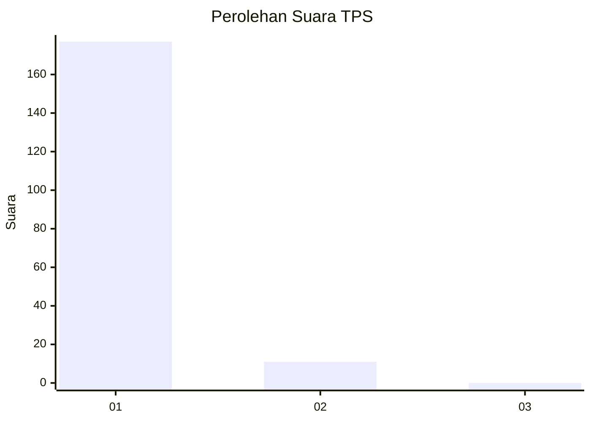
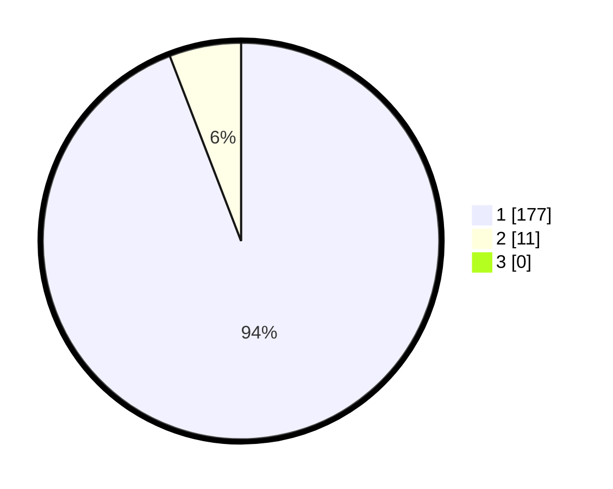

# Hasil

## Grafik

## Tabel

| No. | Nama Paslon    | Suara | Suara (raw) | Persentase |
|:--- |:-------------- | -----:| -----------:| ----------:|
| 1   | ANIES MUHAIMIN | 177   | [177][p-1]  | 94,15      |
| 2   | PRABOWO GIBRAN | 11    | [11][p-2]   | 5,85       |
| 3   | GANJAR MAHFUD  | 0     | [0][p-3]    | 0,00       |

[p-1]: https://github.com/gigit-pemilu/pemilu-2024-11-aceh/blob/main/pilpres/hitung-suara/sub/11-aceh/sub/03-aceh-timur/sub/03-idi-rayeuk/sub/2064-gampong-baro/sub/001-tps/sub/paslon-1.txt
[p-2]: https://github.com/gigit-pemilu/pemilu-2024-11-aceh/blob/main/pilpres/hitung-suara/sub/11-aceh/sub/03-aceh-timur/sub/03-idi-rayeuk/sub/2064-gampong-baro/sub/001-tps/sub/paslon-2.txt
[p-3]: https://github.com/gigit-pemilu/pemilu-2024-11-aceh/blob/main/pilpres/hitung-suara/sub/11-aceh/sub/03-aceh-timur/sub/03-idi-rayeuk/sub/2064-gampong-baro/sub/001-tps/sub/paslon-3.txt

## Foto C Plano

https://sirekap-obj-formc.kpu.go.id/81e9/pemilu/ppwp/11/03/03/20/64/1103032064001-20240215-064517--a86a260a-e3ce-4e24-be13-855a641793f6.jpg

https://sirekap-obj-formc.kpu.go.id/81e9/pemilu/ppwp/11/03/03/20/64/1103032064001-20240214-203226--77afc300-7dc6-4b43-9d9e-979ab1ea78b6.jpg

https://sirekap-obj-formc.kpu.go.id/81e9/pemilu/ppwp/11/03/03/20/64/1103032064001-20240214-203538--0eae3647-3306-4768-8386-3444741613ff.jpg

## Metadata

| Key        | Value               |
| ---------- | ------------------- |
| Time Stamp | 2024-02-24 22:31:28 |

