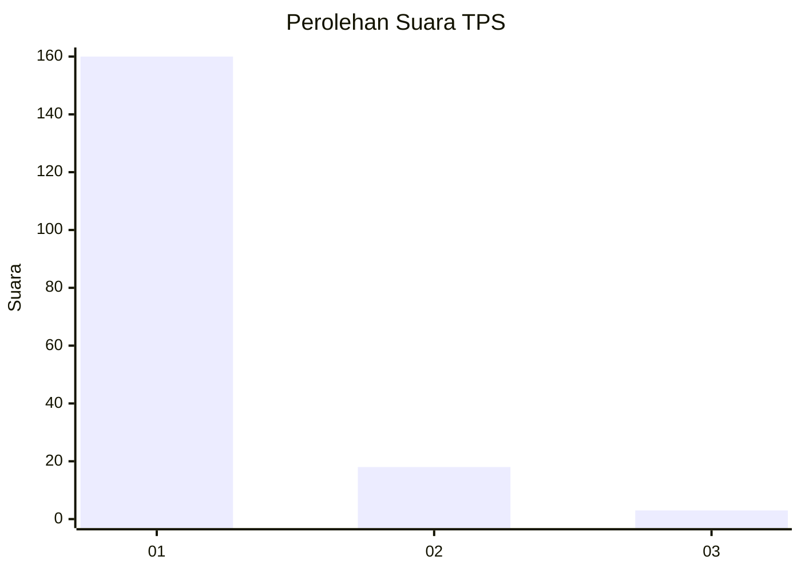
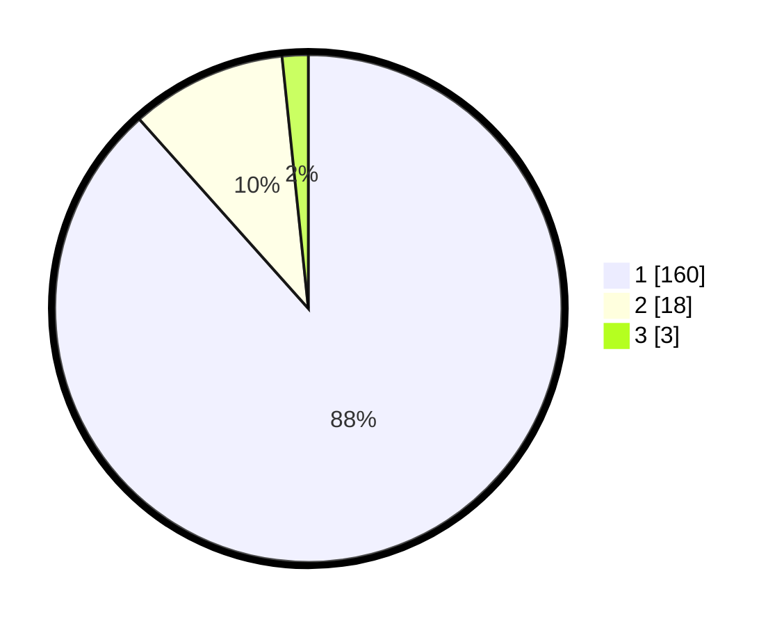

# Hasil

## Grafik

## Tabel

| No. | Nama Paslon    | Suara | Suara (raw) | Persentase |
|:--- |:-------------- | -----:| -----------:| ----------:|
| 1   | ANIES MUHAIMIN | 160   | [160][p-1]  | 88,40      |
| 2   | PRABOWO GIBRAN | 18    | [18][p-2]   | 9,94       |
| 3   | GANJAR MAHFUD  | 3     | [3][p-3]    | 1,66       |

[p-1]: https://github.com/gigit-pemilu/pemilu-2024-11-aceh/blob/main/pilpres/hitung-suara/sub/11-aceh/sub/03-aceh-timur/sub/03-idi-rayeuk/sub/2064-gampong-baro/sub/003-tps/sub/paslon-1.txt
[p-2]: https://github.com/gigit-pemilu/pemilu-2024-11-aceh/blob/main/pilpres/hitung-suara/sub/11-aceh/sub/03-aceh-timur/sub/03-idi-rayeuk/sub/2064-gampong-baro/sub/003-tps/sub/paslon-2.txt
[p-3]: https://github.com/gigit-pemilu/pemilu-2024-11-aceh/blob/main/pilpres/hitung-suara/sub/11-aceh/sub/03-aceh-timur/sub/03-idi-rayeuk/sub/2064-gampong-baro/sub/003-tps/sub/paslon-3.txt

## Foto C Plano

https://sirekap-obj-formc.kpu.go.id/00c6/pemilu/ppwp/11/03/03/20/64/1103032064003-20240215-063002--201417fd-bc00-42f2-a956-884ff0342893.jpg

https://sirekap-obj-formc.kpu.go.id/00c6/pemilu/ppwp/11/03/03/20/64/1103032064003-20240215-063305--025dbc14-7d8e-4688-b168-372019c0c74d.jpg

https://sirekap-obj-formc.kpu.go.id/00c6/pemilu/ppwp/11/03/03/20/64/1103032064003-20240215-063417--0cb42c18-425b-404c-9c04-50f029750954.jpg

## Metadata

| Key        | Value               |
| ---------- | ------------------- |
| Time Stamp | 2024-02-24 22:31:28 |

