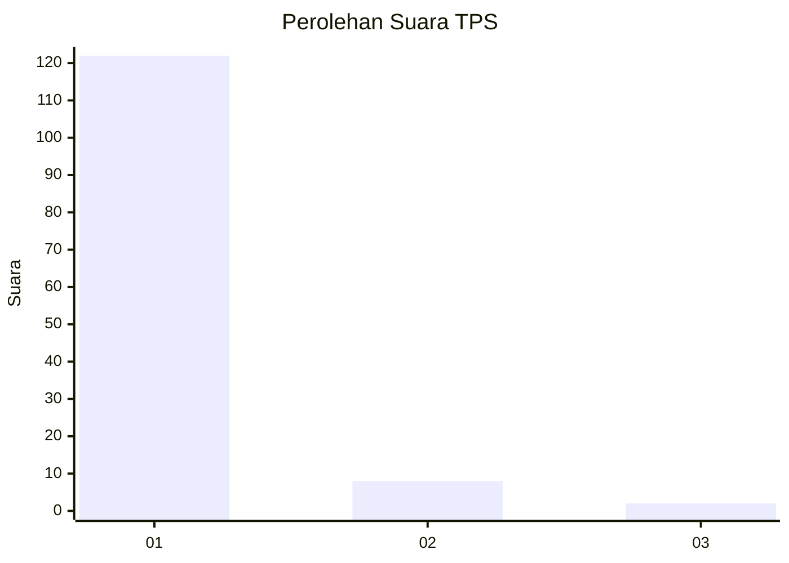
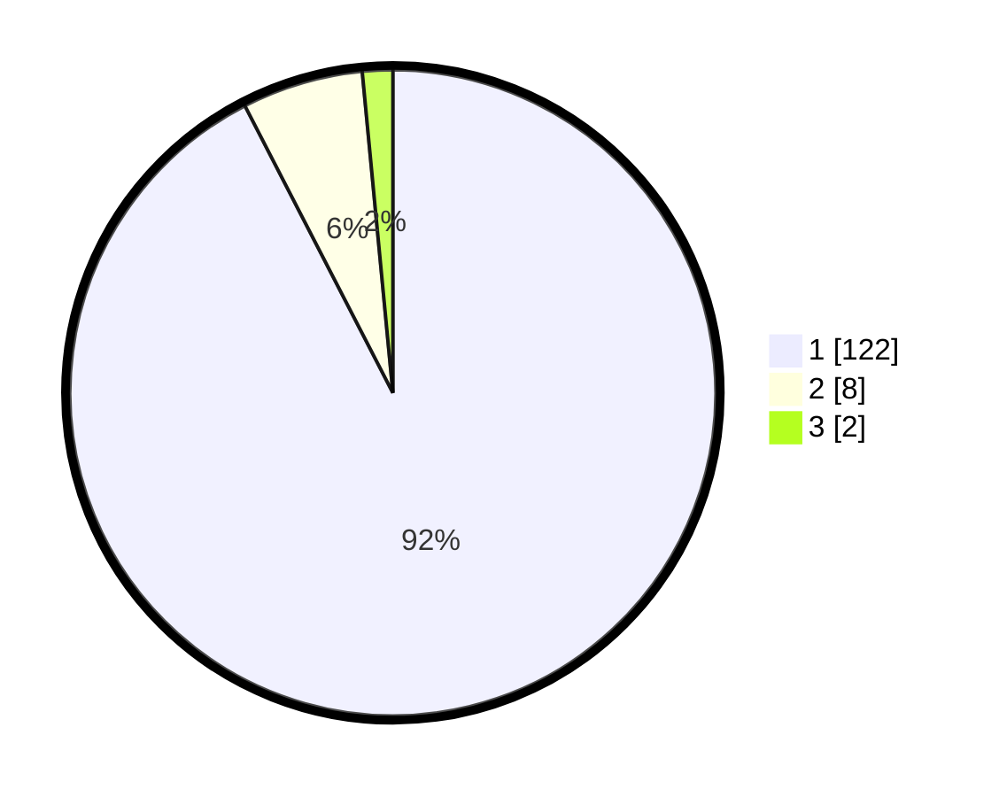

# Hasil

## Grafik

## Tabel

| No. | Nama Paslon    | Suara | Suara (raw) | Persentase |
|:--- |:-------------- | -----:| -----------:| ----------:|
| 1   | ANIES MUHAIMIN | 122   | [122][p-1]  | 92,42      |
| 2   | PRABOWO GIBRAN | 8     | [8][p-2]    | 6,06       |
| 3   | GANJAR MAHFUD  | 2     | [2][p-3]    | 1,52       |

[p-1]: https://github.com/gigit-pemilu/pemilu-2024-11-aceh/blob/main/pilpres/hitung-suara/sub/11-aceh/sub/03-aceh-timur/sub/03-idi-rayeuk/sub/2067-kuta-lawah/sub/002-tps/sub/paslon-1.txt
[p-2]: https://github.com/gigit-pemilu/pemilu-2024-11-aceh/blob/main/pilpres/hitung-suara/sub/11-aceh/sub/03-aceh-timur/sub/03-idi-rayeuk/sub/2067-kuta-lawah/sub/002-tps/sub/paslon-2.txt
[p-3]: https://github.com/gigit-pemilu/pemilu-2024-11-aceh/blob/main/pilpres/hitung-suara/sub/11-aceh/sub/03-aceh-timur/sub/03-idi-rayeuk/sub/2067-kuta-lawah/sub/002-tps/sub/paslon-3.txt

## Foto C Plano

https://sirekap-obj-formc.kpu.go.id/5098/pemilu/ppwp/11/03/03/20/67/1103032067002-20240215-143125--91229cdb-08b3-4d08-a1da-1c9b0b64d8ec.jpg

https://sirekap-obj-formc.kpu.go.id/5098/pemilu/ppwp/11/03/03/20/67/1103032067002-20240215-143139--7ffbc04f-7a5a-4375-9a46-5230d10d3185.jpg

https://sirekap-obj-formc.kpu.go.id/5098/pemilu/ppwp/11/03/03/20/67/1103032067002-20240215-143158--7f3e4028-53c1-4b22-bcff-552c7552ba9a.jpg

## Metadata

| Key        | Value               |
| ---------- | ------------------- |
| Time Stamp | 2024-02-24 22:31:28 |

