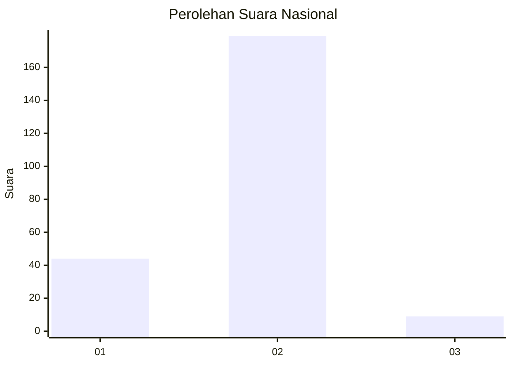
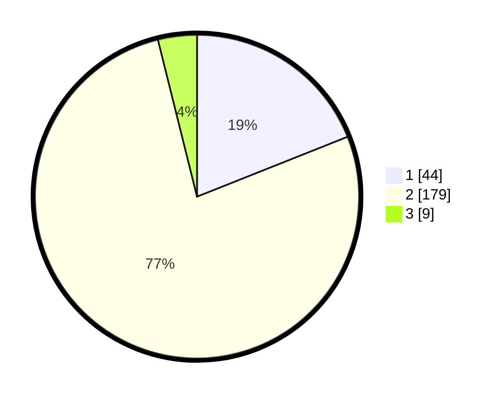

# Hasil

## Grafik

## Tabel

| No. | Nama Paslon    | Suara | Suara (raw) | Persentase |
|:--- |:-------------- | -----:| -----------:| ----------:|
| 1   | ANIES MUHAIMIN | 44    | [44][p-1]   | 18,97      |
| 2   | PRABOWO GIBRAN | 179   | [179][p-2]  | 77,16      |
| 3   | GANJAR MAHFUD  | 9     | [9][p-3]    | 3,88       |

[p-1]: https://github.com/gigit-pemilu/pemilu-2024/blob/main/pilpres/hitung-suara/sub/11-aceh/sub/03-aceh-timur/sub/04-birem-bayeun/sub/2001-jambo-labu/sub/004-tps/sub/paslon-1.txt
[p-2]: https://github.com/gigit-pemilu/pemilu-2024/blob/main/pilpres/hitung-suara/sub/11-aceh/sub/03-aceh-timur/sub/04-birem-bayeun/sub/2001-jambo-labu/sub/004-tps/sub/paslon-2.txt
[p-3]: https://github.com/gigit-pemilu/pemilu-2024/blob/main/pilpres/hitung-suara/sub/11-aceh/sub/03-aceh-timur/sub/04-birem-bayeun/sub/2001-jambo-labu/sub/004-tps/sub/paslon-3.txt

## Foto C Plano

https://sirekap-obj-formc.kpu.go.id/6ad5/pemilu/ppwp/11/03/04/20/01/1103042001004-20240214-195036--8796a1d5-77f2-4d49-8413-10287bc0119d.jpg

https://sirekap-obj-formc.kpu.go.id/6ad5/pemilu/ppwp/11/03/04/20/01/1103042001004-20240214-200252--b1c7ea92-dd10-4034-a1c7-8808b601350b.jpg

https://sirekap-obj-formc.kpu.go.id/6ad5/pemilu/ppwp/11/03/04/20/01/1103042001004-20240214-193941--dde470d8-6c3b-4799-89a5-3d2e2aa5688f.jpg

## Metadata

| Key        | Value               |
| ---------- | ------------------- |
| Time Stamp | 2024-02-14 21:46:01 |

