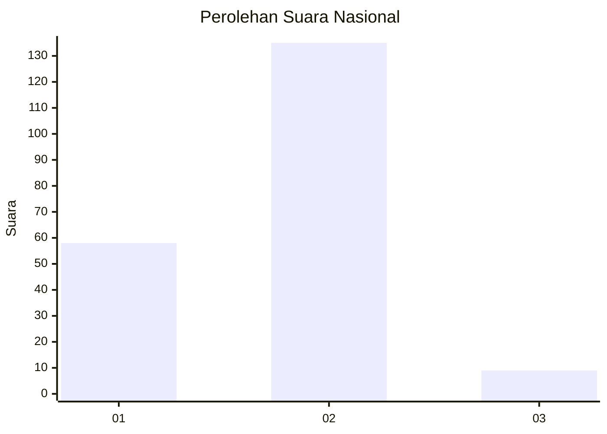
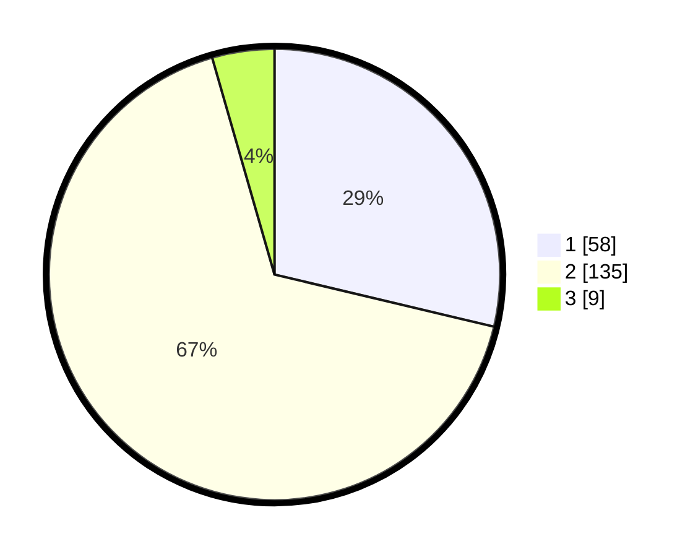

# Hasil

## Grafik

## Tabel

| No. | Nama Paslon    | Suara | Suara (raw) | Persentase |
|:--- |:-------------- | -----:| -----------:| ----------:|
| 1   | ANIES MUHAIMIN | 58    | [58][p-1]   | 28,71      |
| 2   | PRABOWO GIBRAN | 135   | [135][p-2]  | 66,83      |
| 3   | GANJAR MAHFUD  | 9     | [9][p-3]    | 4,46       |

[p-1]: https://github.com/gigit-pemilu/pemilu-2024/blob/main/pilpres/hitung-suara/sub/11-aceh/sub/03-aceh-timur/sub/04-birem-bayeun/sub/2001-jambo-labu/sub/006-tps/sub/paslon-1.txt
[p-2]: https://github.com/gigit-pemilu/pemilu-2024/blob/main/pilpres/hitung-suara/sub/11-aceh/sub/03-aceh-timur/sub/04-birem-bayeun/sub/2001-jambo-labu/sub/006-tps/sub/paslon-2.txt
[p-3]: https://github.com/gigit-pemilu/pemilu-2024/blob/main/pilpres/hitung-suara/sub/11-aceh/sub/03-aceh-timur/sub/04-birem-bayeun/sub/2001-jambo-labu/sub/006-tps/sub/paslon-3.txt

## Foto C Plano

https://sirekap-obj-formc.kpu.go.id/862e/pemilu/ppwp/11/03/04/20/01/1103042001006-20240214-194453--4b3259cd-2b38-400d-80ad-0e20dea76f3e.jpg

https://sirekap-obj-formc.kpu.go.id/862e/pemilu/ppwp/11/03/04/20/01/1103042001006-20240214-194651--70bd7524-c93a-4743-b282-193e9f05112a.jpg

https://sirekap-obj-formc.kpu.go.id/862e/pemilu/ppwp/11/03/04/20/01/1103042001006-20240214-195010--8fc19cef-3124-4923-8926-f3f76a9ba9b5.jpg

## Metadata

| Key        | Value               |
| ---------- | ------------------- |
| Time Stamp | 2024-02-19 12:00:00 |

