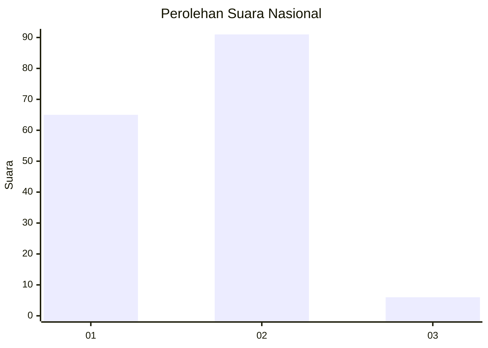
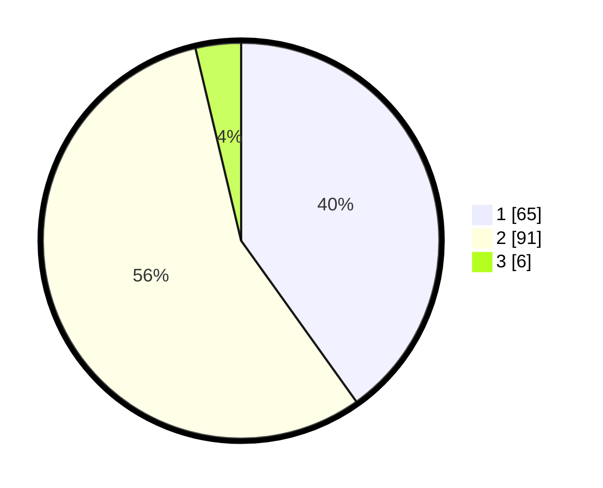

# Hasil

## Grafik

## Tabel

| No. | Nama Paslon    | Suara | Suara (raw) | Persentase |
|:--- |:-------------- | -----:| -----------:| ----------:|
| 1   | ANIES MUHAIMIN | 65    | [65][p-1]   | 40,12      |
| 2   | PRABOWO GIBRAN | 91    | [91][p-2]   | 56,17      |
| 3   | GANJAR MAHFUD  | 6     | [6][p-3]    | 3,70       |

[p-1]: https://github.com/gigit-pemilu/pemilu-2024/blob/main/pilpres/hitung-suara/sub/11-aceh/sub/03-aceh-timur/sub/04-birem-bayeun/sub/2002-alue-canang/sub/002-tps/sub/paslon-1.txt
[p-2]: https://github.com/gigit-pemilu/pemilu-2024/blob/main/pilpres/hitung-suara/sub/11-aceh/sub/03-aceh-timur/sub/04-birem-bayeun/sub/2002-alue-canang/sub/002-tps/sub/paslon-2.txt
[p-3]: https://github.com/gigit-pemilu/pemilu-2024/blob/main/pilpres/hitung-suara/sub/11-aceh/sub/03-aceh-timur/sub/04-birem-bayeun/sub/2002-alue-canang/sub/002-tps/sub/paslon-3.txt

## Foto C Plano

https://sirekap-obj-formc.kpu.go.id/d092/pemilu/ppwp/11/03/04/20/02/1103042002002-20240215-004558--968b4198-e63a-40cb-bf52-74596e4383e1.jpg

https://sirekap-obj-formc.kpu.go.id/d092/pemilu/ppwp/11/03/04/20/02/1103042002002-20240215-031714--4e666998-8b67-4ed1-864e-18071a60b62a.jpg

https://sirekap-obj-formc.kpu.go.id/d092/pemilu/ppwp/11/03/04/20/02/1103042002002-20240215-005143--29b1496e-120e-4e27-9c9a-bae1ddc11ecc.jpg

## Metadata

| Key        | Value               |
| ---------- | ------------------- |
| Time Stamp | 2024-02-16 21:01:00 |

## DATA PEMILIH TETAP

Jumlah pemilih dalam DPT: **231**.
 * L: **121**.
 * P: **110**.

## DATA PENGGUNA HAK PILIH

Jumlah pengguna hak pilih dalam DPT: **164**.
 * L: **88**.
 * P: **76**.

Jumlah pengguna hak pilih dalam DPTb: **0**.
 * L: **0**.
 * P: **0**.

Jumlah pengguna hak pilih dalam DPK: **0**.
 * L: **0**.
 * P: **0**.

Jumlah pengguna hak pilih: **164**.
 * L: **88**.
 * P: **76**.

## JUMLAH SUARA SAH DAN TIDAK SAH

JUMLAH SELURUH SUARA SAH: **162**.

JUMLAH SUARA TIDAK SAH: **2**.

JUMLAH SELURUH SUARA SAH DAN SUARA TIDAK SAH: **164**.

