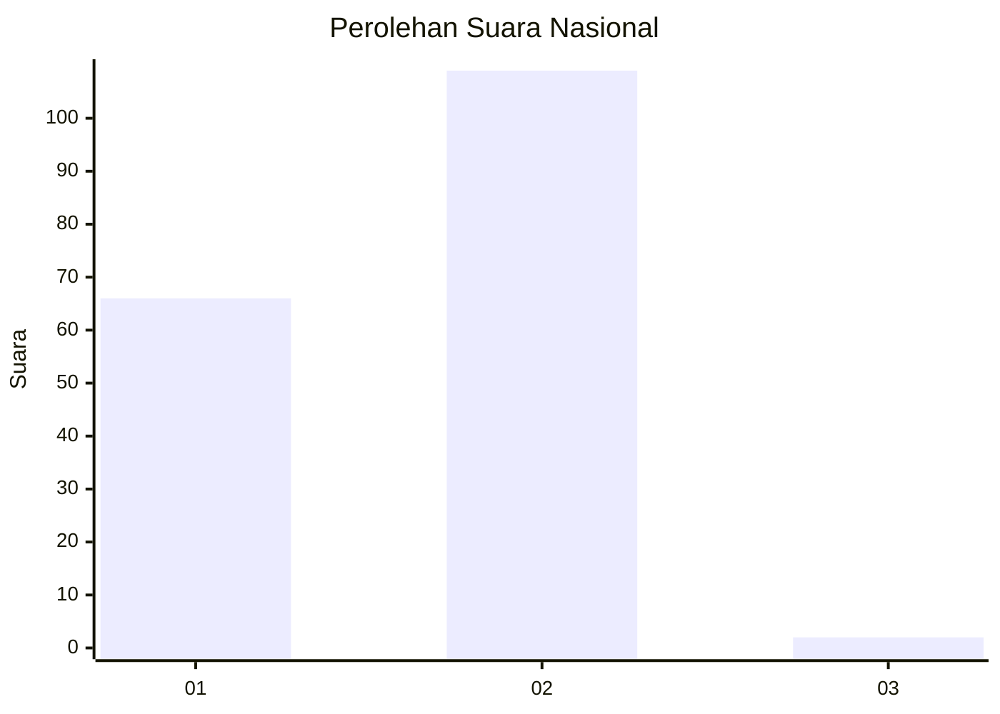
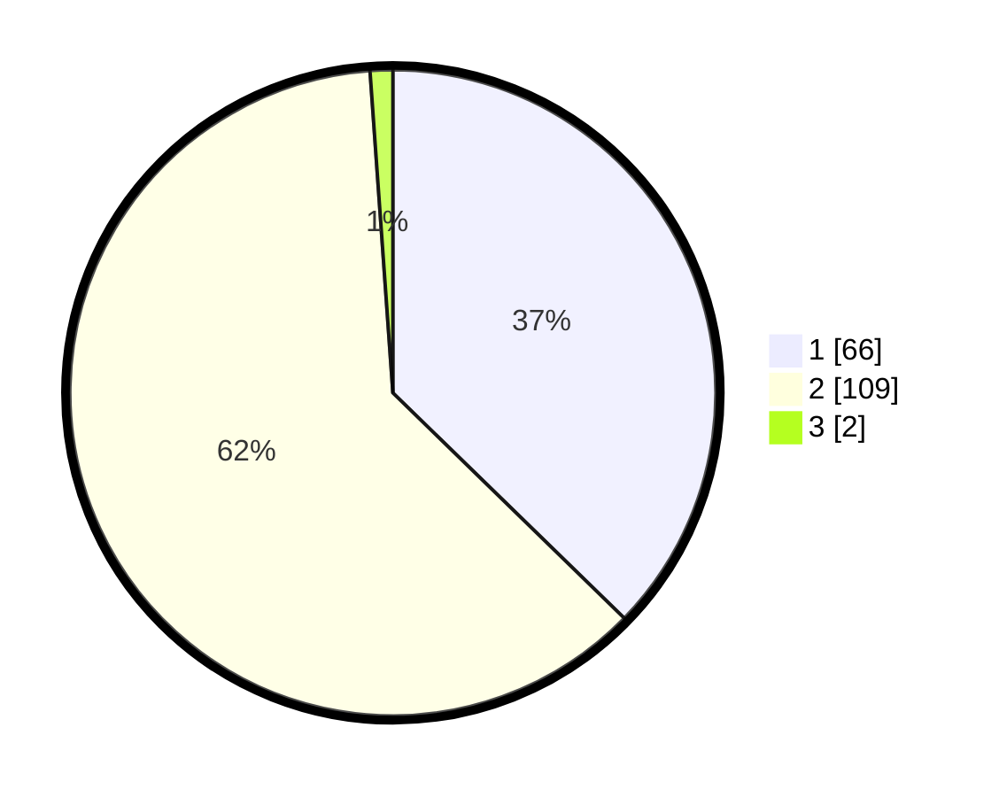

# Hasil

## Grafik

## Tabel

| No. | Nama Paslon    | Suara | Suara (raw) | Persentase |
|:--- |:-------------- | -----:| -----------:| ----------:|
| 1   | ANIES MUHAIMIN | 66    | [66][p-1]   | 37,29      |
| 2   | PRABOWO GIBRAN | 109   | [109][p-2]  | 61,58      |
| 3   | GANJAR MAHFUD  | 2     | [2][p-3]    | 1,13       |

[p-1]: https://github.com/gigit-pemilu/pemilu-2024/blob/main/pilpres/hitung-suara/sub/11-aceh/sub/03-aceh-timur/sub/04-birem-bayeun/sub/2002-alue-canang/sub/003-tps/sub/paslon-1.txt
[p-2]: https://github.com/gigit-pemilu/pemilu-2024/blob/main/pilpres/hitung-suara/sub/11-aceh/sub/03-aceh-timur/sub/04-birem-bayeun/sub/2002-alue-canang/sub/003-tps/sub/paslon-2.txt
[p-3]: https://github.com/gigit-pemilu/pemilu-2024/blob/main/pilpres/hitung-suara/sub/11-aceh/sub/03-aceh-timur/sub/04-birem-bayeun/sub/2002-alue-canang/sub/003-tps/sub/paslon-3.txt

## Foto C Plano

https://sirekap-obj-formc.kpu.go.id/b901/pemilu/ppwp/11/03/04/20/02/1103042002003-20240215-045637--8a47a253-4c8a-4c63-b0a6-0f4aa11b35f1.jpg

https://sirekap-obj-formc.kpu.go.id/b901/pemilu/ppwp/11/03/04/20/02/1103042002003-20240215-045655--b36dd346-804a-4637-99ca-2c36b0dd2653.jpg

https://sirekap-obj-formc.kpu.go.id/b901/pemilu/ppwp/11/03/04/20/02/1103042002003-20240215-045718--d6c5e31a-358a-400e-a476-a38f54922c35.jpg

## Metadata

| Key        | Value               |
| ---------- | ------------------- |
| Time Stamp | 2024-02-15 16:30:25 |

