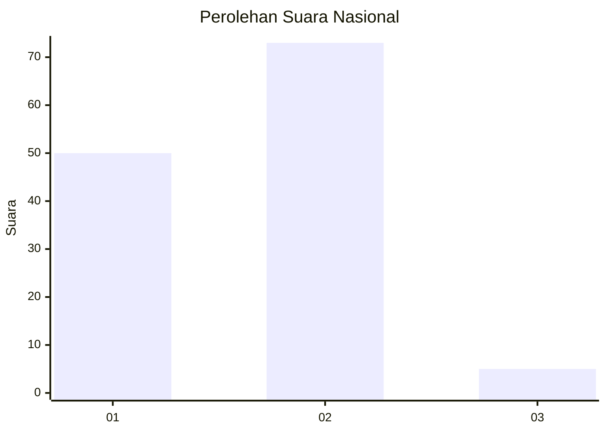
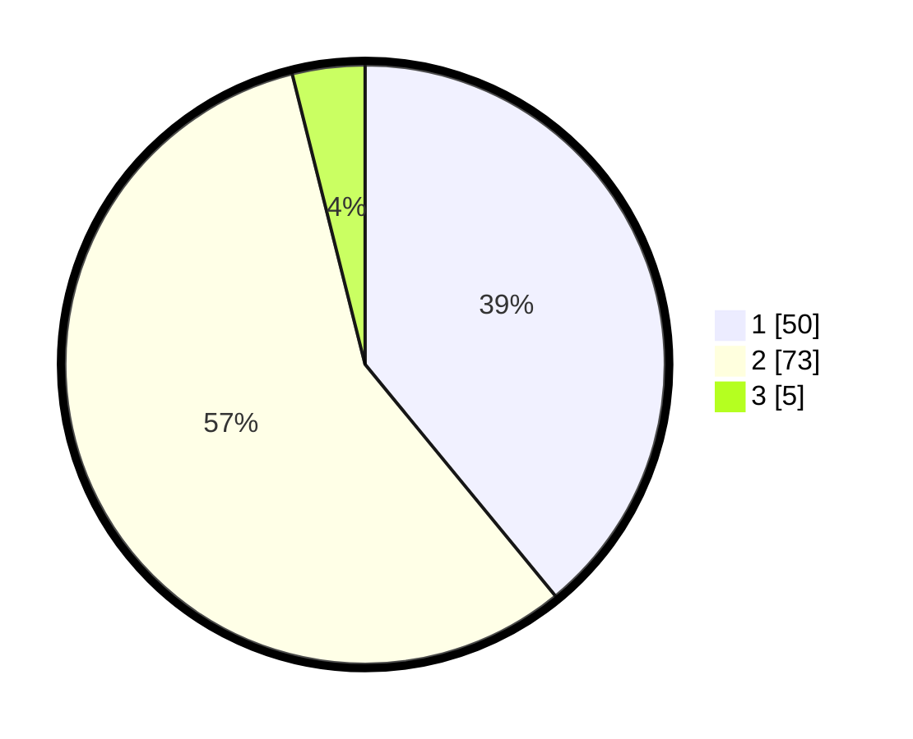

# Hasil

## Grafik

## Tabel

| No. | Nama Paslon    | Suara | Suara (raw) | Persentase |
|:--- |:-------------- | -----:| -----------:| ----------:|
| 1   | ANIES MUHAIMIN | 50    | [50][p-1]   | 39,06      |
| 2   | PRABOWO GIBRAN | 73    | [73][p-2]   | 57,03      |
| 3   | GANJAR MAHFUD  | 5     | [5][p-3]    | 3,91       |

[p-1]: https://github.com/gigit-pemilu/pemilu-2024/blob/main/pilpres/hitung-suara/sub/11-aceh/sub/03-aceh-timur/sub/04-birem-bayeun/sub/2002-alue-canang/sub/004-tps/sub/paslon-1.txt
[p-2]: https://github.com/gigit-pemilu/pemilu-2024/blob/main/pilpres/hitung-suara/sub/11-aceh/sub/03-aceh-timur/sub/04-birem-bayeun/sub/2002-alue-canang/sub/004-tps/sub/paslon-2.txt
[p-3]: https://github.com/gigit-pemilu/pemilu-2024/blob/main/pilpres/hitung-suara/sub/11-aceh/sub/03-aceh-timur/sub/04-birem-bayeun/sub/2002-alue-canang/sub/004-tps/sub/paslon-3.txt

## Foto C Plano

https://sirekap-obj-formc.kpu.go.id/cb80/pemilu/ppwp/11/03/04/20/02/1103042002004-20240215-031433--3821b53d-db73-4d11-871f-54156c517194.jpg

https://sirekap-obj-formc.kpu.go.id/cb80/pemilu/ppwp/11/03/04/20/02/1103042002004-20240214-234802--f6231a20-2f84-4b5b-b176-a5ff2702a267.jpg

https://sirekap-obj-formc.kpu.go.id/cb80/pemilu/ppwp/11/03/04/20/02/1103042002004-20240215-045609--7bdd5117-8fad-4d5e-9c66-805d0d4c70d3.jpg

## Metadata

| Key        | Value               |
| ---------- | ------------------- |
| Time Stamp | 2024-02-19 06:16:00 |

