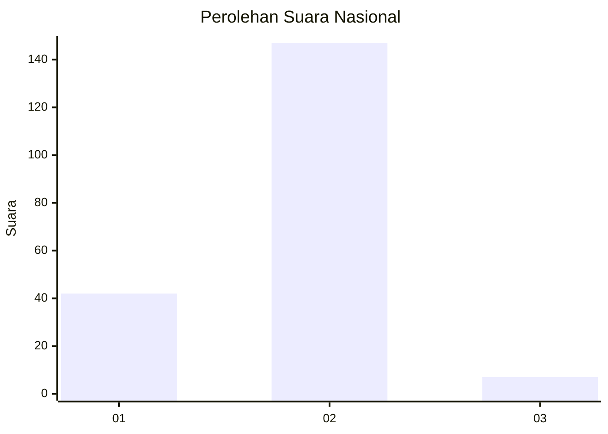

# Hasil

## Grafik

## Tabel

| No. | Nama Paslon    | Suara | Suara (raw) | Persentase |
|:--- |:-------------- | -----:| -----------:| ----------:|
| 1   | ANIES MUHAIMIN | 42    | [42][p-1]   | 21,43      |
| 2   | PRABOWO GIBRAN | 147   | [147][p-2]  | 75,00      |
| 3   | GANJAR MAHFUD  | 7     | [7][p-3]    | 3,57       |

[p-1]: https://github.com/gigit-pemilu/pemilu-2024/blob/main/pilpres/hitung-suara/sub/11-aceh/sub/03-aceh-timur/sub/04-birem-bayeun/sub/2004-buket-tiga/sub/003-tps/sub/paslon-1.txt
[p-2]: https://github.com/gigit-pemilu/pemilu-2024/blob/main/pilpres/hitung-suara/sub/11-aceh/sub/03-aceh-timur/sub/04-birem-bayeun/sub/2004-buket-tiga/sub/003-tps/sub/paslon-2.txt
[p-3]: https://github.com/gigit-pemilu/pemilu-2024/blob/main/pilpres/hitung-suara/sub/11-aceh/sub/03-aceh-timur/sub/04-birem-bayeun/sub/2004-buket-tiga/sub/003-tps/sub/paslon-3.txt

## Foto C Plano

https://sirekap-obj-formc.kpu.go.id/a264/pemilu/ppwp/11/03/04/20/04/1103042004003-20240215-074559--44784b81-8aef-4d0b-bd51-45958f06aa1a.jpg

https://sirekap-obj-formc.kpu.go.id/a264/pemilu/ppwp/11/03/04/20/04/1103042004003-20240215-073553--e09d1a4e-8b77-4ab3-bf5b-954b63a76cbe.jpg

## Metadata

| Key        | Value               |
| ---------- | ------------------- |
| Time Stamp | 2024-02-26 22:00:00 |

