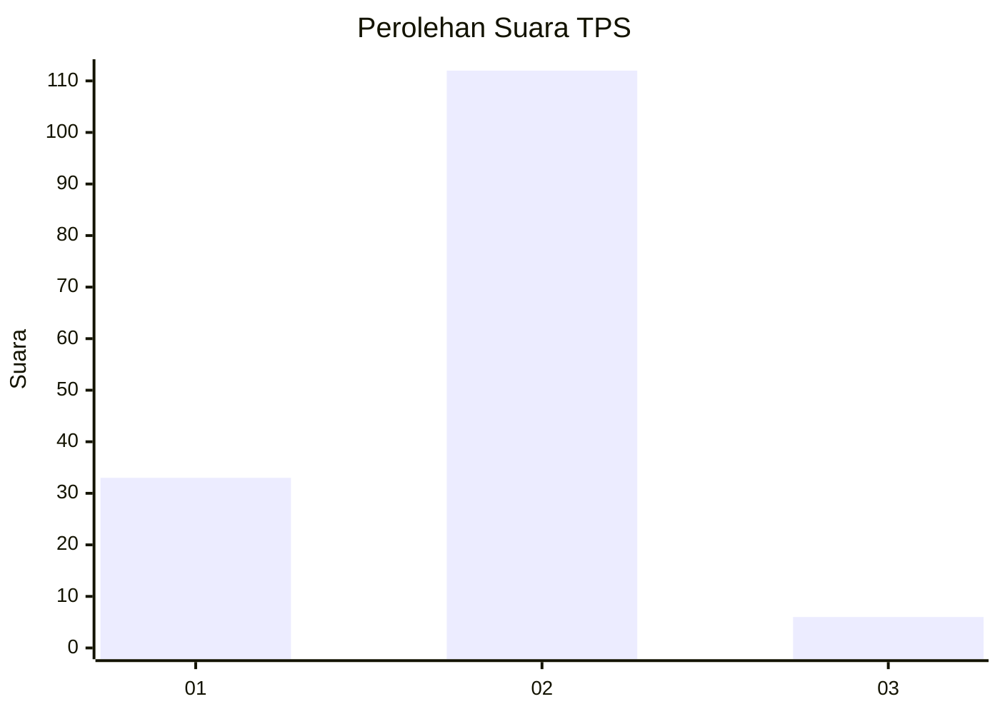

# Hasil

## Grafik

## Tabel

| No. | Nama Paslon    | Suara | Suara (raw) | Persentase |
|:--- |:-------------- | -----:| -----------:| ----------:|
| 1   | ANIES MUHAIMIN | 33    | [33][p-1]   | 21,85      |
| 2   | PRABOWO GIBRAN | 112   | [112][p-2]  | 74,17      |
| 3   | GANJAR MAHFUD  | 6     | [6][p-3]    | 3,97       |

[p-1]: https://github.com/gigit-pemilu/pemilu-2024-11-aceh/blob/main/pilpres/hitung-suara/sub/11-aceh/sub/03-aceh-timur/sub/04-birem-bayeun/sub/2012-alue-gadeng-sa/sub/001-tps/sub/paslon-1.txt
[p-2]: https://github.com/gigit-pemilu/pemilu-2024-11-aceh/blob/main/pilpres/hitung-suara/sub/11-aceh/sub/03-aceh-timur/sub/04-birem-bayeun/sub/2012-alue-gadeng-sa/sub/001-tps/sub/paslon-2.txt
[p-3]: https://github.com/gigit-pemilu/pemilu-2024-11-aceh/blob/main/pilpres/hitung-suara/sub/11-aceh/sub/03-aceh-timur/sub/04-birem-bayeun/sub/2012-alue-gadeng-sa/sub/001-tps/sub/paslon-3.txt

## Foto C Plano

https://sirekap-obj-formc.kpu.go.id/6ae3/pemilu/ppwp/11/03/04/20/12/1103042012001-20240214-223040--0d3ec2f2-2cc7-42e7-b9a9-9f6b8d446e2a.jpg

https://sirekap-obj-formc.kpu.go.id/6ae3/pemilu/ppwp/11/03/04/20/12/1103042012001-20240214-223258--828bc707-d725-4b53-9bca-7f92e7b3a098.jpg

https://sirekap-obj-formc.kpu.go.id/6ae3/pemilu/ppwp/11/03/04/20/12/1103042012001-20240214-223454--08cdf38e-6f38-4080-9a00-bf3736bcac0d.jpg

## Metadata

| Key        | Value               |
| ---------- | ------------------- |
| Time Stamp | 2024-02-24 22:31:28 |

