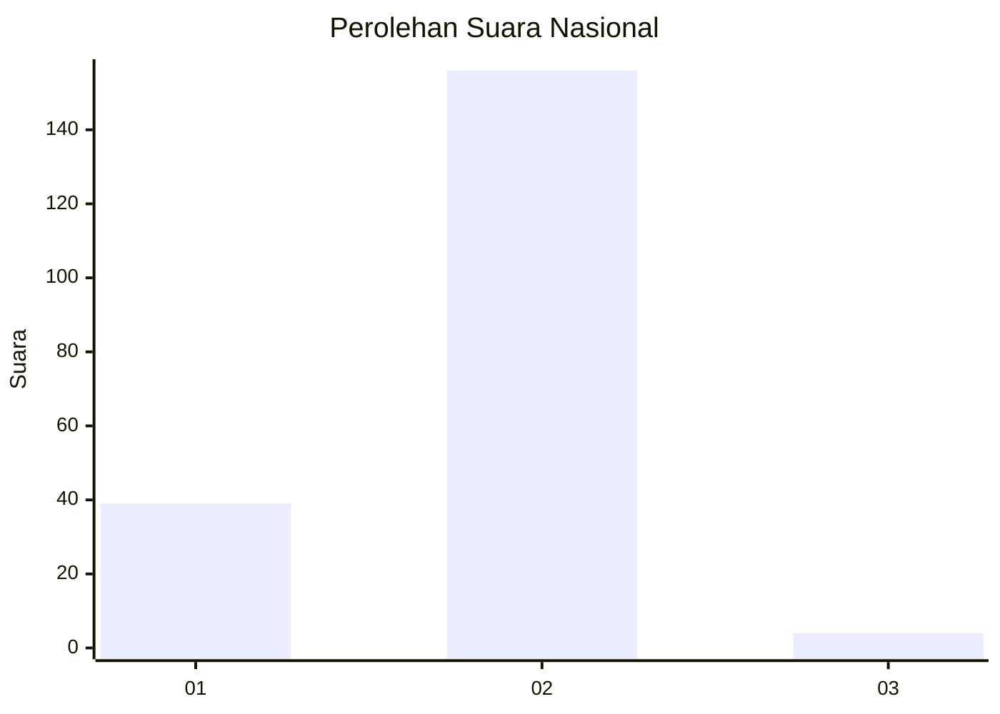
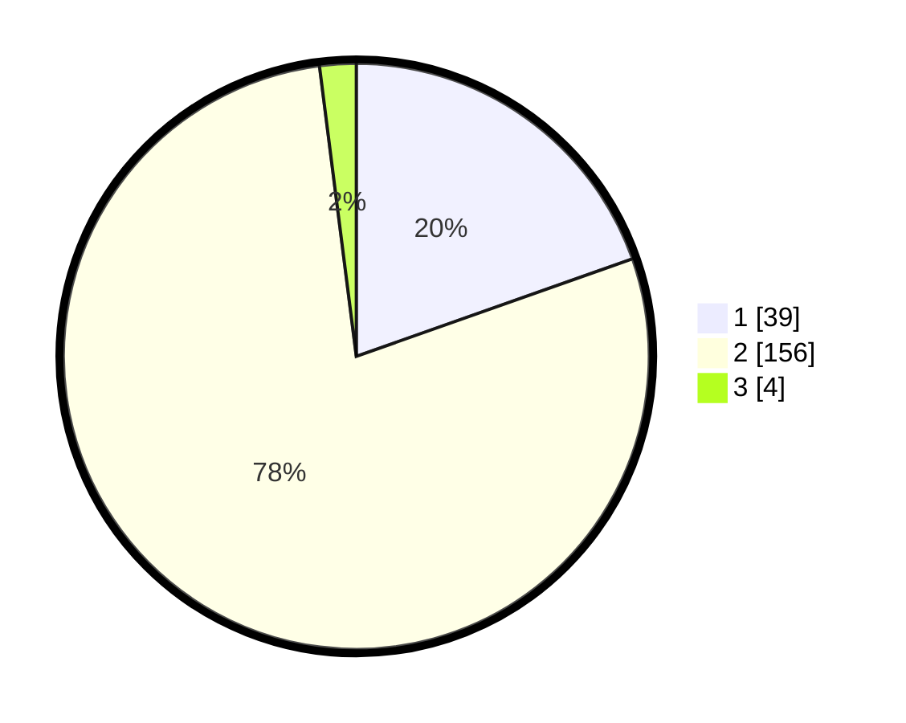

# Hasil

## Grafik

## Tabel

| No. | Nama Paslon    | Suara | Suara (raw) | Persentase |
|:--- |:-------------- | -----:| -----------:| ----------:|
| 1   | ANIES MUHAIMIN | 39    | [39][p-1]   | 19,60      |
| 2   | PRABOWO GIBRAN | 156   | [156][p-2]  | 78,39      |
| 3   | GANJAR MAHFUD  | 4     | [4][p-3]    | 2,01       |

[p-1]: https://github.com/gigit-pemilu/pemilu-2024/blob/main/pilpres/hitung-suara/sub/11-aceh/sub/03-aceh-timur/sub/04-birem-bayeun/sub/2014-paya-bili-dua/sub/005-tps/sub/paslon-1.txt
[p-2]: https://github.com/gigit-pemilu/pemilu-2024/blob/main/pilpres/hitung-suara/sub/11-aceh/sub/03-aceh-timur/sub/04-birem-bayeun/sub/2014-paya-bili-dua/sub/005-tps/sub/paslon-2.txt
[p-3]: https://github.com/gigit-pemilu/pemilu-2024/blob/main/pilpres/hitung-suara/sub/11-aceh/sub/03-aceh-timur/sub/04-birem-bayeun/sub/2014-paya-bili-dua/sub/005-tps/sub/paslon-3.txt

## Foto C Plano

https://sirekap-obj-formc.kpu.go.id/ec7c/pemilu/ppwp/11/03/04/20/14/1103042014005-20240214-222326--5f5fb4c6-8337-4a9c-8aca-954723a7a199.jpg

https://sirekap-obj-formc.kpu.go.id/ec7c/pemilu/ppwp/11/03/04/20/14/1103042014005-20240214-222332--46a5499d-4a8f-4c49-a9b4-488e27f187c8.jpg

https://sirekap-obj-formc.kpu.go.id/ec7c/pemilu/ppwp/11/03/04/20/14/1103042014005-20240215-225427--fb6444f7-d98f-4a19-90e7-1e924df91e3b.jpg

## Metadata

| Key        | Value               |
| ---------- | ------------------- |
| Time Stamp | 2024-02-15 23:29:50 |

## DATA PEMILIH TETAP

Jumlah pemilih dalam DPT: **238**.
 * L: **128**.
 * P: **110**.

## DATA PENGGUNA HAK PILIH

Jumlah pengguna hak pilih dalam DPT: **181**.
 * L: **90**.
 * P: **91**.

Jumlah pengguna hak pilih dalam DPTb: **21**.
 * L: **12**.
 * P: **9**.

Jumlah pengguna hak pilih dalam DPK: **0**.
 * L: **0**.
 * P: **0**.

Jumlah pengguna hak pilih: **202**.
 * L: **102**.
 * P: **100**.

## JUMLAH SUARA SAH DAN TIDAK SAH

JUMLAH SELURUH SUARA SAH: **199**.

JUMLAH SUARA TIDAK SAH: **3**.

JUMLAH SELURUH SUARA SAH DAN SUARA TIDAK SAH: **202**.

