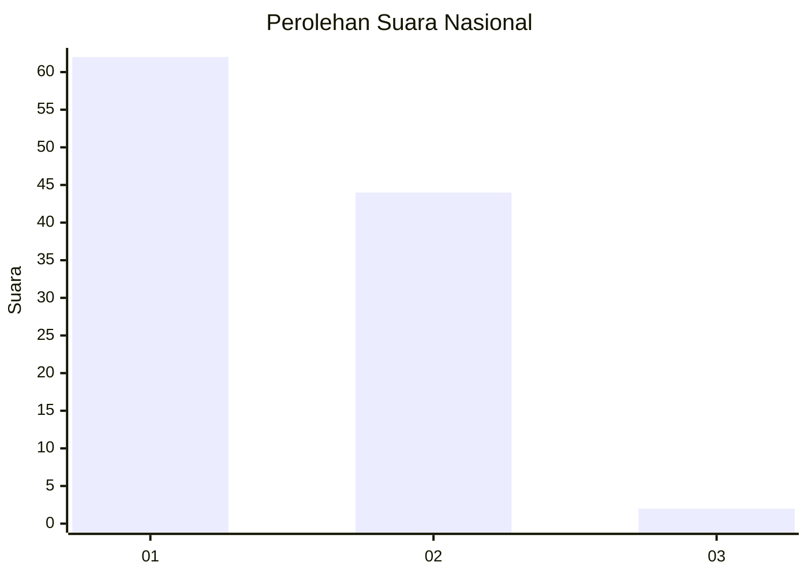
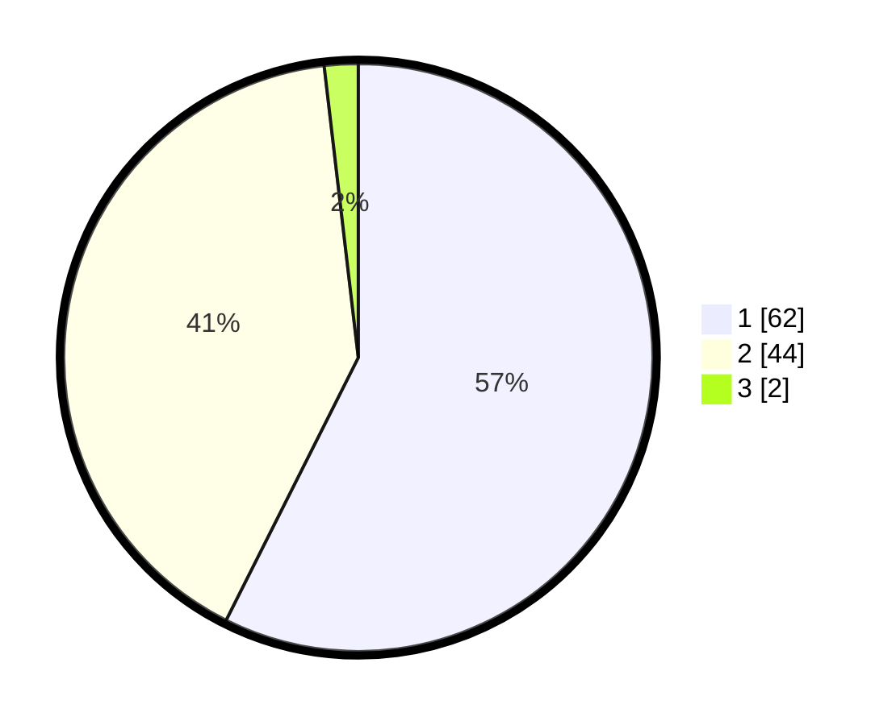

# Hasil

## Grafik

## Tabel

| No. | Nama Paslon    | Suara | Suara (raw) | Persentase |
|:--- |:-------------- | -----:| -----------:| ----------:|
| 1   | ANIES MUHAIMIN | 62    | [62][p-1]   | 57,41      |
| 2   | PRABOWO GIBRAN | 44    | [44][p-2]   | 40,74      |
| 3   | GANJAR MAHFUD  | 2     | [2][p-3]    | 1,85       |

[p-1]: https://github.com/gigit-pemilu/pemilu-2024/blob/main/pilpres/hitung-suara/sub/11-aceh/sub/03-aceh-timur/sub/04-birem-bayeun/sub/2015-paya-bili-sa/sub/003-tps/sub/paslon-1.txt
[p-2]: https://github.com/gigit-pemilu/pemilu-2024/blob/main/pilpres/hitung-suara/sub/11-aceh/sub/03-aceh-timur/sub/04-birem-bayeun/sub/2015-paya-bili-sa/sub/003-tps/sub/paslon-2.txt
[p-3]: https://github.com/gigit-pemilu/pemilu-2024/blob/main/pilpres/hitung-suara/sub/11-aceh/sub/03-aceh-timur/sub/04-birem-bayeun/sub/2015-paya-bili-sa/sub/003-tps/sub/paslon-3.txt

## Foto C Plano

https://sirekap-obj-formc.kpu.go.id/6067/pemilu/ppwp/11/03/04/20/15/1103042015003-20240215-054721--b348c9e6-b998-44cf-b4dc-3fc992537236.jpg

https://sirekap-obj-formc.kpu.go.id/6067/pemilu/ppwp/11/03/04/20/15/1103042015003-20240215-054403--9edc8a89-48b1-4e10-a962-07dc4a660c08.jpg

https://sirekap-obj-formc.kpu.go.id/6067/pemilu/ppwp/11/03/04/20/15/1103042015003-20240215-054603--781fad6e-1d7d-4c6d-b749-2cb70db0cd1f.jpg

## Metadata

| Key        | Value               |
| ---------- | ------------------- |
| Time Stamp | 2024-02-15 15:30:25 |

