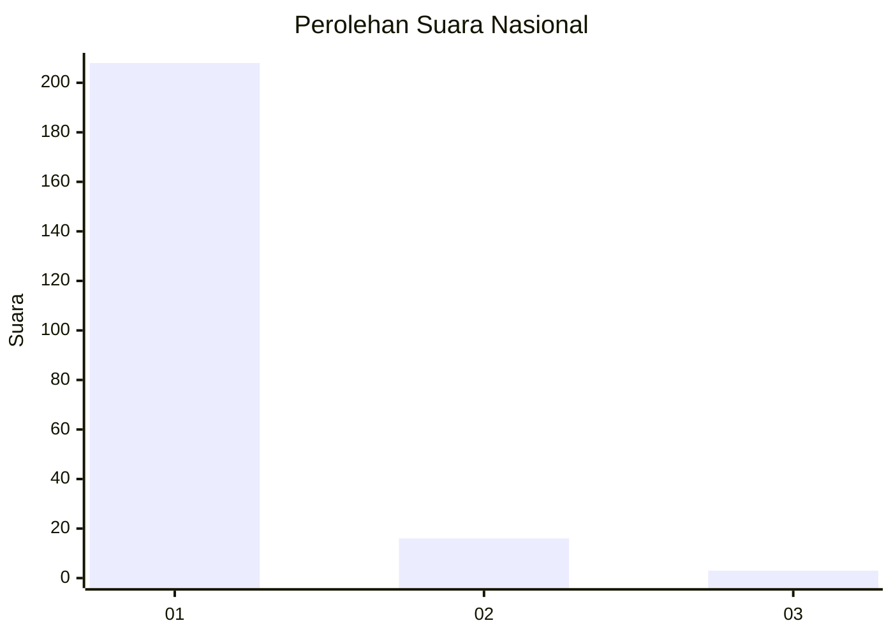
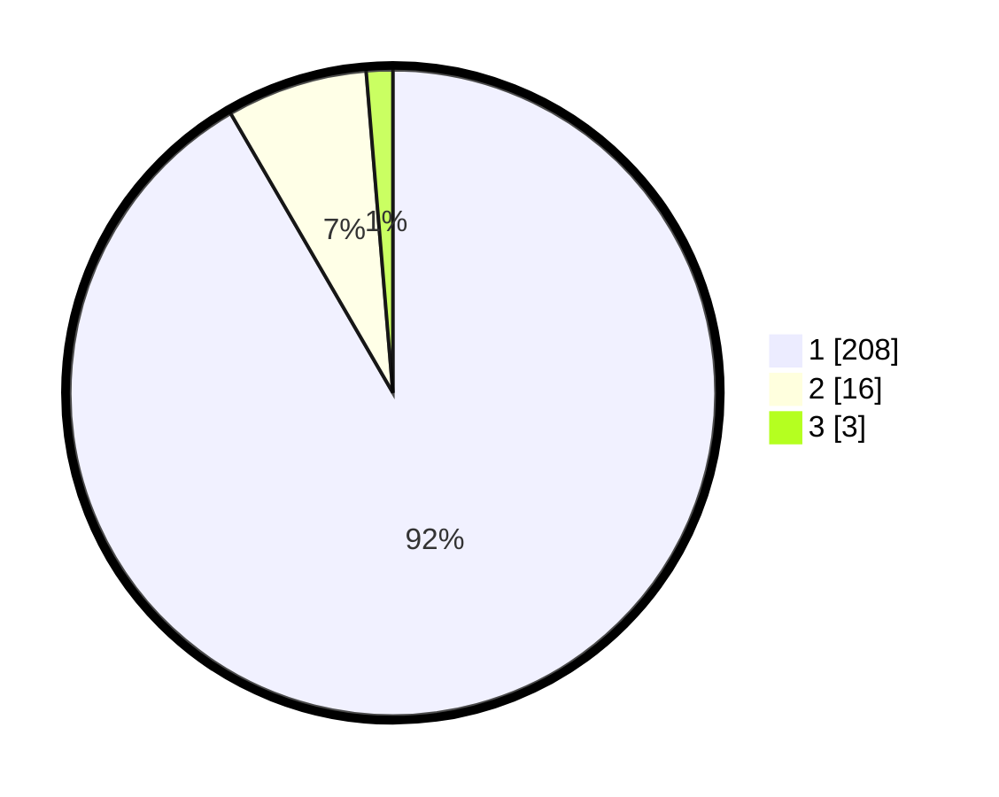

# Hasil

## Grafik

## Tabel

| No. | Nama Paslon    | Suara | Suara (raw) | Persentase |
|:--- |:-------------- | -----:| -----------:| ----------:|
| 1   | ANIES MUHAIMIN | 208   | [208][p-1]  | 91,63      |
| 2   | PRABOWO GIBRAN | 16    | [16][p-2]   | 7,05       |
| 3   | GANJAR MAHFUD  | 3     | [3][p-3]    | 1,32       |

[p-1]: https://github.com/gigit-pemilu/pemilu-2024/blob/main/pilpres/hitung-suara/sub/11-aceh/sub/03-aceh-timur/sub/04-birem-bayeun/sub/2016-paya-peulawi/sub/002-tps/sub/paslon-1.txt
[p-2]: https://github.com/gigit-pemilu/pemilu-2024/blob/main/pilpres/hitung-suara/sub/11-aceh/sub/03-aceh-timur/sub/04-birem-bayeun/sub/2016-paya-peulawi/sub/002-tps/sub/paslon-2.txt
[p-3]: https://github.com/gigit-pemilu/pemilu-2024/blob/main/pilpres/hitung-suara/sub/11-aceh/sub/03-aceh-timur/sub/04-birem-bayeun/sub/2016-paya-peulawi/sub/002-tps/sub/paslon-3.txt

## Foto C Plano

https://sirekap-obj-formc.kpu.go.id/52e7/pemilu/ppwp/11/03/04/20/16/1103042016002-20240214-233208--09fff9c0-d66d-4e40-bcef-a3290f6b7ba1.jpg

https://sirekap-obj-formc.kpu.go.id/52e7/pemilu/ppwp/11/03/04/20/16/1103042016002-20240214-211825--74b2184b-482f-44fd-9018-e0297b77cc38.jpg

https://sirekap-obj-formc.kpu.go.id/52e7/pemilu/ppwp/11/03/04/20/16/1103042016002-20240214-233447--e1f8a7d1-920d-4800-aea8-6c42dc431ac4.jpg

## Metadata

| Key        | Value               |
| ---------- | ------------------- |
| Time Stamp | 2024-02-25 12:00:00 |

