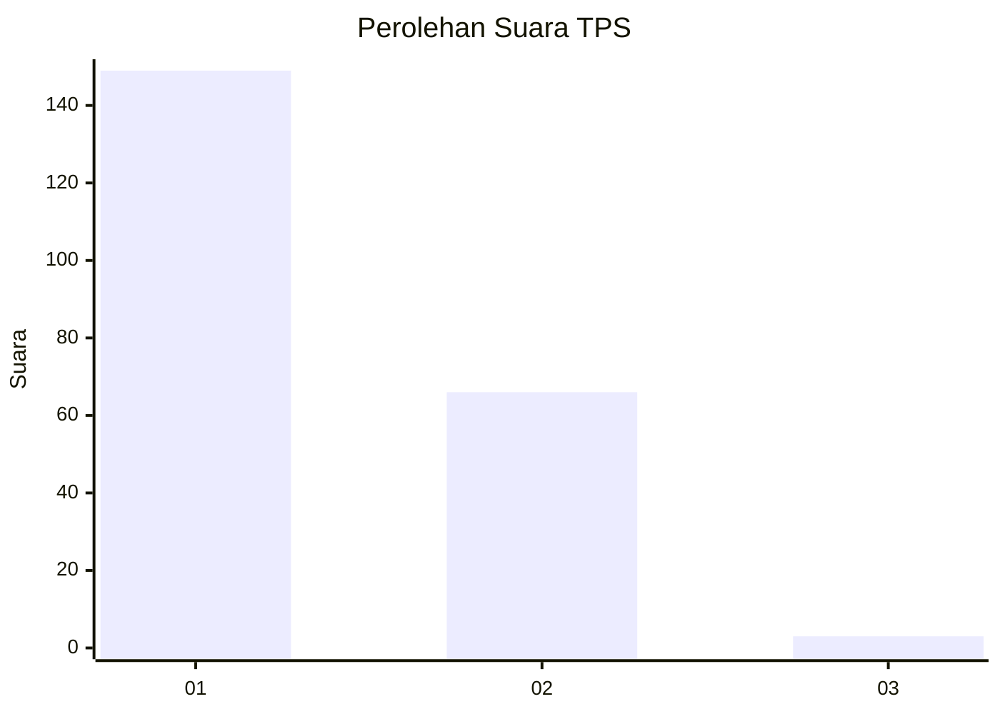
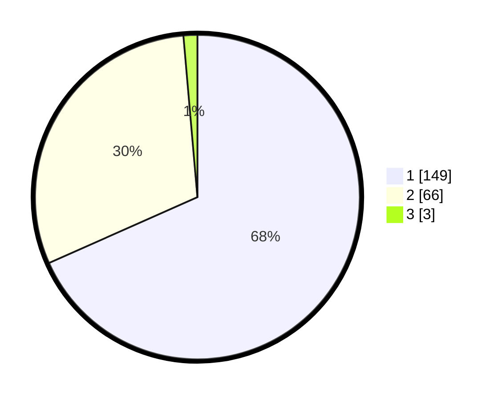

# Hasil

## Grafik

## Tabel

| No. | Nama Paslon    | Suara | Suara (raw) | Persentase |
|:--- |:-------------- | -----:| -----------:| ----------:|
| 1   | ANIES MUHAIMIN | 149   | [149][p-1]  | 68,35      |
| 2   | PRABOWO GIBRAN | 66    | [66][p-2]   | 30,28      |
| 3   | GANJAR MAHFUD  | 3     | [3][p-3]    | 1,38       |

[p-1]: https://github.com/gigit-pemilu/pemilu-2024-11-aceh/blob/main/pilpres/hitung-suara/sub/11-aceh/sub/03-aceh-timur/sub/04-birem-bayeun/sub/2017-keude-birem/sub/004-tps/sub/paslon-1.txt
[p-2]: https://github.com/gigit-pemilu/pemilu-2024-11-aceh/blob/main/pilpres/hitung-suara/sub/11-aceh/sub/03-aceh-timur/sub/04-birem-bayeun/sub/2017-keude-birem/sub/004-tps/sub/paslon-2.txt
[p-3]: https://github.com/gigit-pemilu/pemilu-2024-11-aceh/blob/main/pilpres/hitung-suara/sub/11-aceh/sub/03-aceh-timur/sub/04-birem-bayeun/sub/2017-keude-birem/sub/004-tps/sub/paslon-3.txt

## Foto C Plano

https://sirekap-obj-formc.kpu.go.id/ac6e/pemilu/ppwp/11/03/04/20/17/1103042017004-20240215-040512--e80bece4-ca9d-4526-afe2-b1c2c9756fb9.jpg

https://sirekap-obj-formc.kpu.go.id/ac6e/pemilu/ppwp/11/03/04/20/17/1103042017004-20240215-040721--409be1f0-07aa-4d2d-a7fd-37cba48072c1.jpg

https://sirekap-obj-formc.kpu.go.id/ac6e/pemilu/ppwp/11/03/04/20/17/1103042017004-20240215-040928--d524f04b-2197-40ed-9903-635138de9ce7.jpg

## Metadata

| Key        | Value               |
| ---------- | ------------------- |
| Time Stamp | 2024-02-24 22:31:28 |

