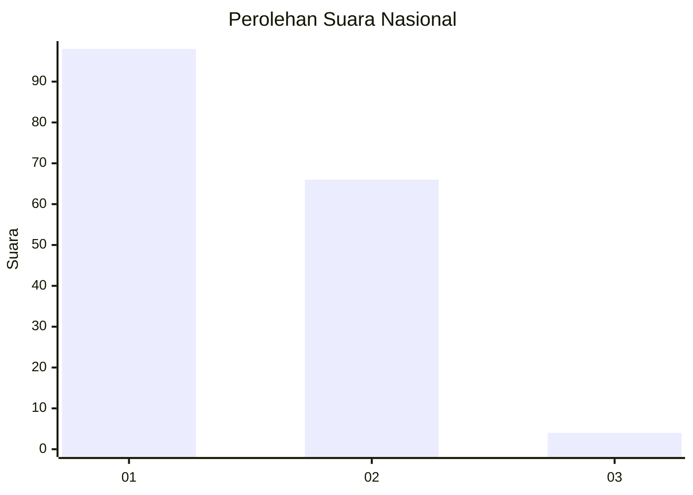
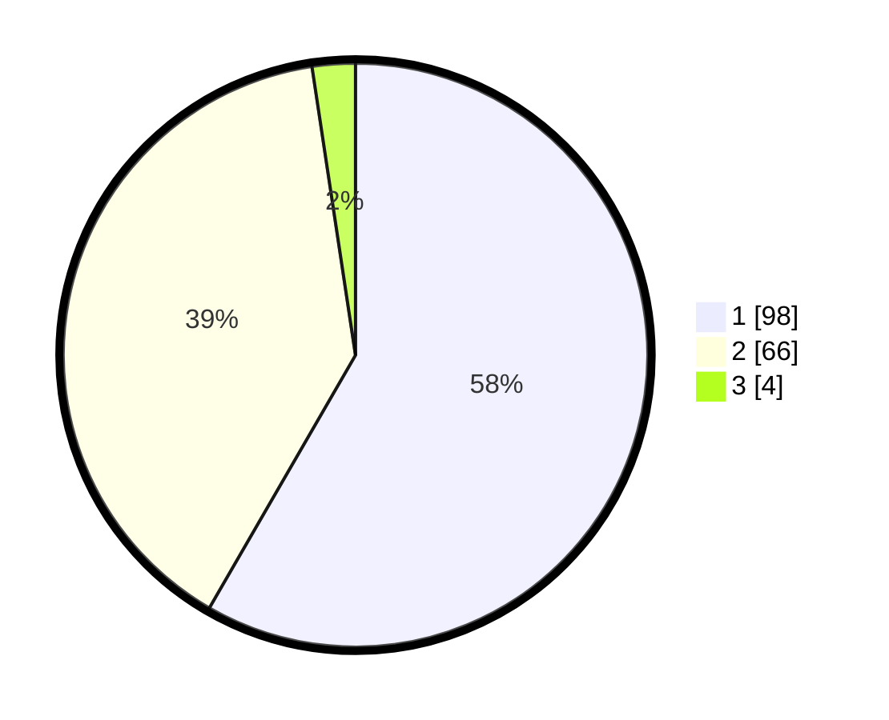

# Hasil

## Grafik

## Tabel

| No. | Nama Paslon    | Suara | Suara (raw) | Persentase |
|:--- |:-------------- | -----:| -----------:| ----------:|
| 1   | ANIES MUHAIMIN | 98    | [98][p-1]   | 58,33      |
| 2   | PRABOWO GIBRAN | 66    | [66][p-2]   | 39,29      |
| 3   | GANJAR MAHFUD  | 4     | [4][p-3]    | 2,38       |

[p-1]: https://github.com/gigit-pemilu/pemilu-2024/blob/main/pilpres/hitung-suara/sub/11-aceh/sub/03-aceh-timur/sub/04-birem-bayeun/sub/2021-buket-seuleumak/sub/002-tps/sub/paslon-1.txt
[p-2]: https://github.com/gigit-pemilu/pemilu-2024/blob/main/pilpres/hitung-suara/sub/11-aceh/sub/03-aceh-timur/sub/04-birem-bayeun/sub/2021-buket-seuleumak/sub/002-tps/sub/paslon-2.txt
[p-3]: https://github.com/gigit-pemilu/pemilu-2024/blob/main/pilpres/hitung-suara/sub/11-aceh/sub/03-aceh-timur/sub/04-birem-bayeun/sub/2021-buket-seuleumak/sub/002-tps/sub/paslon-3.txt

## Foto C Plano

https://sirekap-obj-formc.kpu.go.id/18e1/pemilu/ppwp/11/03/04/20/21/1103042021002-20240215-033710--0fad703c-54d3-4d8c-9fac-d8ef0e933692.jpg

https://sirekap-obj-formc.kpu.go.id/18e1/pemilu/ppwp/11/03/04/20/21/1103042021002-20240215-034612--f123d74c-2a32-4588-b771-2b6157ed9286.jpg

## Metadata

| Key        | Value               |
| ---------- | ------------------- |
| Time Stamp | 2024-02-24 22:31:28 |

