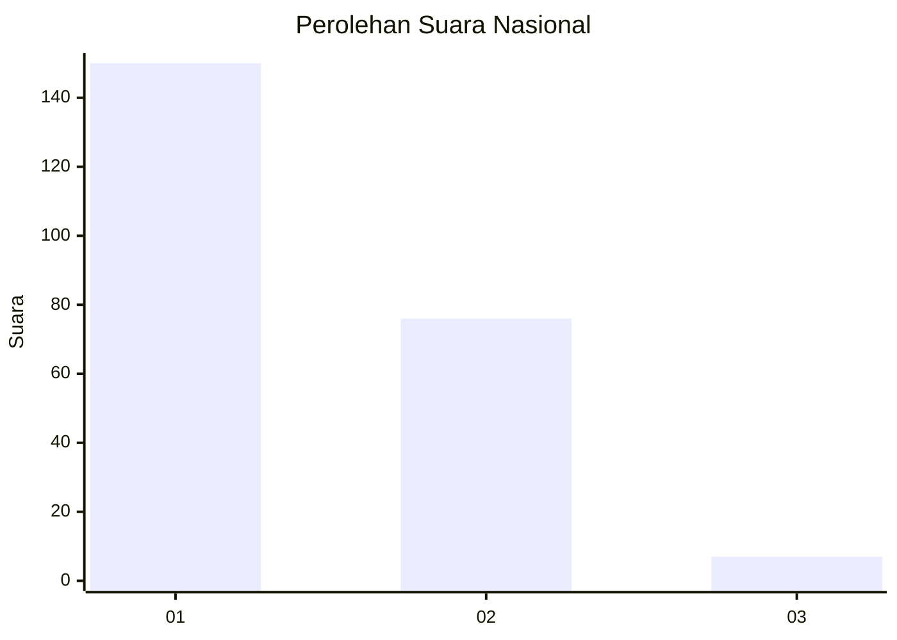
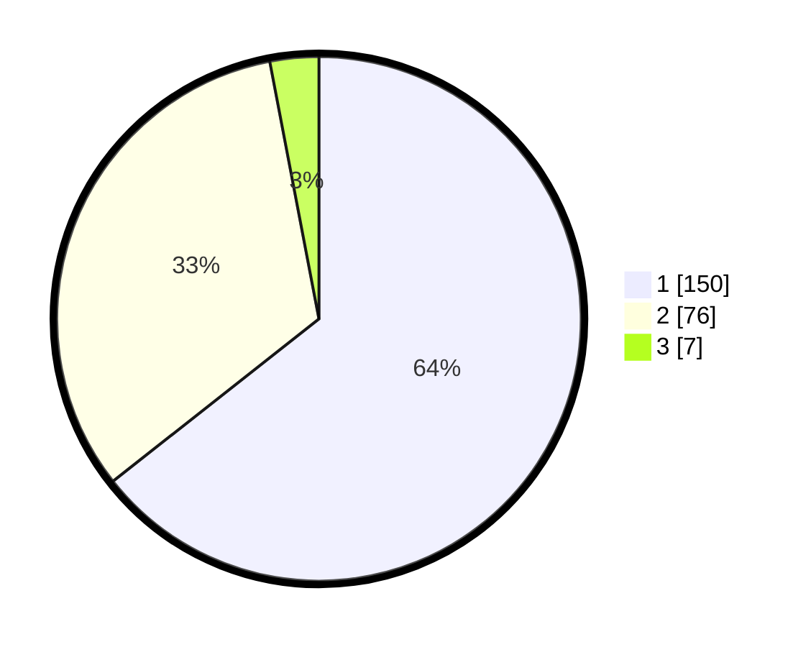

# Hasil

## Grafik

## Tabel

| No. | Nama Paslon    | Suara | Suara (raw) | Persentase |
|:--- |:-------------- | -----:| -----------:| ----------:|
| 1   | ANIES MUHAIMIN | 150   | [150][p-1]  | 64,38      |
| 2   | PRABOWO GIBRAN | 76    | [76][p-2]   | 32,62      |
| 3   | GANJAR MAHFUD  | 7     | [7][p-3]    | 3,00       |

[p-1]: https://github.com/gigit-pemilu/pemilu-2024/blob/main/pilpres/hitung-suara/sub/11-aceh/sub/03-aceh-timur/sub/04-birem-bayeun/sub/2023-alue-gadeng/sub/001-tps/sub/paslon-1.txt
[p-2]: https://github.com/gigit-pemilu/pemilu-2024/blob/main/pilpres/hitung-suara/sub/11-aceh/sub/03-aceh-timur/sub/04-birem-bayeun/sub/2023-alue-gadeng/sub/001-tps/sub/paslon-2.txt
[p-3]: https://github.com/gigit-pemilu/pemilu-2024/blob/main/pilpres/hitung-suara/sub/11-aceh/sub/03-aceh-timur/sub/04-birem-bayeun/sub/2023-alue-gadeng/sub/001-tps/sub/paslon-3.txt

## Foto C Plano

https://sirekap-obj-formc.kpu.go.id/364b/pemilu/ppwp/11/03/04/20/23/1103042023001-20240216-112753--0c554178-9cde-44fb-9709-274cbeacb8b8.jpg

https://sirekap-obj-formc.kpu.go.id/364b/pemilu/ppwp/11/03/04/20/23/1103042023001-20240216-121305--1f30feb4-05db-4502-af78-9e2ca3200150.jpg

https://sirekap-obj-formc.kpu.go.id/364b/pemilu/ppwp/11/03/04/20/23/1103042023001-20240216-121345--4a26fbde-239b-4cb9-b712-a96de200476f.jpg

## Metadata

| Key        | Value               |
| ---------- | ------------------- |
| Time Stamp | 2024-02-17 12:00:00 |

