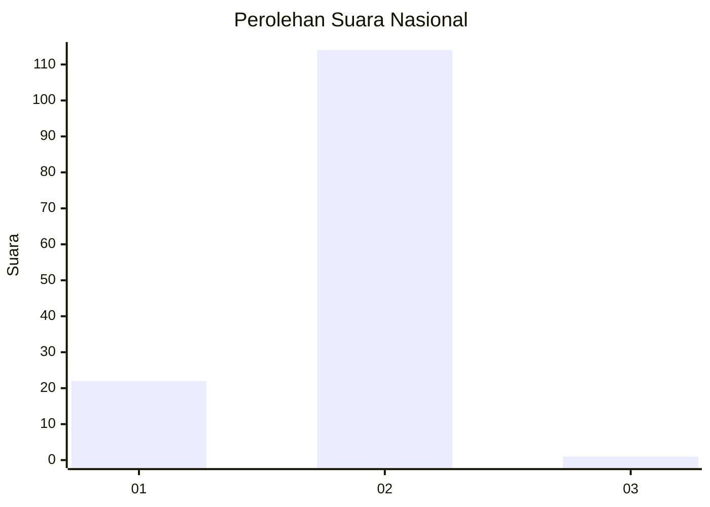
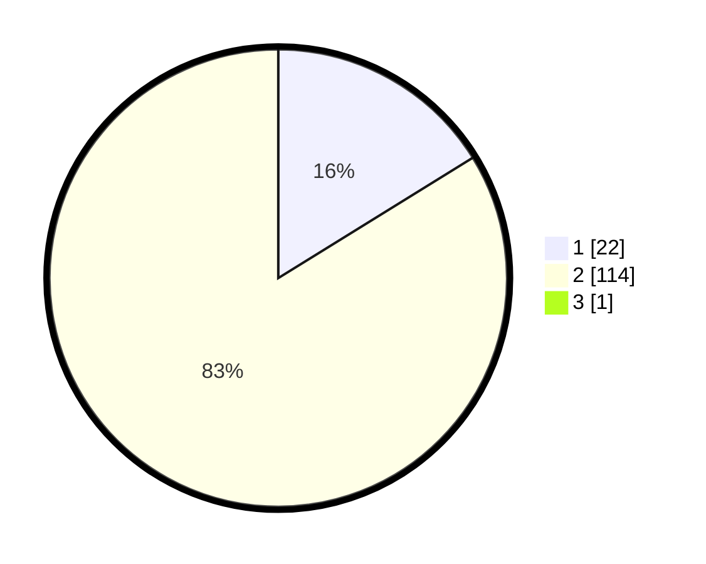

# Hasil

## Grafik

## Tabel

| No. | Nama Paslon    | Suara | Suara (raw) | Persentase |
|:--- |:-------------- | -----:| -----------:| ----------:|
| 1   | ANIES MUHAIMIN | 22    | [22][p-1]   | 16,06      |
| 2   | PRABOWO GIBRAN | 114   | [114][p-2]  | 83,21      |
| 3   | GANJAR MAHFUD  | 1     | [1][p-3]    | 0,73       |

[p-1]: https://github.com/gigit-pemilu/pemilu-2024/blob/main/pilpres/hitung-suara/sub/11-aceh/sub/03-aceh-timur/sub/04-birem-bayeun/sub/2024-alue-gadeng-dua/sub/002-tps/sub/paslon-1.txt
[p-2]: https://github.com/gigit-pemilu/pemilu-2024/blob/main/pilpres/hitung-suara/sub/11-aceh/sub/03-aceh-timur/sub/04-birem-bayeun/sub/2024-alue-gadeng-dua/sub/002-tps/sub/paslon-2.txt
[p-3]: https://github.com/gigit-pemilu/pemilu-2024/blob/main/pilpres/hitung-suara/sub/11-aceh/sub/03-aceh-timur/sub/04-birem-bayeun/sub/2024-alue-gadeng-dua/sub/002-tps/sub/paslon-3.txt

## Foto C Plano

https://sirekap-obj-formc.kpu.go.id/757a/pemilu/ppwp/11/03/04/20/24/1103042024002-20240214-193451--4fb8a037-cc79-4299-80f5-3f17a02fcc3c.jpg

https://sirekap-obj-formc.kpu.go.id/757a/pemilu/ppwp/11/03/04/20/24/1103042024002-20240214-193506--aa440967-879f-42ea-874e-04b46158abca.jpg

https://sirekap-obj-formc.kpu.go.id/757a/pemilu/ppwp/11/03/04/20/24/1103042024002-20240214-193609--ebc18458-a552-4a68-ac44-8ff3da749c99.jpg

## Metadata

| Key        | Value               |
| ---------- | ------------------- |
| Time Stamp | 2024-02-15 12:00:28 |

## DATA PEMILIH TETAP

Jumlah pemilih dalam DPT: **182**.
 * L: **92**.
 * P: **90**.

## DATA PENGGUNA HAK PILIH

Jumlah pengguna hak pilih dalam DPT: **133**.
 * L: **66**.
 * P: **67**.

Jumlah pengguna hak pilih dalam DPTb: **3**.
 * L: **1**.
 * P: **2**.

Jumlah pengguna hak pilih dalam DPK: **2**.
 * L: **0**.
 * P: **2**.

Jumlah pengguna hak pilih: **138**.
 * L: **67**.
 * P: **71**.

## JUMLAH SUARA SAH DAN TIDAK SAH

JUMLAH SELURUH SUARA SAH: **137**.

JUMLAH SUARA TIDAK SAH: **1**.

JUMLAH SELURUH SUARA SAH DAN SUARA TIDAK SAH: **138**.

