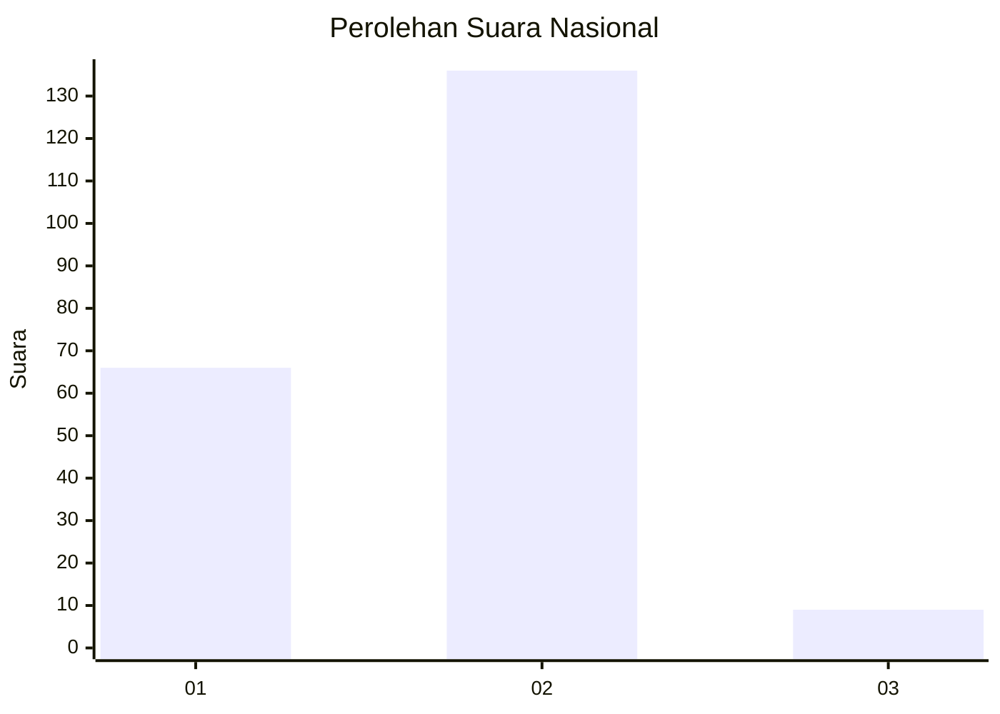
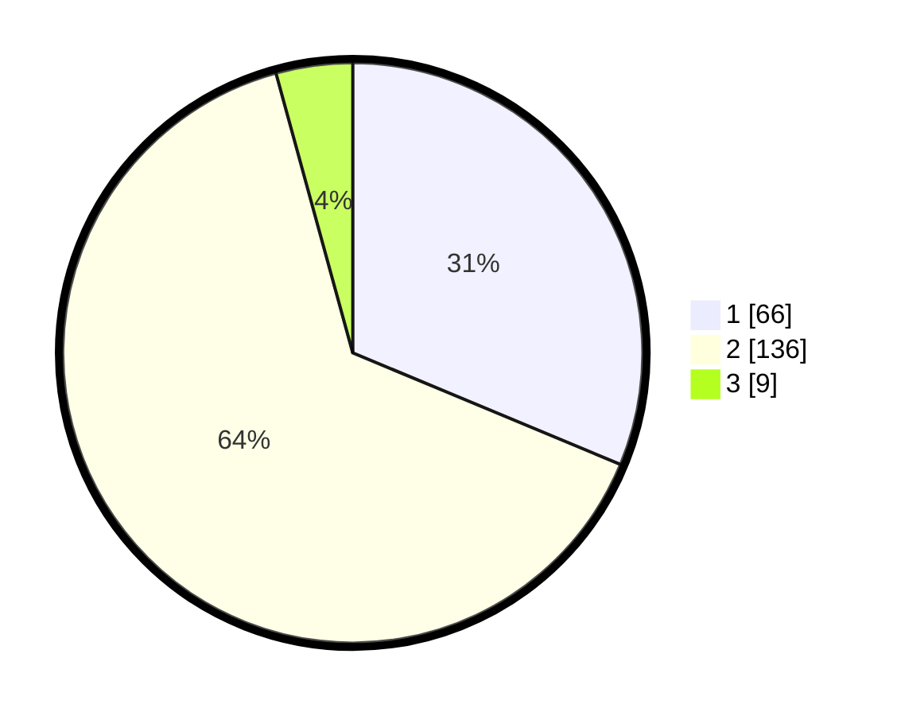

# Hasil

## Grafik

## Tabel

| No. | Nama Paslon    | Suara | Suara (raw) | Persentase |
|:--- |:-------------- | -----:| -----------:| ----------:|
| 1   | ANIES MUHAIMIN | 66    | [66][p-1]   | 31,28      |
| 2   | PRABOWO GIBRAN | 136   | [136][p-2]  | 64,45      |
| 3   | GANJAR MAHFUD  | 9     | [9][p-3]    | 4,27       |

[p-1]: https://github.com/gigit-pemilu/pemilu-2024/blob/main/pilpres/hitung-suara/sub/11-aceh/sub/03-aceh-timur/sub/04-birem-bayeun/sub/2025-alue-sentang/sub/001-tps/sub/paslon-1.txt
[p-2]: https://github.com/gigit-pemilu/pemilu-2024/blob/main/pilpres/hitung-suara/sub/11-aceh/sub/03-aceh-timur/sub/04-birem-bayeun/sub/2025-alue-sentang/sub/001-tps/sub/paslon-2.txt
[p-3]: https://github.com/gigit-pemilu/pemilu-2024/blob/main/pilpres/hitung-suara/sub/11-aceh/sub/03-aceh-timur/sub/04-birem-bayeun/sub/2025-alue-sentang/sub/001-tps/sub/paslon-3.txt

## Foto C Plano

https://sirekap-obj-formc.kpu.go.id/1d2a/pemilu/ppwp/11/03/04/20/25/1103042025001-20240215-031149--cc8c4ea2-5652-4fbd-8b28-addc1689489e.jpg

https://sirekap-obj-formc.kpu.go.id/1d2a/pemilu/ppwp/11/03/04/20/25/1103042025001-20240214-210658--8e87d7f2-c438-43cc-aece-37373095bc2a.jpg

https://sirekap-obj-formc.kpu.go.id/1d2a/pemilu/ppwp/11/03/04/20/25/1103042025001-20240214-212353--6d7bb709-7619-4468-8125-ffdb32a20f2a.jpg

## Metadata

| Key        | Value               |
| ---------- | ------------------- |
| Time Stamp | 2024-02-15 04:00:24 |

