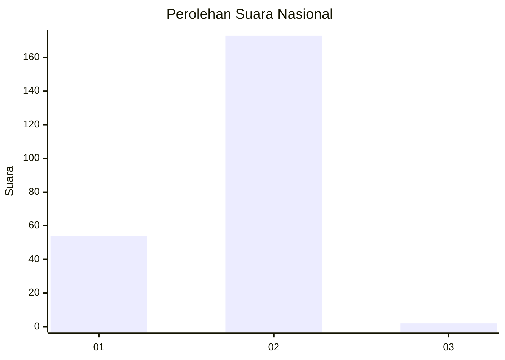
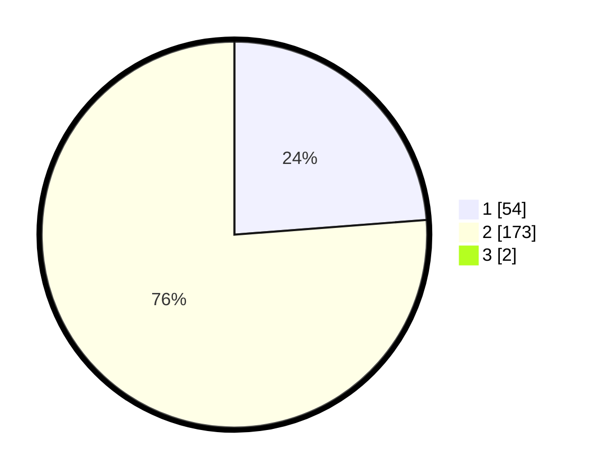

# Hasil

## Grafik

## Tabel

| No. | Nama Paslon    | Suara | Suara (raw) | Persentase |
|:--- |:-------------- | -----:| -----------:| ----------:|
| 1   | ANIES MUHAIMIN | 54    | [54][p-1]   | 23,58      |
| 2   | PRABOWO GIBRAN | 173   | [173][p-2]  | 75,55      |
| 3   | GANJAR MAHFUD  | 2     | [2][p-3]    | 0,87       |

[p-1]: https://github.com/gigit-pemilu/pemilu-2024/blob/main/pilpres/hitung-suara/sub/11-aceh/sub/03-aceh-timur/sub/04-birem-bayeun/sub/2025-alue-sentang/sub/003-tps/sub/paslon-1.txt
[p-2]: https://github.com/gigit-pemilu/pemilu-2024/blob/main/pilpres/hitung-suara/sub/11-aceh/sub/03-aceh-timur/sub/04-birem-bayeun/sub/2025-alue-sentang/sub/003-tps/sub/paslon-2.txt
[p-3]: https://github.com/gigit-pemilu/pemilu-2024/blob/main/pilpres/hitung-suara/sub/11-aceh/sub/03-aceh-timur/sub/04-birem-bayeun/sub/2025-alue-sentang/sub/003-tps/sub/paslon-3.txt

## Foto C Plano

https://sirekap-obj-formc.kpu.go.id/3361/pemilu/ppwp/11/03/04/20/25/1103042025003-20240215-023227--0ff8ece6-d8bc-4672-9efa-74baefae8bde.jpg

https://sirekap-obj-formc.kpu.go.id/3361/pemilu/ppwp/11/03/04/20/25/1103042025003-20240215-023717--b27808a3-1d6f-4583-866b-e97186a28d3b.jpg

https://sirekap-obj-formc.kpu.go.id/3361/pemilu/ppwp/11/03/04/20/25/1103042025003-20240215-023901--d5271dc7-19a8-4d63-a7c0-f1d20ffdf9bb.jpg

## Metadata

| Key        | Value               |
| ---------- | ------------------- |
| Time Stamp | 2024-02-24 22:31:28 |

