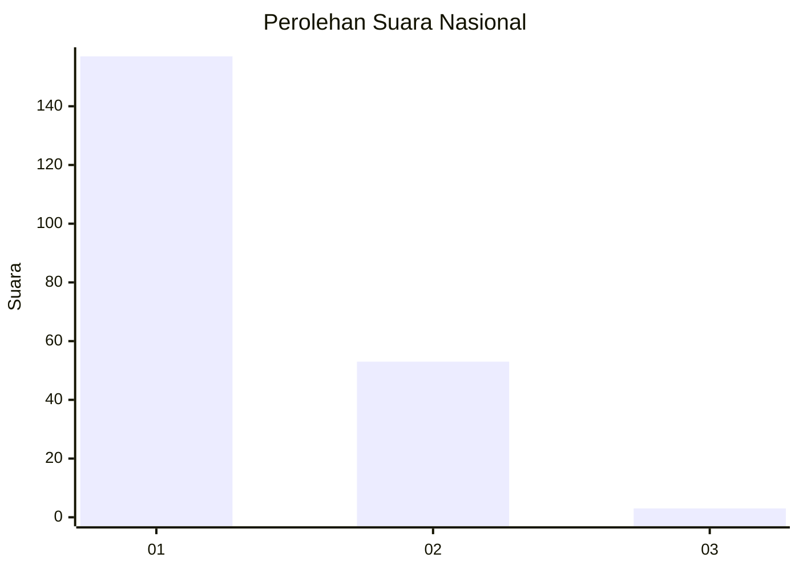
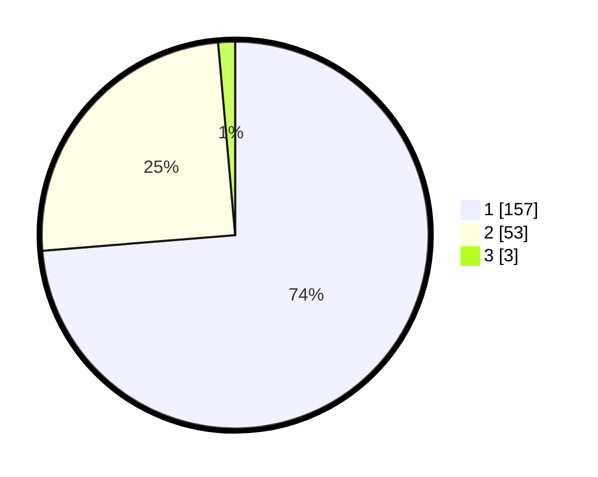

# Hasil

## Grafik

## Tabel

| No. | Nama Paslon    | Suara | Suara (raw) | Persentase |
|:--- |:-------------- | -----:| -----------:| ----------:|
| 1   | ANIES MUHAIMIN | 157   | [157][p-1]  | 73,71      |
| 2   | PRABOWO GIBRAN | 53    | [53][p-2]   | 24,88      |
| 3   | GANJAR MAHFUD  | 3     | [3][p-3]    | 1,41       |

[p-1]: https://github.com/gigit-pemilu/pemilu-2024/blob/main/pilpres/hitung-suara/sub/11-aceh/sub/03-aceh-timur/sub/05-serbajadi/sub/2001-lokop/sub/001-tps/sub/paslon-1.txt
[p-2]: https://github.com/gigit-pemilu/pemilu-2024/blob/main/pilpres/hitung-suara/sub/11-aceh/sub/03-aceh-timur/sub/05-serbajadi/sub/2001-lokop/sub/001-tps/sub/paslon-2.txt
[p-3]: https://github.com/gigit-pemilu/pemilu-2024/blob/main/pilpres/hitung-suara/sub/11-aceh/sub/03-aceh-timur/sub/05-serbajadi/sub/2001-lokop/sub/001-tps/sub/paslon-3.txt

## Foto C Plano

https://sirekap-obj-formc.kpu.go.id/9553/pemilu/ppwp/11/03/05/20/01/1103052001001-20240215-133309--2b792d55-a64c-42cf-8651-a7d0419a311d.jpg

https://sirekap-obj-formc.kpu.go.id/9553/pemilu/ppwp/11/03/05/20/01/1103052001001-20240220-123522--06cecd43-ffbf-4d80-b024-9558b0eb2cfb.jpg

https://sirekap-obj-formc.kpu.go.id/9553/pemilu/ppwp/11/03/05/20/01/1103052001001-20240219-192052--71883806-120b-4812-8e83-164a2e41dbc1.jpg

## Metadata

| Key        | Value               |
| ---------- | ------------------- |
| Time Stamp | 2024-02-21 18:00:00 |

## DATA PEMILIH TETAP

Jumlah pemilih dalam DPT: **245**.
 * L: **121**.
 * P: **124**.

## DATA PENGGUNA HAK PILIH

Jumlah pengguna hak pilih dalam DPT: **210**.
 * L: **119**.
 * P: **91**.

Jumlah pengguna hak pilih dalam DPTb: **1**.
 * L: **0**.
 * P: **1**.

Jumlah pengguna hak pilih dalam DPK: **2**.
 * L: **2**.
 * P: **0**.

Jumlah pengguna hak pilih: **213**.
 * L: **121**.
 * P: **92**.

## JUMLAH SUARA SAH DAN TIDAK SAH

JUMLAH SELURUH SUARA SAH: **213**.

JUMLAH SUARA TIDAK SAH: **0**.

JUMLAH SELURUH SUARA SAH DAN SUARA TIDAK SAH: **213**.

