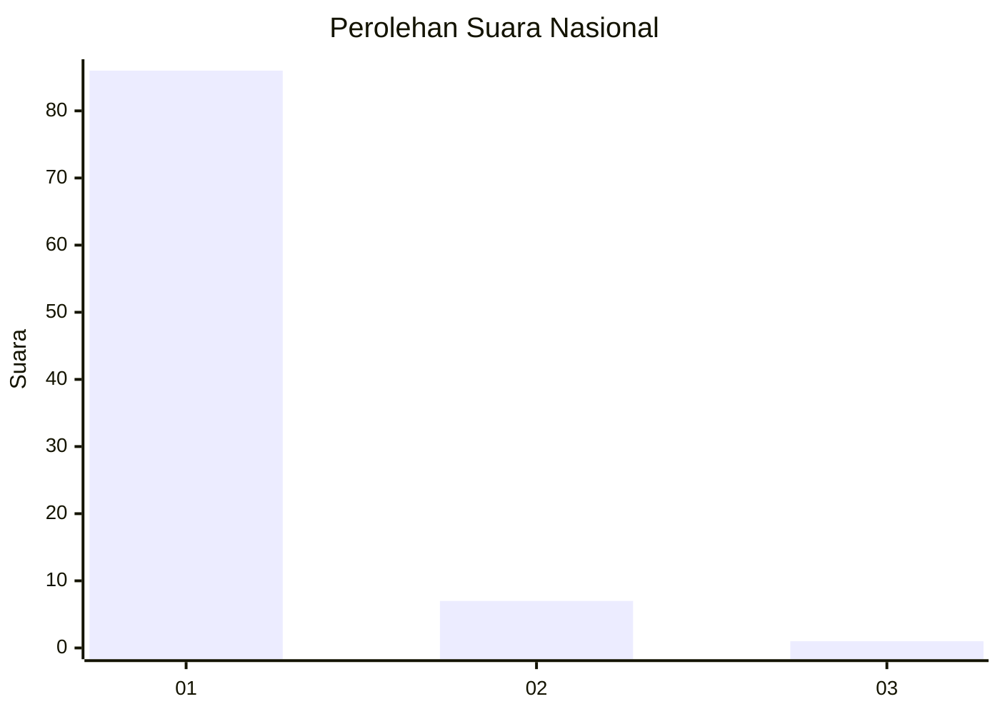
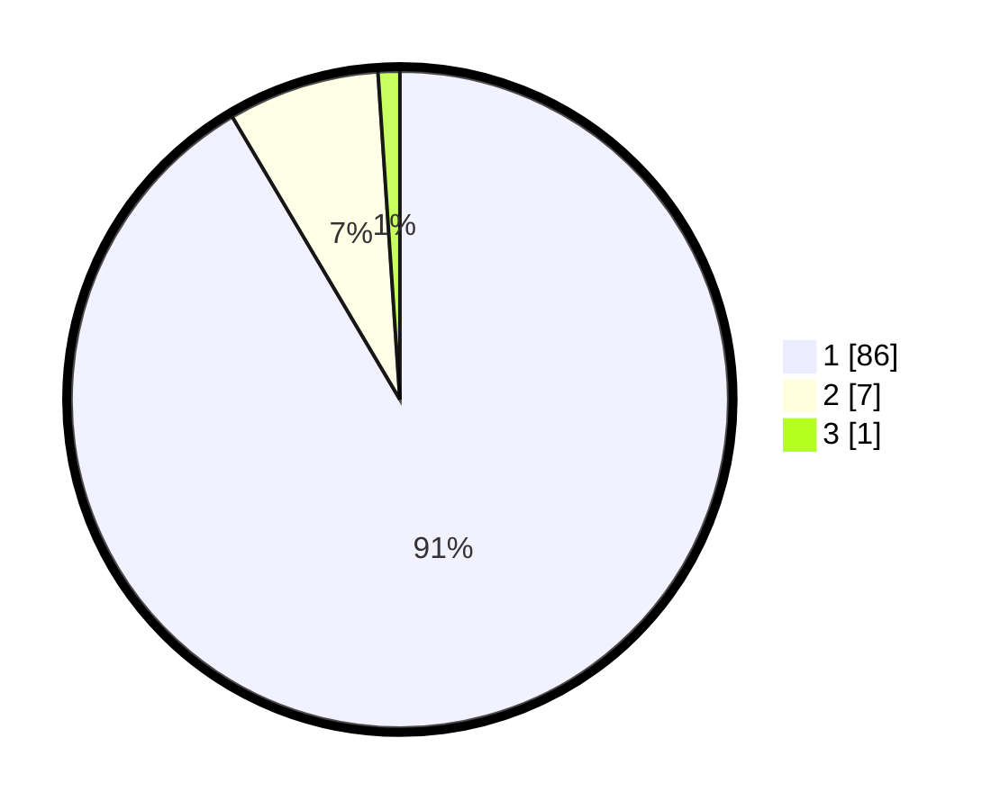

# Hasil

## Grafik

## Tabel

| No. | Nama Paslon    | Suara | Suara (raw) | Persentase |
|:--- |:-------------- | -----:| -----------:| ----------:|
| 1   | ANIES MUHAIMIN | 86    | [86][p-1]   | 91,49      |
| 2   | PRABOWO GIBRAN | 7     | [7][p-2]    | 7,45       |
| 3   | GANJAR MAHFUD  | 1     | [1][p-3]    | 1,06       |

[p-1]: https://github.com/gigit-pemilu/pemilu-2024/blob/main/pilpres/hitung-suara/sub/11-aceh/sub/03-aceh-timur/sub/05-serbajadi/sub/2006-nalon/sub/002-tps/sub/paslon-1.txt
[p-2]: https://github.com/gigit-pemilu/pemilu-2024/blob/main/pilpres/hitung-suara/sub/11-aceh/sub/03-aceh-timur/sub/05-serbajadi/sub/2006-nalon/sub/002-tps/sub/paslon-2.txt
[p-3]: https://github.com/gigit-pemilu/pemilu-2024/blob/main/pilpres/hitung-suara/sub/11-aceh/sub/03-aceh-timur/sub/05-serbajadi/sub/2006-nalon/sub/002-tps/sub/paslon-3.txt

## Foto C Plano

https://sirekap-obj-formc.kpu.go.id/3166/pemilu/ppwp/11/03/05/20/06/1103052006002-20240220-214329--d34c2701-ee58-4a6d-a37f-e8afcf26b7a3.jpg

https://sirekap-obj-formc.kpu.go.id/3166/pemilu/ppwp/11/03/05/20/06/1103052006002-20240214-212540--55c7679b-44f6-4b22-9027-abc8f203e438.jpg

https://sirekap-obj-formc.kpu.go.id/3166/pemilu/ppwp/11/03/05/20/06/1103052006002-20240214-213007--6c8f8283-891d-4a2f-8859-7c7be498d4d5.jpg

## Metadata

| Key        | Value               |
| ---------- | ------------------- |
| Time Stamp | 2024-02-20 22:00:00 |

