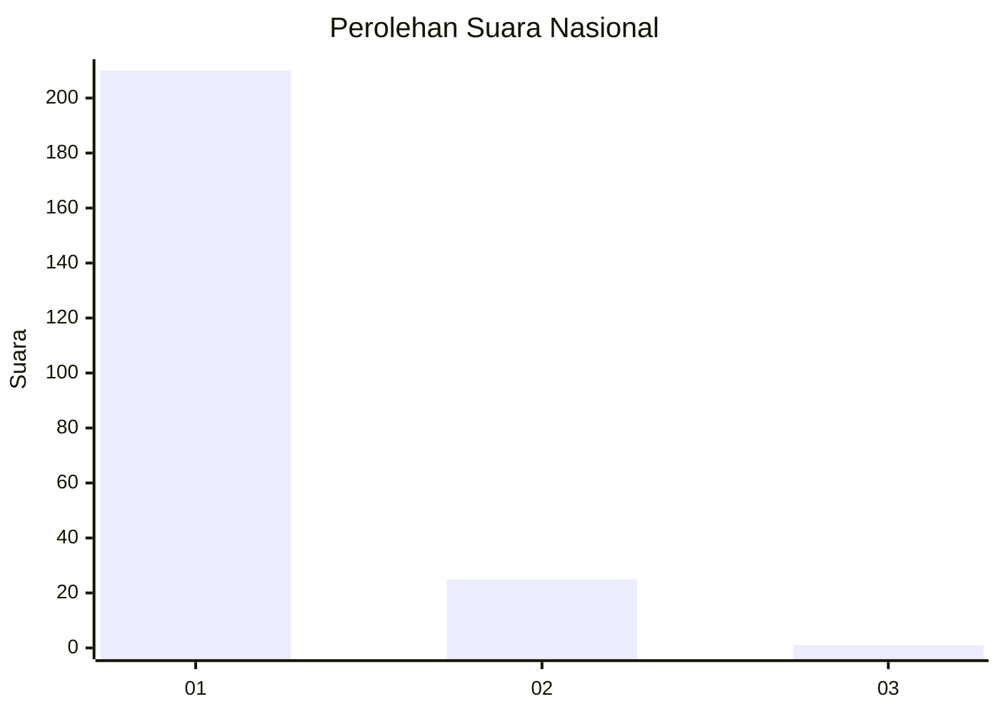
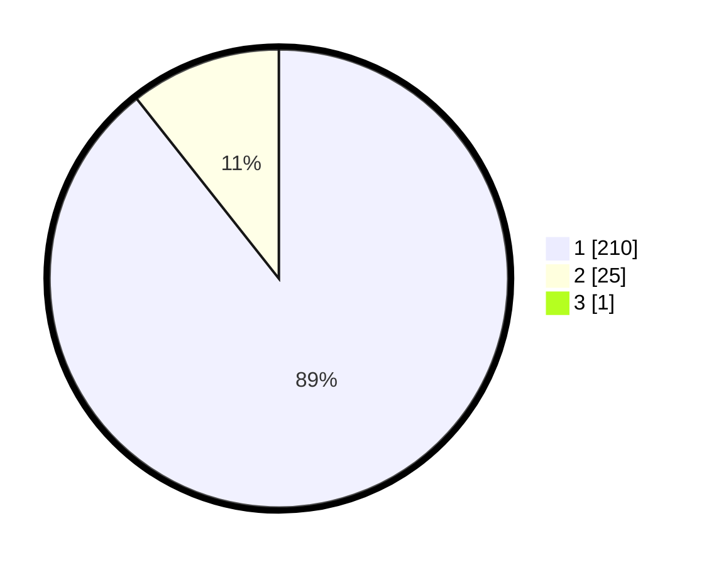

# Hasil

## Grafik

## Tabel

| No. | Nama Paslon    | Suara | Suara (raw) | Persentase |
|:--- |:-------------- | -----:| -----------:| ----------:|
| 1   | ANIES MUHAIMIN | 210   | [210][p-1]  | 88,98      |
| 2   | PRABOWO GIBRAN | 25    | [25][p-2]   | 10,59      |
| 3   | GANJAR MAHFUD  | 1     | [1][p-3]    | 0,42       |

[p-1]: https://github.com/gigit-pemilu/pemilu-2024/blob/main/pilpres/hitung-suara/sub/11-aceh/sub/03-aceh-timur/sub/05-serbajadi/sub/2010-sunti/sub/001-tps/sub/paslon-1.txt
[p-2]: https://github.com/gigit-pemilu/pemilu-2024/blob/main/pilpres/hitung-suara/sub/11-aceh/sub/03-aceh-timur/sub/05-serbajadi/sub/2010-sunti/sub/001-tps/sub/paslon-2.txt
[p-3]: https://github.com/gigit-pemilu/pemilu-2024/blob/main/pilpres/hitung-suara/sub/11-aceh/sub/03-aceh-timur/sub/05-serbajadi/sub/2010-sunti/sub/001-tps/sub/paslon-3.txt

## Foto C Plano

https://sirekap-obj-formc.kpu.go.id/8caf/pemilu/ppwp/11/03/05/20/10/1103052010001-20240219-130158--b321c7d2-580f-4f87-b829-ecaa2d3b5e21.jpg

https://sirekap-obj-formc.kpu.go.id/8caf/pemilu/ppwp/11/03/05/20/10/1103052010001-20240219-130852--1d72b199-de1d-48e3-903b-c2dbdfe2e574.jpg

https://sirekap-obj-formc.kpu.go.id/8caf/pemilu/ppwp/11/03/05/20/10/1103052010001-20240219-131007--7c7a88fc-3c07-4e19-89a3-ee08985c861f.jpg

## Metadata

| Key        | Value               |
| ---------- | ------------------- |
| Time Stamp | 2024-02-24 22:31:28 |

