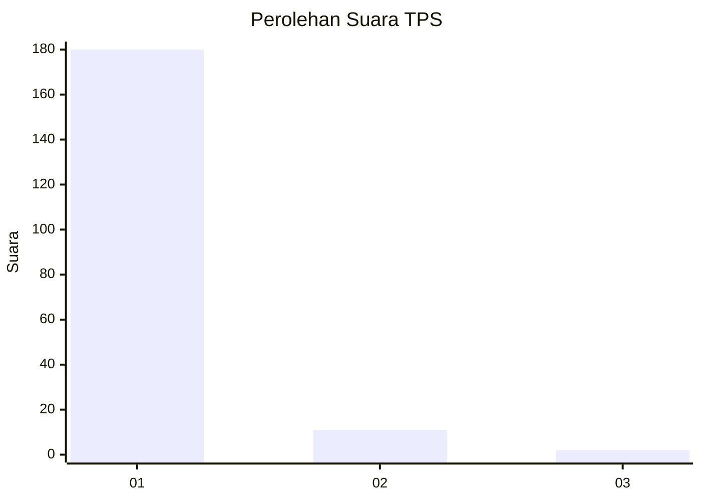
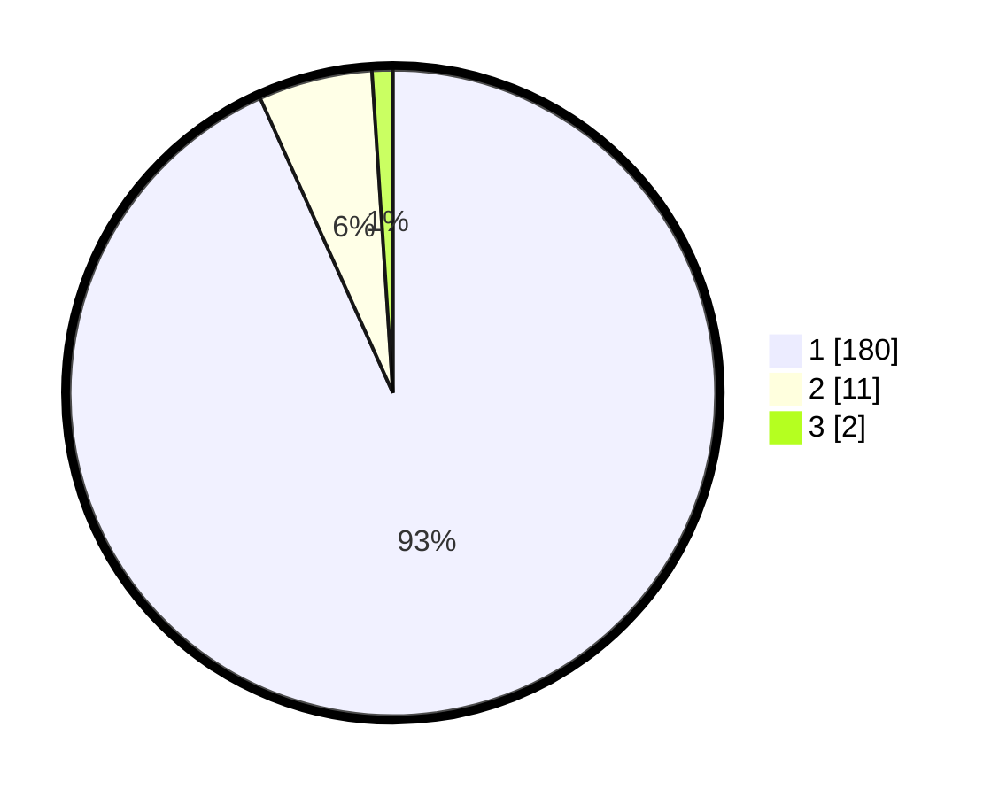

# Hasil

## Grafik

## Tabel

| No. | Nama Paslon    | Suara | Suara (raw) | Persentase |
|:--- |:-------------- | -----:| -----------:| ----------:|
| 1   | ANIES MUHAIMIN | 180   | [180][p-1]  | 93,26      |
| 2   | PRABOWO GIBRAN | 11    | [11][p-2]   | 5,70       |
| 3   | GANJAR MAHFUD  | 2     | [2][p-3]    | 1,04       |

[p-1]: https://github.com/gigit-pemilu/pemilu-2024-11-aceh/blob/main/pilpres/hitung-suara/sub/11-aceh/sub/03-aceh-timur/sub/05-serbajadi/sub/2012-bunin/sub/002-tps/sub/paslon-1.txt
[p-2]: https://github.com/gigit-pemilu/pemilu-2024-11-aceh/blob/main/pilpres/hitung-suara/sub/11-aceh/sub/03-aceh-timur/sub/05-serbajadi/sub/2012-bunin/sub/002-tps/sub/paslon-2.txt
[p-3]: https://github.com/gigit-pemilu/pemilu-2024-11-aceh/blob/main/pilpres/hitung-suara/sub/11-aceh/sub/03-aceh-timur/sub/05-serbajadi/sub/2012-bunin/sub/002-tps/sub/paslon-3.txt

## Foto C Plano

https://sirekap-obj-formc.kpu.go.id/cc71/pemilu/ppwp/11/03/05/20/12/1103052012002-20240215-104859--4b3b48ba-4952-4842-b18b-9922a07dc411.jpg

https://sirekap-obj-formc.kpu.go.id/cc71/pemilu/ppwp/11/03/05/20/12/1103052012002-20240215-105354--21afceca-2497-4e6e-8add-981c4e2641d5.jpg

https://sirekap-obj-formc.kpu.go.id/cc71/pemilu/ppwp/11/03/05/20/12/1103052012002-20240215-121655--2b6dab5f-325c-46e8-bbd4-a52a6848355c.jpg

## Metadata

| Key        | Value               |
| ---------- | ------------------- |
| Time Stamp | 2024-02-24 22:31:28 |

