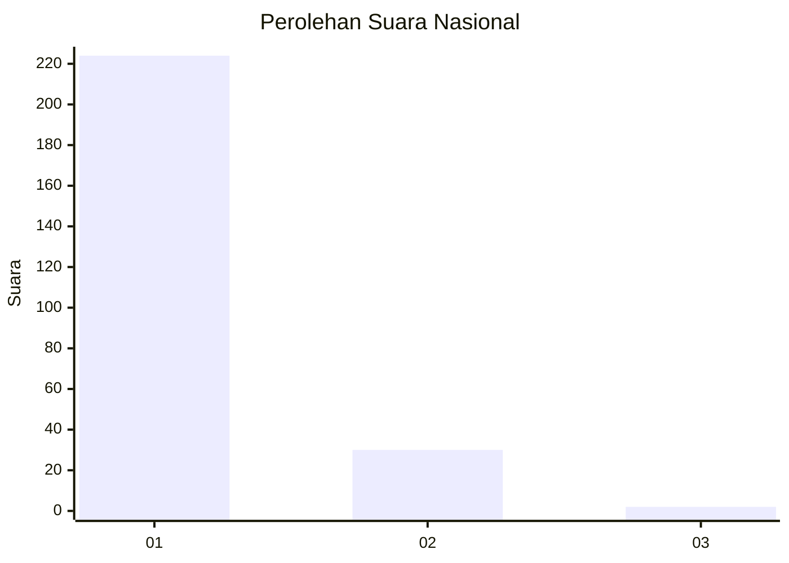
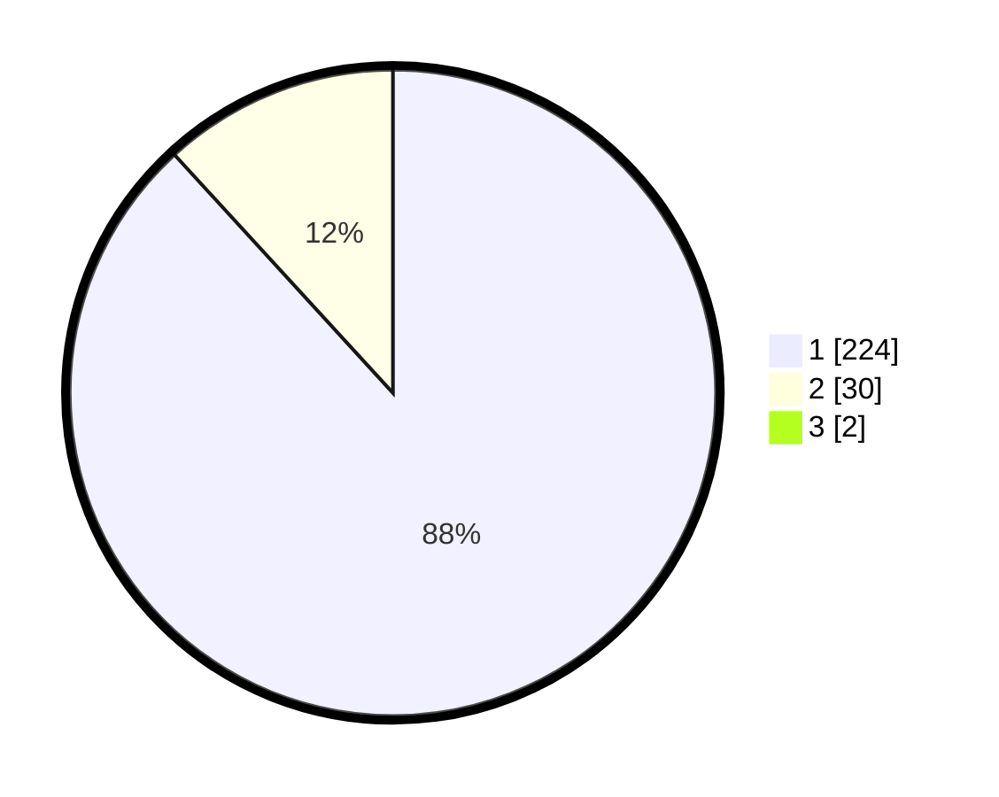

# Hasil

## Grafik

## Tabel

| No. | Nama Paslon    | Suara | Suara (raw) | Persentase |
|:--- |:-------------- | -----:| -----------:| ----------:|
| 1   | ANIES MUHAIMIN | 224   | [224][p-1]  | 87,50      |
| 2   | PRABOWO GIBRAN | 30    | [30][p-2]   | 11,72      |
| 3   | GANJAR MAHFUD  | 2     | [2][p-3]    | 0,78       |

[p-1]: https://github.com/gigit-pemilu/pemilu-2024/blob/main/pilpres/hitung-suara/sub/11-aceh/sub/03-aceh-timur/sub/05-serbajadi/sub/2012-bunin/sub/003-tps/sub/paslon-1.txt
[p-2]: https://github.com/gigit-pemilu/pemilu-2024/blob/main/pilpres/hitung-suara/sub/11-aceh/sub/03-aceh-timur/sub/05-serbajadi/sub/2012-bunin/sub/003-tps/sub/paslon-2.txt
[p-3]: https://github.com/gigit-pemilu/pemilu-2024/blob/main/pilpres/hitung-suara/sub/11-aceh/sub/03-aceh-timur/sub/05-serbajadi/sub/2012-bunin/sub/003-tps/sub/paslon-3.txt

## Foto C Plano

https://sirekap-obj-formc.kpu.go.id/51aa/pemilu/ppwp/11/03/05/20/12/1103052012003-20240214-203059--b3e0d909-f347-47da-a0e5-ef18139c7dae.jpg

https://sirekap-obj-formc.kpu.go.id/51aa/pemilu/ppwp/11/03/05/20/12/1103052012003-20240214-193744--9e3f691b-7414-4648-a021-d650c45200e5.jpg

https://sirekap-obj-formc.kpu.go.id/51aa/pemilu/ppwp/11/03/05/20/12/1103052012003-20240214-194015--c1a280a4-ed88-455e-aaff-592a0ca3e13b.jpg

## Metadata

| Key        | Value               |
| ---------- | ------------------- |
| Time Stamp | 2024-02-15 00:41:44 |

