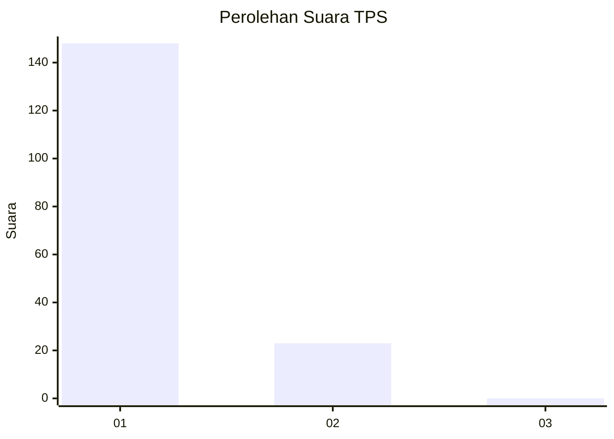
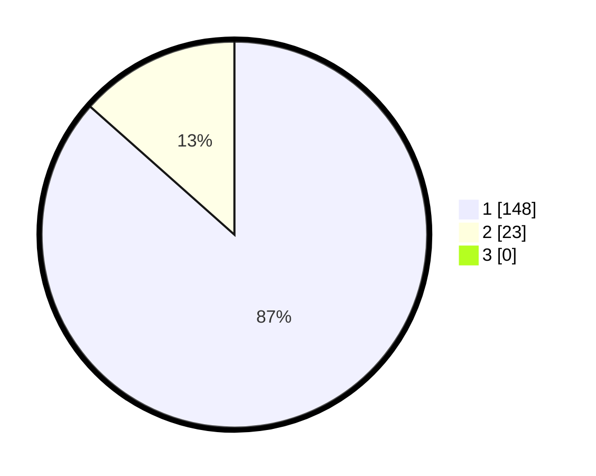

# Hasil

## Grafik

## Tabel

| No. | Nama Paslon    | Suara | Suara (raw) | Persentase |
|:--- |:-------------- | -----:| -----------:| ----------:|
| 1   | ANIES MUHAIMIN | 148   | [148][p-1]  | 86,55      |
| 2   | PRABOWO GIBRAN | 23    | [23][p-2]   | 13,45      |
| 3   | GANJAR MAHFUD  | 0     | [0][p-3]    | 0,00       |

[p-1]: https://github.com/gigit-pemilu/pemilu-2024-11-aceh/blob/main/pilpres/hitung-suara/sub/11-aceh/sub/03-aceh-timur/sub/05-serbajadi/sub/2015-mesir/sub/001-tps/sub/paslon-1.txt
[p-2]: https://github.com/gigit-pemilu/pemilu-2024-11-aceh/blob/main/pilpres/hitung-suara/sub/11-aceh/sub/03-aceh-timur/sub/05-serbajadi/sub/2015-mesir/sub/001-tps/sub/paslon-2.txt
[p-3]: https://github.com/gigit-pemilu/pemilu-2024-11-aceh/blob/main/pilpres/hitung-suara/sub/11-aceh/sub/03-aceh-timur/sub/05-serbajadi/sub/2015-mesir/sub/001-tps/sub/paslon-3.txt

## Foto C Plano

https://sirekap-obj-formc.kpu.go.id/3882/pemilu/ppwp/11/03/05/20/15/1103052015001-20240219-105921--6d5a95ad-35e1-4fe1-9853-5dbb54749e74.jpg

https://sirekap-obj-formc.kpu.go.id/3882/pemilu/ppwp/11/03/05/20/15/1103052015001-20240214-235328--c6fcf0e9-7aae-48fb-a899-731c01bccd5f.jpg

https://sirekap-obj-formc.kpu.go.id/3882/pemilu/ppwp/11/03/05/20/15/1103052015001-20240214-235604--4ffaeff7-0cee-4b65-86b5-b4288f5fc24a.jpg

## Metadata

| Key        | Value               |
| ---------- | ------------------- |
| Time Stamp | 2024-02-25 11:00:00 |

