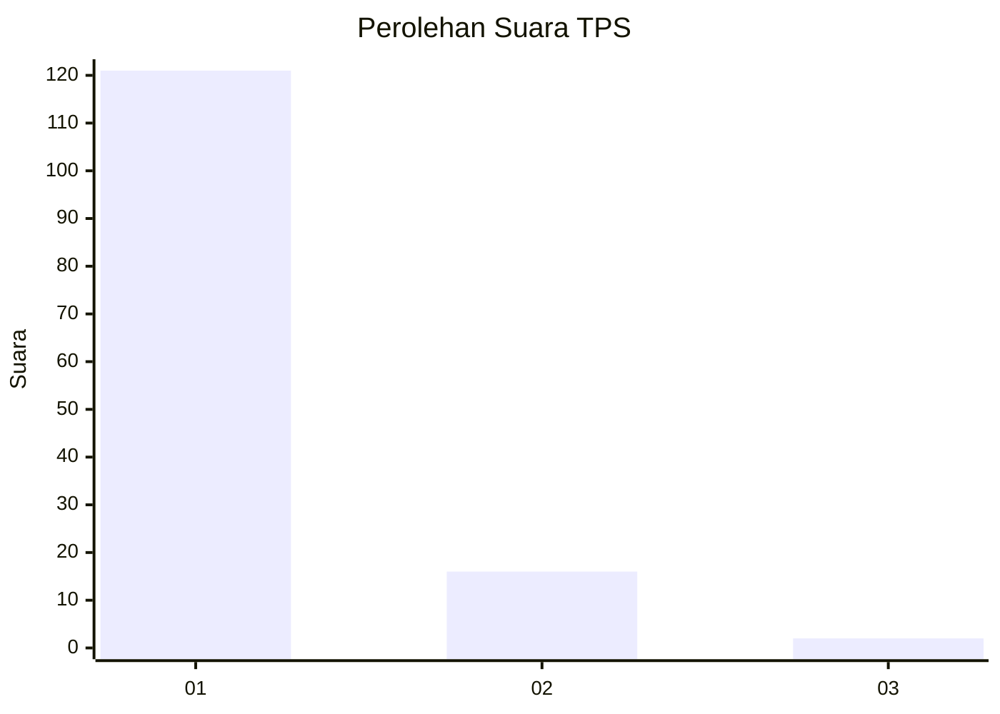
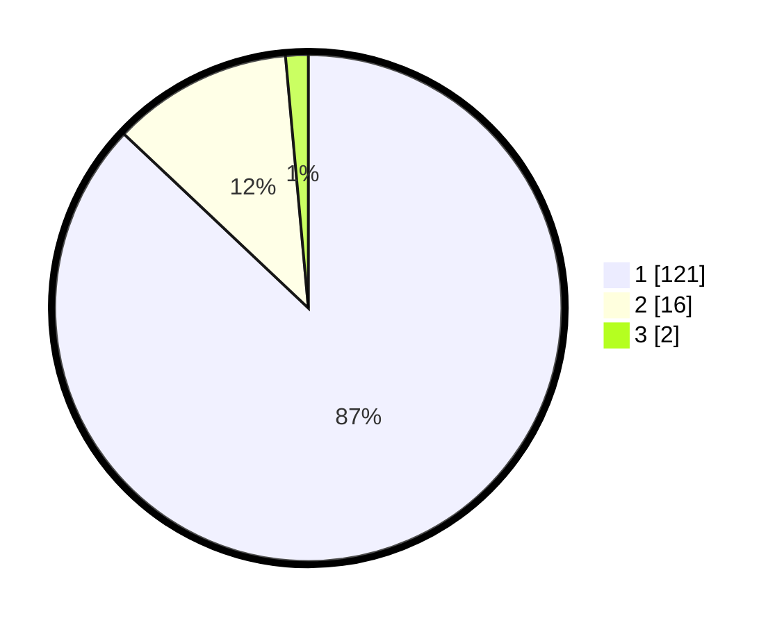

# Hasil

## Grafik

## Tabel

| No. | Nama Paslon    | Suara | Suara (raw) | Persentase |
|:--- |:-------------- | -----:| -----------:| ----------:|
| 1   | ANIES MUHAIMIN | 121   | [121][p-1]  | 87,05      |
| 2   | PRABOWO GIBRAN | 16    | [16][p-2]   | 11,51      |
| 3   | GANJAR MAHFUD  | 2     | [2][p-3]    | 1,44       |

[p-1]: https://github.com/gigit-pemilu/pemilu-2024-11-aceh/blob/main/pilpres/hitung-suara/sub/11-aceh/sub/03-aceh-timur/sub/05-serbajadi/sub/2022-arul-durin/sub/002-tps/sub/paslon-1.txt
[p-2]: https://github.com/gigit-pemilu/pemilu-2024-11-aceh/blob/main/pilpres/hitung-suara/sub/11-aceh/sub/03-aceh-timur/sub/05-serbajadi/sub/2022-arul-durin/sub/002-tps/sub/paslon-2.txt
[p-3]: https://github.com/gigit-pemilu/pemilu-2024-11-aceh/blob/main/pilpres/hitung-suara/sub/11-aceh/sub/03-aceh-timur/sub/05-serbajadi/sub/2022-arul-durin/sub/002-tps/sub/paslon-3.txt

## Foto C Plano

https://sirekap-obj-formc.kpu.go.id/e511/pemilu/ppwp/11/03/05/20/22/1103052022002-20240217-221157--8b7861f5-34e7-488c-b722-53251beffde8.jpg

https://sirekap-obj-formc.kpu.go.id/e511/pemilu/ppwp/11/03/05/20/22/1103052022002-20240217-221159--cdda5994-3799-49ea-af6e-bfad19395fa6.jpg

https://sirekap-obj-formc.kpu.go.id/e511/pemilu/ppwp/11/03/05/20/22/1103052022002-20240217-221158--4b7116ee-74ec-4257-8821-84efd66babaa.jpg

## Metadata

| Key        | Value               |
| ---------- | ------------------- |
| Time Stamp | 2024-02-19 08:00:00 |

## DATA PEMILIH TETAP

Jumlah pemilih dalam DPT: **146**.
 * L: **72**.
 * P: **74**.

## DATA PENGGUNA HAK PILIH

Jumlah pengguna hak pilih dalam DPT: **138**.
 * L: **68**.
 * P: **70**.

Jumlah pengguna hak pilih dalam DPTb: **0**.
 * L: **0**.
 * P: **0**.

Jumlah pengguna hak pilih dalam DPK: **2**.
 * L: **2**.
 * P: **0**.

Jumlah pengguna hak pilih: **140**.
 * L: **70**.
 * P: **70**.

## JUMLAH SUARA SAH DAN TIDAK SAH

JUMLAH SELURUH SUARA SAH: **139**.

JUMLAH SUARA TIDAK SAH: **1**.

JUMLAH SELURUH SUARA SAH DAN SUARA TIDAK SAH: **140**.

