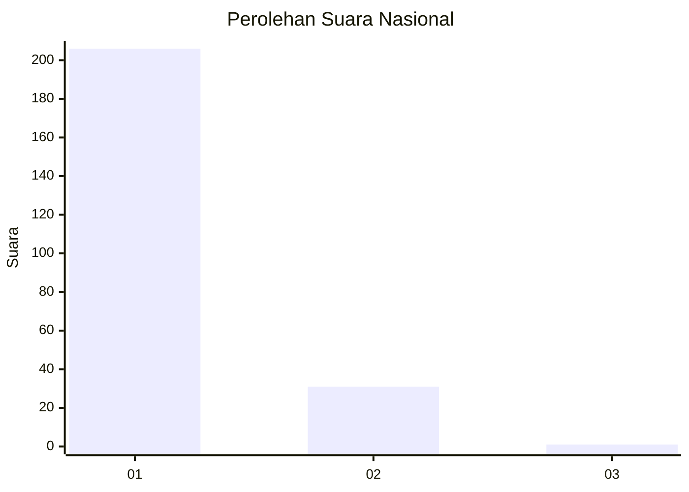
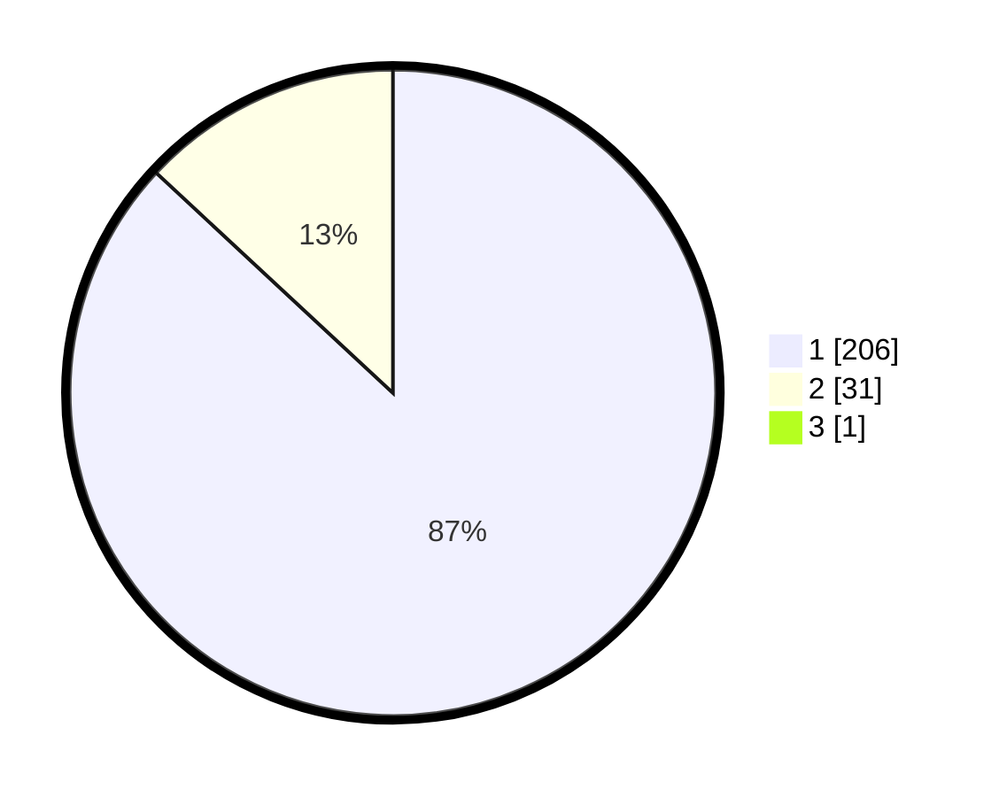

# Hasil

## Grafik

## Tabel

| No. | Nama Paslon    | Suara | Suara (raw) | Persentase |
|:--- |:-------------- | -----:| -----------:| ----------:|
| 1   | ANIES MUHAIMIN | 206   | [206][p-1]  | 86,55      |
| 2   | PRABOWO GIBRAN | 31    | [31][p-2]   | 13,03      |
| 3   | GANJAR MAHFUD  | 1     | [1][p-3]    | 0,42       |

[p-1]: https://github.com/gigit-pemilu/pemilu-2024/blob/main/pilpres/hitung-suara/sub/11-aceh/sub/03-aceh-timur/sub/06-nurussalam/sub/2001-keude-bagok-sa/sub/001-tps/sub/paslon-1.txt
[p-2]: https://github.com/gigit-pemilu/pemilu-2024/blob/main/pilpres/hitung-suara/sub/11-aceh/sub/03-aceh-timur/sub/06-nurussalam/sub/2001-keude-bagok-sa/sub/001-tps/sub/paslon-2.txt
[p-3]: https://github.com/gigit-pemilu/pemilu-2024/blob/main/pilpres/hitung-suara/sub/11-aceh/sub/03-aceh-timur/sub/06-nurussalam/sub/2001-keude-bagok-sa/sub/001-tps/sub/paslon-3.txt

## Foto C Plano

https://sirekap-obj-formc.kpu.go.id/dbcf/pemilu/ppwp/11/03/06/20/01/1103062001001-20240215-093045--0c720c47-e649-4b15-9210-98e8b4c0aaec.jpg

https://sirekap-obj-formc.kpu.go.id/dbcf/pemilu/ppwp/11/03/06/20/01/1103062001001-20240215-093049--11960b52-8b28-4a56-b2d8-a5c86e919780.jpg

https://sirekap-obj-formc.kpu.go.id/dbcf/pemilu/ppwp/11/03/06/20/01/1103062001001-20240215-093052--7a5dc4c8-8af1-41a1-b5ec-e5772aa5f65a.jpg

## Metadata

| Key        | Value               |
| ---------- | ------------------- |
| Time Stamp | 2024-02-16 12:51:22 |

