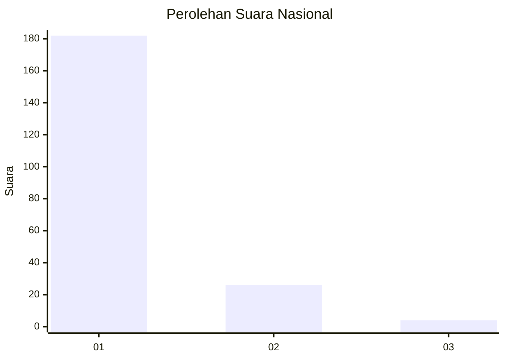
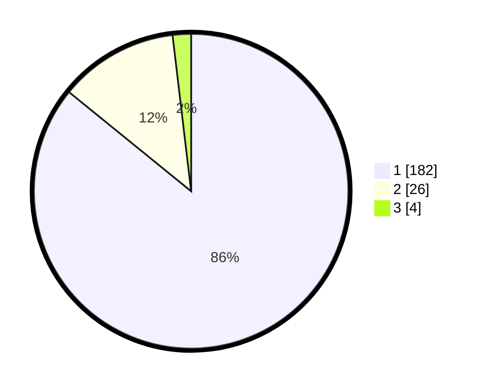

# Hasil

## Grafik

## Tabel

| No. | Nama Paslon    | Suara | Suara (raw) | Persentase |
|:--- |:-------------- | -----:| -----------:| ----------:|
| 1   | ANIES MUHAIMIN | 182   | [182][p-1]  | 85,85      |
| 2   | PRABOWO GIBRAN | 26    | [26][p-2]   | 12,26      |
| 3   | GANJAR MAHFUD  | 4     | [4][p-3]    | 1,89       |

[p-1]: https://github.com/gigit-pemilu/pemilu-2024/blob/main/pilpres/hitung-suara/sub/11-aceh/sub/03-aceh-timur/sub/06-nurussalam/sub/2002-keude-bagok-dua/sub/001-tps/sub/paslon-1.txt
[p-2]: https://github.com/gigit-pemilu/pemilu-2024/blob/main/pilpres/hitung-suara/sub/11-aceh/sub/03-aceh-timur/sub/06-nurussalam/sub/2002-keude-bagok-dua/sub/001-tps/sub/paslon-2.txt
[p-3]: https://github.com/gigit-pemilu/pemilu-2024/blob/main/pilpres/hitung-suara/sub/11-aceh/sub/03-aceh-timur/sub/06-nurussalam/sub/2002-keude-bagok-dua/sub/001-tps/sub/paslon-3.txt

## Foto C Plano

https://sirekap-obj-formc.kpu.go.id/2b04/pemilu/ppwp/11/03/06/20/02/1103062002001-20240215-075206--5eaa9f4d-059e-4d7f-ad26-09fc5a13a514.jpg

https://sirekap-obj-formc.kpu.go.id/2b04/pemilu/ppwp/11/03/06/20/02/1103062002001-20240214-225142--f93215a2-a55d-4b8c-8647-7f88f2626252.jpg

https://sirekap-obj-formc.kpu.go.id/2b04/pemilu/ppwp/11/03/06/20/02/1103062002001-20240214-225811--0c506105-512f-4f73-9fde-b2eaa9092a55.jpg

## Metadata

| Key        | Value               |
| ---------- | ------------------- |
| Time Stamp | 2024-02-15 15:00:29 |

## DATA PEMILIH TETAP

Jumlah pemilih dalam DPT: **260**.
 * L: **127**.
 * P: **133**.

## DATA PENGGUNA HAK PILIH

Jumlah pengguna hak pilih dalam DPT: **203**.
 * L: **92**.
 * P: **111**.

Jumlah pengguna hak pilih dalam DPTb: **1**.
 * L: **1**.
 * P: **0**.

Jumlah pengguna hak pilih dalam DPK: **10**.
 * L: **7**.
 * P: **3**.

Jumlah pengguna hak pilih: **214**.
 * L: **100**.
 * P: **114**.

## JUMLAH SUARA SAH DAN TIDAK SAH

JUMLAH SELURUH SUARA SAH: **212**.

JUMLAH SUARA TIDAK SAH: **2**.

JUMLAH SELURUH SUARA SAH DAN SUARA TIDAK SAH: **214**.

