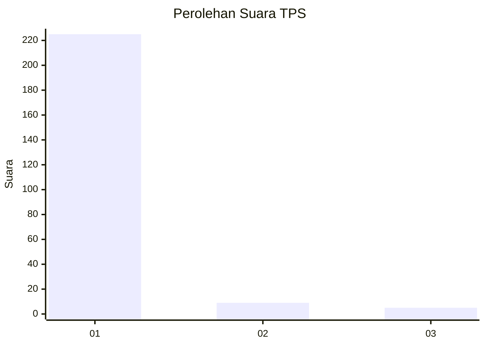
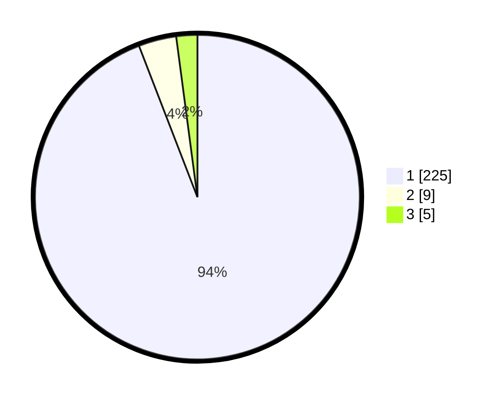

# Hasil

## Grafik

## Tabel

| No. | Nama Paslon    | Suara | Suara (raw) | Persentase |
|:--- |:-------------- | -----:| -----------:| ----------:|
| 1   | ANIES MUHAIMIN | 225   | [225][p-1]  | 94,14      |
| 2   | PRABOWO GIBRAN | 9     | [9][p-2]    | 3,77       |
| 3   | GANJAR MAHFUD  | 5     | [5][p-3]    | 2,09       |

[p-1]: https://github.com/gigit-pemilu/pemilu-2024-11-aceh/blob/main/pilpres/hitung-suara/sub/11-aceh/sub/03-aceh-timur/sub/06-nurussalam/sub/2002-keude-bagok-dua/sub/002-tps/sub/paslon-1.txt
[p-2]: https://github.com/gigit-pemilu/pemilu-2024-11-aceh/blob/main/pilpres/hitung-suara/sub/11-aceh/sub/03-aceh-timur/sub/06-nurussalam/sub/2002-keude-bagok-dua/sub/002-tps/sub/paslon-2.txt
[p-3]: https://github.com/gigit-pemilu/pemilu-2024-11-aceh/blob/main/pilpres/hitung-suara/sub/11-aceh/sub/03-aceh-timur/sub/06-nurussalam/sub/2002-keude-bagok-dua/sub/002-tps/sub/paslon-3.txt

## Foto C Plano

https://sirekap-obj-formc.kpu.go.id/42f4/pemilu/ppwp/11/03/06/20/02/1103062002002-20240215-031735--999c4339-1827-4241-b3d2-2e8d98731553.jpg

https://sirekap-obj-formc.kpu.go.id/42f4/pemilu/ppwp/11/03/06/20/02/1103062002002-20240215-031844--fddf8e1b-b260-42cb-b2ef-97bb5c685f62.jpg

https://sirekap-obj-formc.kpu.go.id/42f4/pemilu/ppwp/11/03/06/20/02/1103062002002-20240215-064750--298dc58f-3ed0-468e-ae3c-c63325c96941.jpg

## Metadata

| Key        | Value               |
| ---------- | ------------------- |
| Time Stamp | 2024-02-15 20:00:44 |

## DATA PEMILIH TETAP

Jumlah pemilih dalam DPT: **283**.
 * L: **138**.
 * P: **145**.

## DATA PENGGUNA HAK PILIH

Jumlah pengguna hak pilih dalam DPT: **243**.
 * L: **119**.
 * P: **124**.

Jumlah pengguna hak pilih dalam DPTb: **0**.
 * L: **0**.
 * P: **0**.

Jumlah pengguna hak pilih dalam DPK: **0**.
 * L: **0**.
 * P: **0**.

Jumlah pengguna hak pilih: **243**.
 * L: **119**.
 * P: **124**.

## JUMLAH SUARA SAH DAN TIDAK SAH

JUMLAH SELURUH SUARA SAH: **239**.

JUMLAH SUARA TIDAK SAH: **4**.

JUMLAH SELURUH SUARA SAH DAN SUARA TIDAK SAH: **243**.

