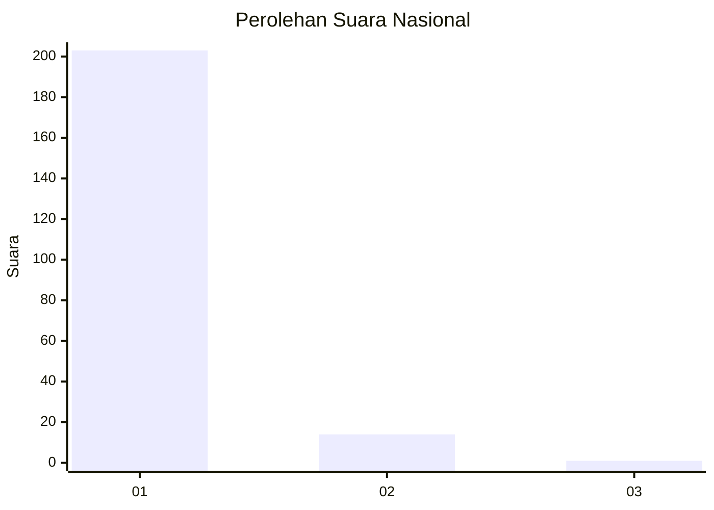
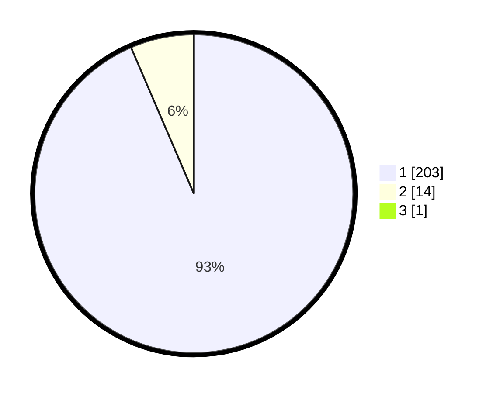

# Hasil

## Grafik

## Tabel

| No. | Nama Paslon    | Suara | Suara (raw) | Persentase |
|:--- |:-------------- | -----:| -----------:| ----------:|
| 1   | ANIES MUHAIMIN | 203   | [203][p-1]  | 93,12      |
| 2   | PRABOWO GIBRAN | 14    | [14][p-2]   | 6,42       |
| 3   | GANJAR MAHFUD  | 1     | [1][p-3]    | 0,46       |

[p-1]: https://github.com/gigit-pemilu/pemilu-2024/blob/main/pilpres/hitung-suara/sub/11-aceh/sub/03-aceh-timur/sub/06-nurussalam/sub/2004-bantayan/sub/001-tps/sub/paslon-1.txt
[p-2]: https://github.com/gigit-pemilu/pemilu-2024/blob/main/pilpres/hitung-suara/sub/11-aceh/sub/03-aceh-timur/sub/06-nurussalam/sub/2004-bantayan/sub/001-tps/sub/paslon-2.txt
[p-3]: https://github.com/gigit-pemilu/pemilu-2024/blob/main/pilpres/hitung-suara/sub/11-aceh/sub/03-aceh-timur/sub/06-nurussalam/sub/2004-bantayan/sub/001-tps/sub/paslon-3.txt

## Foto C Plano

https://sirekap-obj-formc.kpu.go.id/06c7/pemilu/ppwp/11/03/06/20/04/1103062004001-20240215-124332--408b5ef5-8840-48c8-9d03-6cb050425d01.jpg

https://sirekap-obj-formc.kpu.go.id/06c7/pemilu/ppwp/11/03/06/20/04/1103062004001-20240215-124455--e77bab96-63f7-4cf9-bbb6-98138dc41b78.jpg

https://sirekap-obj-formc.kpu.go.id/06c7/pemilu/ppwp/11/03/06/20/04/1103062004001-20240215-124901--223d611c-4783-430a-9c92-99551c1fe363.jpg

## Metadata

| Key        | Value               |
| ---------- | ------------------- |
| Time Stamp | 2024-02-19 06:16:00 |

