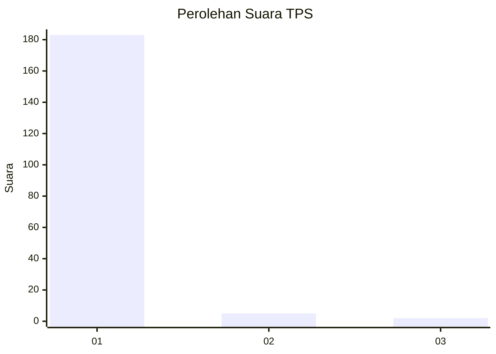
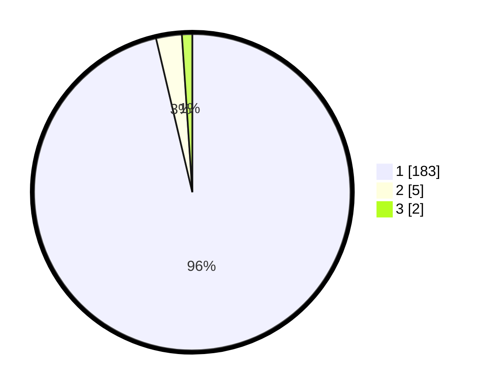

# Hasil

## Grafik

## Tabel

| No. | Nama Paslon    | Suara | Suara (raw) | Persentase |
|:--- |:-------------- | -----:| -----------:| ----------:|
| 1   | ANIES MUHAIMIN | 183   | [183][p-1]  | 96,32      |
| 2   | PRABOWO GIBRAN | 5     | [5][p-2]    | 2,63       |
| 3   | GANJAR MAHFUD  | 2     | [2][p-3]    | 1,05       |

[p-1]: https://github.com/gigit-pemilu/pemilu-2024-11-aceh/blob/main/pilpres/hitung-suara/sub/11-aceh/sub/03-aceh-timur/sub/06-nurussalam/sub/2012-baroh-bugeng/sub/001-tps/sub/paslon-1.txt
[p-2]: https://github.com/gigit-pemilu/pemilu-2024-11-aceh/blob/main/pilpres/hitung-suara/sub/11-aceh/sub/03-aceh-timur/sub/06-nurussalam/sub/2012-baroh-bugeng/sub/001-tps/sub/paslon-2.txt
[p-3]: https://github.com/gigit-pemilu/pemilu-2024-11-aceh/blob/main/pilpres/hitung-suara/sub/11-aceh/sub/03-aceh-timur/sub/06-nurussalam/sub/2012-baroh-bugeng/sub/001-tps/sub/paslon-3.txt

## Foto C Plano

https://sirekap-obj-formc.kpu.go.id/2813/pemilu/ppwp/11/03/06/20/12/1103062012001-20240215-140904--c732dcfb-4a57-46c7-85cb-be3f077f6204.jpg

https://sirekap-obj-formc.kpu.go.id/2813/pemilu/ppwp/11/03/06/20/12/1103062012001-20240215-142101--d2a4d347-73b1-4f68-9b34-4eb25bc02546.jpg

https://sirekap-obj-formc.kpu.go.id/2813/pemilu/ppwp/11/03/06/20/12/1103062012001-20240215-142153--81bad287-b6be-41fa-a671-ae1f3e129703.jpg

## Metadata

| Key        | Value               |
| ---------- | ------------------- |
| Time Stamp | 2024-02-19 06:16:00 |

