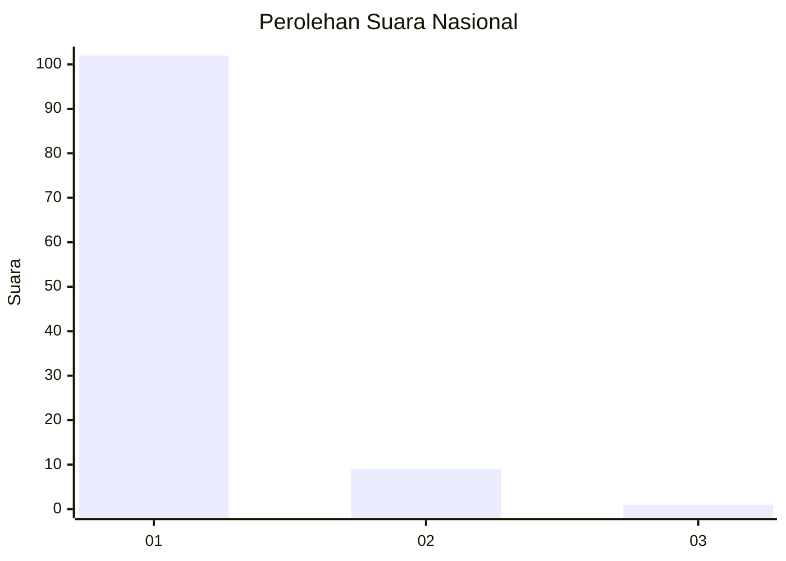
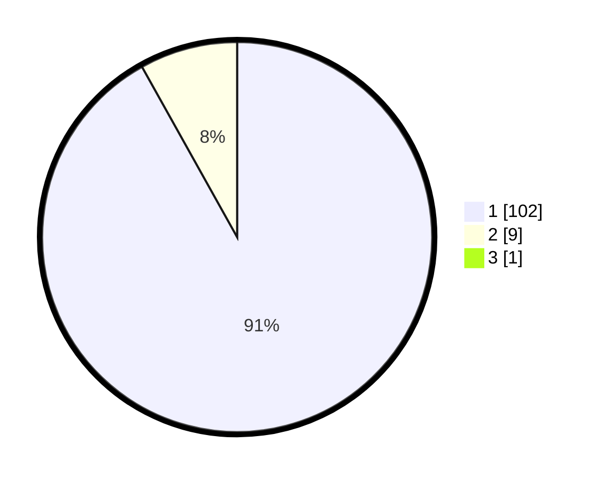

# Hasil

## Grafik

## Tabel

| No. | Nama Paslon    | Suara | Suara (raw) | Persentase |
|:--- |:-------------- | -----:| -----------:| ----------:|
| 1   | ANIES MUHAIMIN | 102   | [102][p-1]  | 91,07      |
| 2   | PRABOWO GIBRAN | 9     | [9][p-2]    | 8,04       |
| 3   | GANJAR MAHFUD  | 1     | [1][p-3]    | 0,89       |

[p-1]: https://github.com/gigit-pemilu/pemilu-2024/blob/main/pilpres/hitung-suara/sub/11-aceh/sub/03-aceh-timur/sub/06-nurussalam/sub/2013-seumatang-aron/sub/001-tps/sub/paslon-1.txt
[p-2]: https://github.com/gigit-pemilu/pemilu-2024/blob/main/pilpres/hitung-suara/sub/11-aceh/sub/03-aceh-timur/sub/06-nurussalam/sub/2013-seumatang-aron/sub/001-tps/sub/paslon-2.txt
[p-3]: https://github.com/gigit-pemilu/pemilu-2024/blob/main/pilpres/hitung-suara/sub/11-aceh/sub/03-aceh-timur/sub/06-nurussalam/sub/2013-seumatang-aron/sub/001-tps/sub/paslon-3.txt

## Foto C Plano

https://sirekap-obj-formc.kpu.go.id/7b26/pemilu/ppwp/11/03/06/20/13/1103062013001-20240216-130015--d9219f1d-0645-41bb-8ae8-36b5fce3e7b9.jpg

https://sirekap-obj-formc.kpu.go.id/7b26/pemilu/ppwp/11/03/06/20/13/1103062013001-20240216-130022--64543e89-345c-4368-8588-025d1d6962ac.jpg

https://sirekap-obj-formc.kpu.go.id/7b26/pemilu/ppwp/11/03/06/20/13/1103062013001-20240216-130017--a22d41e9-8976-433a-b63a-3be09c23a508.jpg

## Metadata

| Key        | Value               |
| ---------- | ------------------- |
| Time Stamp | 2024-02-17 13:37:34 |

## DATA PEMILIH TETAP

Jumlah pemilih dalam DPT: **127**.
 * L: **62**.
 * P: **65**.

## DATA PENGGUNA HAK PILIH

Jumlah pengguna hak pilih dalam DPT: **104**.
 * L: **47**.
 * P: **57**.

Jumlah pengguna hak pilih dalam DPTb: **0**.
 * L: **0**.
 * P: **0**.

Jumlah pengguna hak pilih dalam DPK: **9**.
 * L: **6**.
 * P: **3**.

Jumlah pengguna hak pilih: **113**.
 * L: **53**.
 * P: **60**.

## JUMLAH SUARA SAH DAN TIDAK SAH

JUMLAH SELURUH SUARA SAH: **112**.

JUMLAH SUARA TIDAK SAH: **1**.

JUMLAH SELURUH SUARA SAH DAN SUARA TIDAK SAH: **113**.

