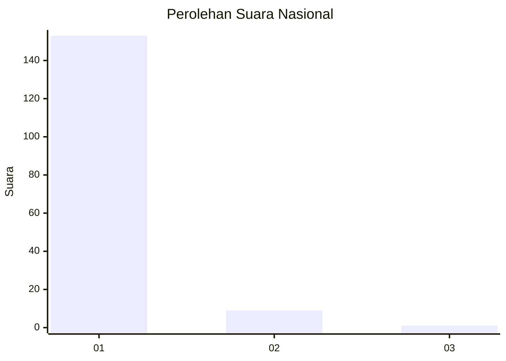
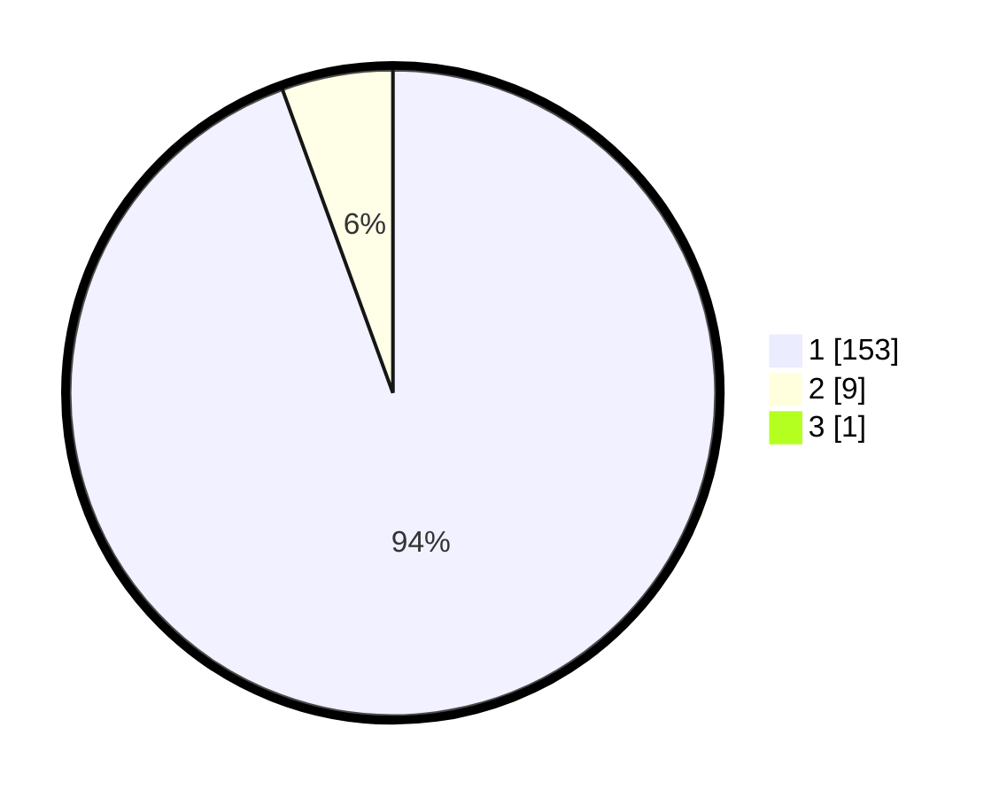

# Hasil

## Grafik

## Tabel

| No. | Nama Paslon    | Suara | Suara (raw) | Persentase |
|:--- |:-------------- | -----:| -----------:| ----------:|
| 1   | ANIES MUHAIMIN | 153   | [153][p-1]  | 93,87      |
| 2   | PRABOWO GIBRAN | 9     | [9][p-2]    | 5,52       |
| 3   | GANJAR MAHFUD  | 1     | [1][p-3]    | 0,61       |

[p-1]: https://github.com/gigit-pemilu/pemilu-2024/blob/main/pilpres/hitung-suara/sub/11-aceh/sub/03-aceh-timur/sub/06-nurussalam/sub/2014-blang-panjou/sub/001-tps/sub/paslon-1.txt
[p-2]: https://github.com/gigit-pemilu/pemilu-2024/blob/main/pilpres/hitung-suara/sub/11-aceh/sub/03-aceh-timur/sub/06-nurussalam/sub/2014-blang-panjou/sub/001-tps/sub/paslon-2.txt
[p-3]: https://github.com/gigit-pemilu/pemilu-2024/blob/main/pilpres/hitung-suara/sub/11-aceh/sub/03-aceh-timur/sub/06-nurussalam/sub/2014-blang-panjou/sub/001-tps/sub/paslon-3.txt

## Foto C Plano

https://sirekap-obj-formc.kpu.go.id/2bf9/pemilu/ppwp/11/03/06/20/14/1103062014001-20240215-002752--47f99c86-3a3a-49b6-9b0e-5a49d0767cf2.jpg

https://sirekap-obj-formc.kpu.go.id/2bf9/pemilu/ppwp/11/03/06/20/14/1103062014001-20240215-000656--e16234a2-a097-4506-86b5-8a7cff2b0e90.jpg

https://sirekap-obj-formc.kpu.go.id/2bf9/pemilu/ppwp/11/03/06/20/14/1103062014001-20240215-000806--72ef766e-6f36-41be-a65c-30ed2f48be93.jpg

## Metadata

| Key        | Value               |
| ---------- | ------------------- |
| Time Stamp | 2024-02-19 06:16:00 |

