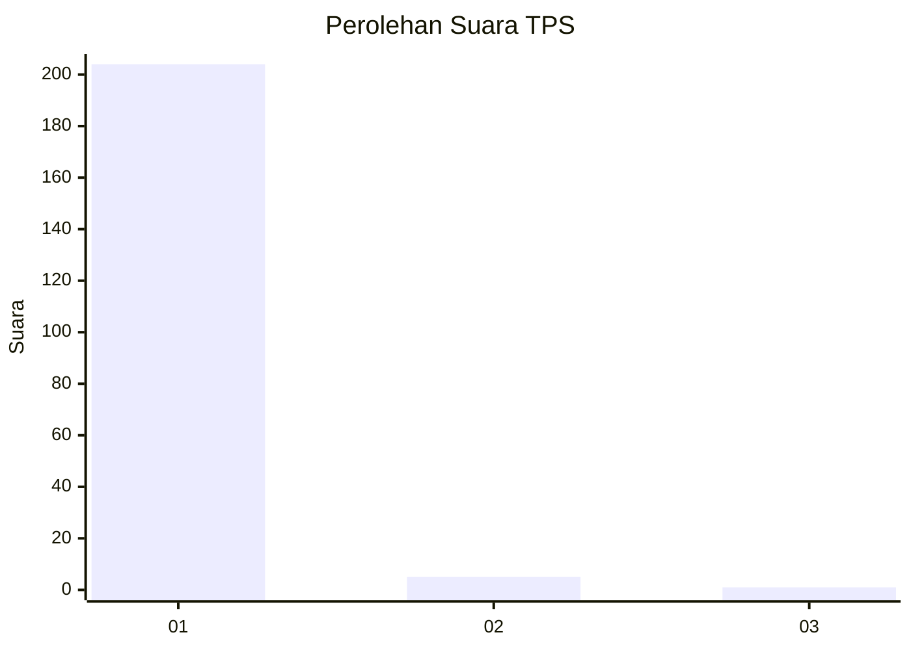
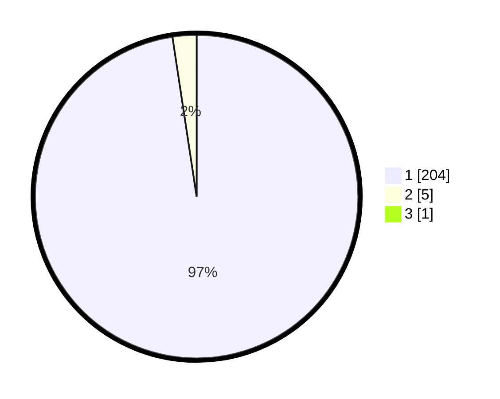

# Hasil

## Grafik

## Tabel

| No. | Nama Paslon    | Suara | Suara (raw) | Persentase |
|:--- |:-------------- | -----:| -----------:| ----------:|
| 1   | ANIES MUHAIMIN | 204   | [204][p-1]  | 97,14      |
| 2   | PRABOWO GIBRAN | 5     | [5][p-2]    | 2,38       |
| 3   | GANJAR MAHFUD  | 1     | [1][p-3]    | 0,48       |

[p-1]: https://github.com/gigit-pemilu/pemilu-2024-11-aceh/blob/main/pilpres/hitung-suara/sub/11-aceh/sub/03-aceh-timur/sub/06-nurussalam/sub/2025-pulo-u/sub/002-tps/sub/paslon-1.txt
[p-2]: https://github.com/gigit-pemilu/pemilu-2024-11-aceh/blob/main/pilpres/hitung-suara/sub/11-aceh/sub/03-aceh-timur/sub/06-nurussalam/sub/2025-pulo-u/sub/002-tps/sub/paslon-2.txt
[p-3]: https://github.com/gigit-pemilu/pemilu-2024-11-aceh/blob/main/pilpres/hitung-suara/sub/11-aceh/sub/03-aceh-timur/sub/06-nurussalam/sub/2025-pulo-u/sub/002-tps/sub/paslon-3.txt

## Foto C Plano

https://sirekap-obj-formc.kpu.go.id/02fa/pemilu/ppwp/11/03/06/20/25/1103062025002-20240215-065328--35ab126a-2724-4020-8abd-ed20008ad64d.jpg

https://sirekap-obj-formc.kpu.go.id/02fa/pemilu/ppwp/11/03/06/20/25/1103062025002-20240215-090228--864c20a1-0b29-45fd-9f4c-d617acf984c6.jpg

https://sirekap-obj-formc.kpu.go.id/02fa/pemilu/ppwp/11/03/06/20/25/1103062025002-20240215-042530--a81c0314-c034-4ee5-8a0e-43473dfe38eb.jpg

## Metadata

| Key        | Value               |
| ---------- | ------------------- |
| Time Stamp | 2024-02-15 17:30:25 |

