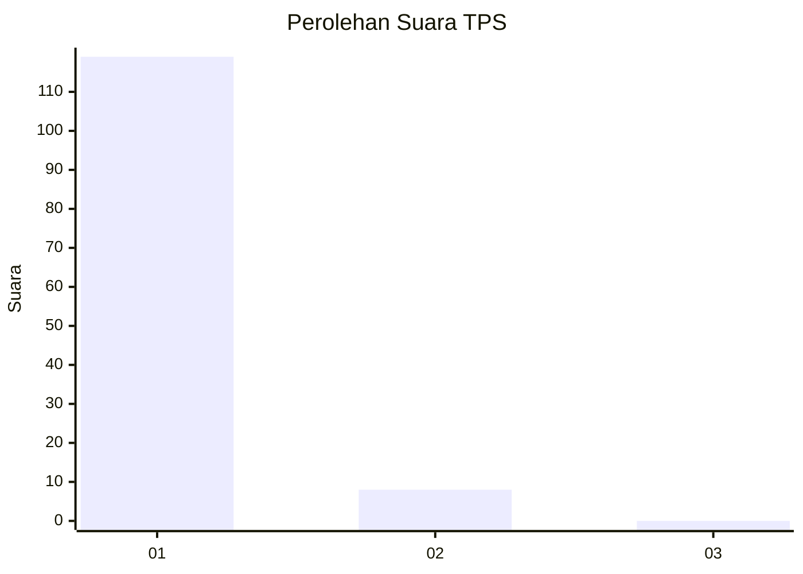
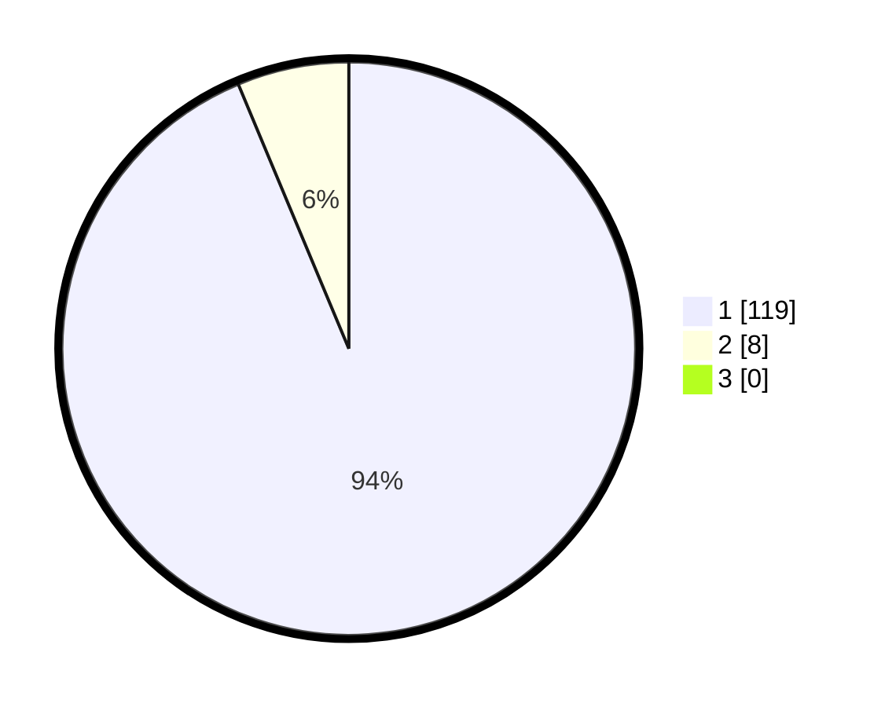

# Hasil

## Grafik

## Tabel

| No. | Nama Paslon    | Suara | Suara (raw) | Persentase |
|:--- |:-------------- | -----:| -----------:| ----------:|
| 1   | ANIES MUHAIMIN | 119   | [119][p-1]  | 93,70      |
| 2   | PRABOWO GIBRAN | 8     | [8][p-2]    | 6,30       |
| 3   | GANJAR MAHFUD  | 0     | [0][p-3]    | 0,00       |

[p-1]: https://github.com/gigit-pemilu/pemilu-2024-11-aceh/blob/main/pilpres/hitung-suara/sub/11-aceh/sub/03-aceh-timur/sub/06-nurussalam/sub/2027-paya-enjee/sub/001-tps/sub/paslon-1.txt
[p-2]: https://github.com/gigit-pemilu/pemilu-2024-11-aceh/blob/main/pilpres/hitung-suara/sub/11-aceh/sub/03-aceh-timur/sub/06-nurussalam/sub/2027-paya-enjee/sub/001-tps/sub/paslon-2.txt
[p-3]: https://github.com/gigit-pemilu/pemilu-2024-11-aceh/blob/main/pilpres/hitung-suara/sub/11-aceh/sub/03-aceh-timur/sub/06-nurussalam/sub/2027-paya-enjee/sub/001-tps/sub/paslon-3.txt

## Foto C Plano

https://sirekap-obj-formc.kpu.go.id/03a9/pemilu/ppwp/11/03/06/20/27/1103062027001-20240215-133353--06622187-d3a9-445a-affe-3b522b373f4a.jpg

https://sirekap-obj-formc.kpu.go.id/03a9/pemilu/ppwp/11/03/06/20/27/1103062027001-20240215-133557--bc0fb5d4-535f-4de6-8ced-dd2c7f19ea23.jpg

https://sirekap-obj-formc.kpu.go.id/03a9/pemilu/ppwp/11/03/06/20/27/1103062027001-20240215-133702--8e94f02a-401f-4a56-8420-ee051dfe4dcd.jpg

## Metadata

| Key        | Value               |
| ---------- | ------------------- |
| Time Stamp | 2024-02-19 06:16:00 |

