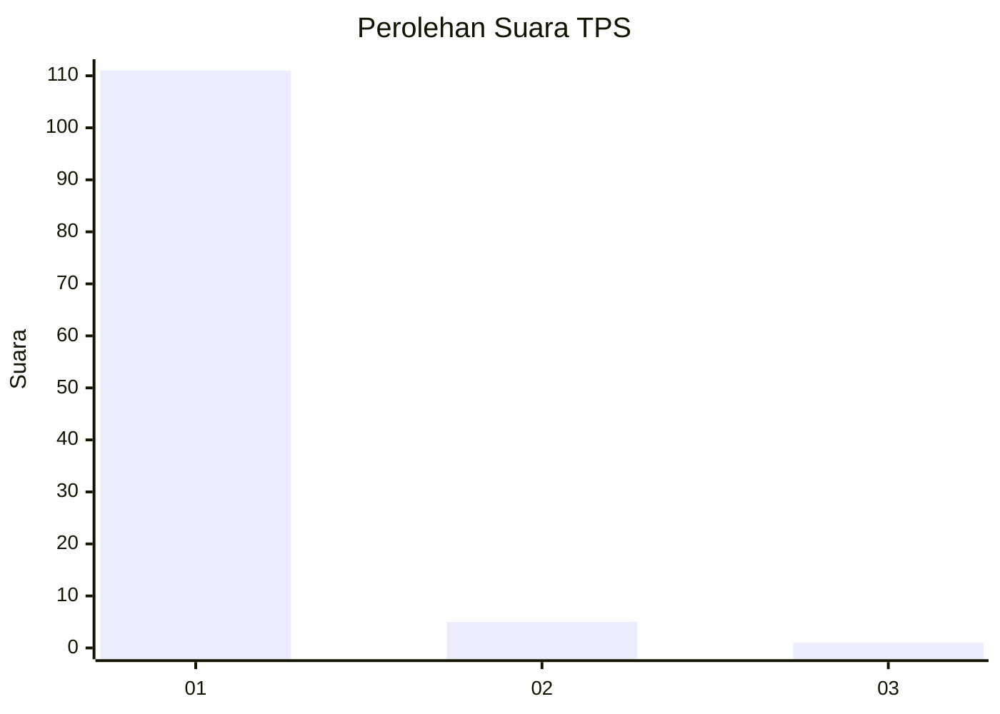
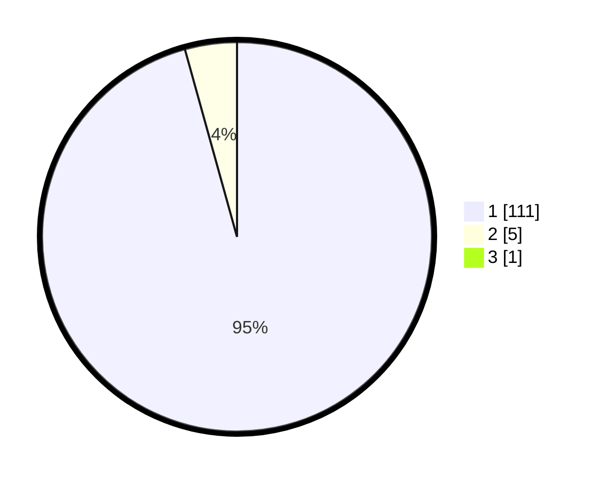

# Hasil

## Grafik

## Tabel

| No. | Nama Paslon    | Suara | Suara (raw) | Persentase |
|:--- |:-------------- | -----:| -----------:| ----------:|
| 1   | ANIES MUHAIMIN | 111   | [111][p-1]  | 94,87      |
| 2   | PRABOWO GIBRAN | 5     | [5][p-2]    | 4,27       |
| 3   | GANJAR MAHFUD  | 1     | [1][p-3]    | 0,85       |

[p-1]: https://github.com/gigit-pemilu/pemilu-2024-11-aceh/blob/main/pilpres/hitung-suara/sub/11-aceh/sub/03-aceh-timur/sub/06-nurussalam/sub/2028-seuleumak-muda/sub/001-tps/sub/paslon-1.txt
[p-2]: https://github.com/gigit-pemilu/pemilu-2024-11-aceh/blob/main/pilpres/hitung-suara/sub/11-aceh/sub/03-aceh-timur/sub/06-nurussalam/sub/2028-seuleumak-muda/sub/001-tps/sub/paslon-2.txt
[p-3]: https://github.com/gigit-pemilu/pemilu-2024-11-aceh/blob/main/pilpres/hitung-suara/sub/11-aceh/sub/03-aceh-timur/sub/06-nurussalam/sub/2028-seuleumak-muda/sub/001-tps/sub/paslon-3.txt

## Foto C Plano

https://sirekap-obj-formc.kpu.go.id/715f/pemilu/ppwp/11/03/06/20/28/1103062028001-20240216-142934--acbf6f2e-d333-4c68-82b3-90b161fc7420.jpg

https://sirekap-obj-formc.kpu.go.id/715f/pemilu/ppwp/11/03/06/20/28/1103062028001-20240216-142936--4d17c4bd-407b-44cb-ba91-d00de94c48d5.jpg

https://sirekap-obj-formc.kpu.go.id/715f/pemilu/ppwp/11/03/06/20/28/1103062028001-20240216-142935--d91b0f24-85cc-4527-8b79-387c9812e502.jpg

## Metadata

| Key        | Value               |
| ---------- | ------------------- |
| Time Stamp | 2024-02-17 13:37:34 |

## DATA PEMILIH TETAP

Jumlah pemilih dalam DPT: **137**.
 * L: **68**.
 * P: **69**.

## DATA PENGGUNA HAK PILIH

Jumlah pengguna hak pilih dalam DPT: **115**.
 * L: **52**.
 * P: **63**.

Jumlah pengguna hak pilih dalam DPTb: **2**.
 * L: **0**.
 * P: **2**.

Jumlah pengguna hak pilih dalam DPK: **0**.
 * L: **0**.
 * P: **0**.

Jumlah pengguna hak pilih: **117**.
 * L: **52**.
 * P: **65**.

## JUMLAH SUARA SAH DAN TIDAK SAH

JUMLAH SELURUH SUARA SAH: **117**.

JUMLAH SUARA TIDAK SAH: **0**.

JUMLAH SELURUH SUARA SAH DAN SUARA TIDAK SAH: **117**.

