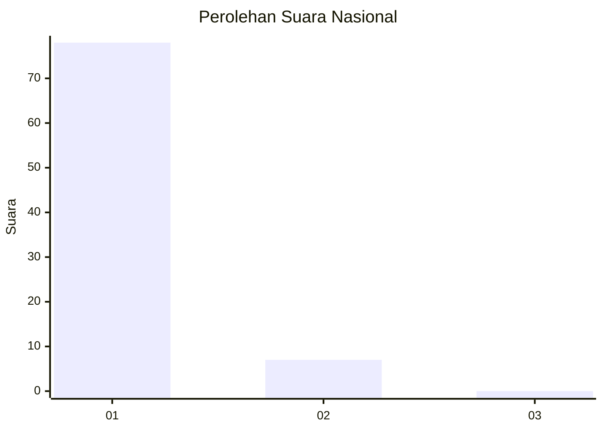
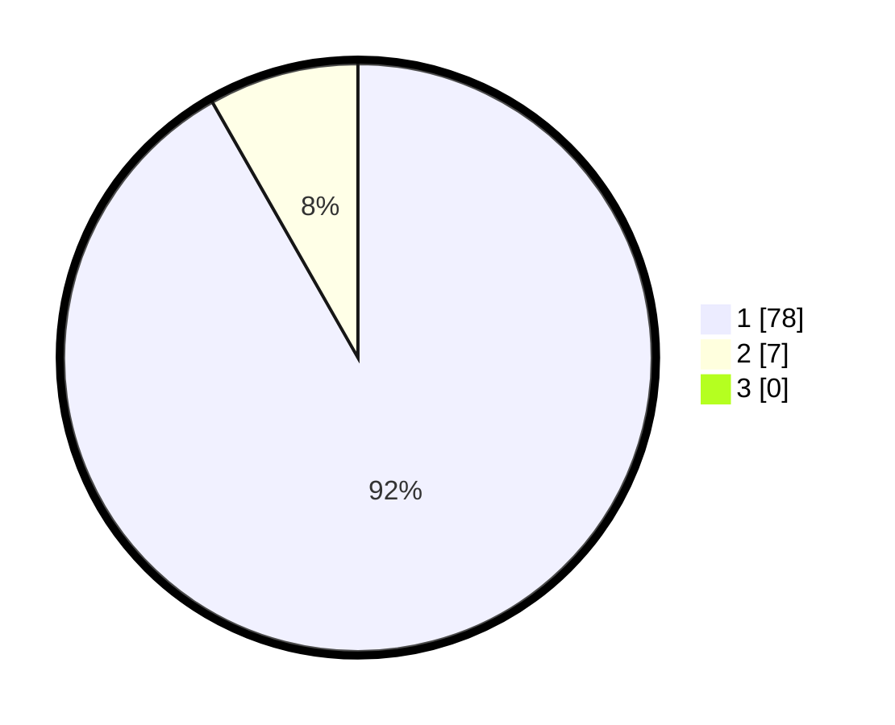

# Hasil

## Grafik

## Tabel

| No. | Nama Paslon    | Suara | Suara (raw) | Persentase |
|:--- |:-------------- | -----:| -----------:| ----------:|
| 1   | ANIES MUHAIMIN | 78    | [78][p-1]   | 91,76      |
| 2   | PRABOWO GIBRAN | 7     | [7][p-2]    | 8,24       |
| 3   | GANJAR MAHFUD  | 0     | [0][p-3]    | 0,00       |

[p-1]: https://github.com/gigit-pemilu/pemilu-2024/blob/main/pilpres/hitung-suara/sub/11-aceh/sub/03-aceh-timur/sub/06-nurussalam/sub/2029-matang-panyang/sub/002-tps/sub/paslon-1.txt
[p-2]: https://github.com/gigit-pemilu/pemilu-2024/blob/main/pilpres/hitung-suara/sub/11-aceh/sub/03-aceh-timur/sub/06-nurussalam/sub/2029-matang-panyang/sub/002-tps/sub/paslon-2.txt
[p-3]: https://github.com/gigit-pemilu/pemilu-2024/blob/main/pilpres/hitung-suara/sub/11-aceh/sub/03-aceh-timur/sub/06-nurussalam/sub/2029-matang-panyang/sub/002-tps/sub/paslon-3.txt

## Foto C Plano

https://sirekap-obj-formc.kpu.go.id/aae4/pemilu/ppwp/11/03/06/20/29/1103062029002-20240216-153858--44e2347b-a6d2-4e2a-9be5-fd343c78529d.jpg

https://sirekap-obj-formc.kpu.go.id/aae4/pemilu/ppwp/11/03/06/20/29/1103062029002-20240216-153859--404825a4-2eae-49a7-9faf-173b1be41e5a.jpg

https://sirekap-obj-formc.kpu.go.id/aae4/pemilu/ppwp/11/03/06/20/29/1103062029002-20240216-153858--d090fbfd-dc71-4262-a56e-d518c64ee0d9.jpg

## Metadata

| Key        | Value               |
| ---------- | ------------------- |
| Time Stamp | 2024-02-17 13:37:34 |

## DATA PEMILIH TETAP

Jumlah pemilih dalam DPT: **115**.
 * L: **56**.
 * P: **59**.

## DATA PENGGUNA HAK PILIH

Jumlah pengguna hak pilih dalam DPT: **84**.
 * L: **33**.
 * P: **51**.

Jumlah pengguna hak pilih dalam DPTb: **0**.
 * L: **0**.
 * P: **0**.

Jumlah pengguna hak pilih dalam DPK: **4**.
 * L: **2**.
 * P: **2**.

Jumlah pengguna hak pilih: **88**.
 * L: **35**.
 * P: **53**.

## JUMLAH SUARA SAH DAN TIDAK SAH

JUMLAH SELURUH SUARA SAH: **85**.

JUMLAH SUARA TIDAK SAH: **3**.

JUMLAH SELURUH SUARA SAH DAN SUARA TIDAK SAH: **88**.

