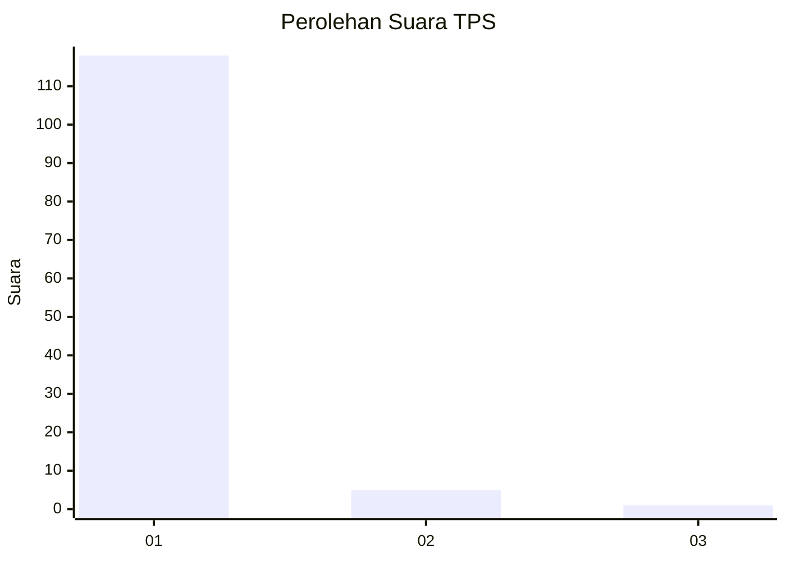
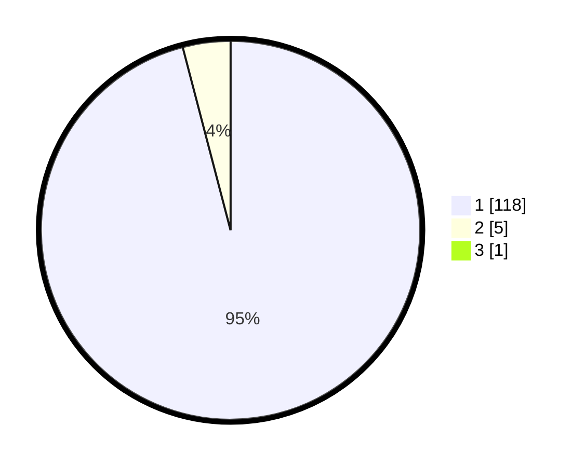

# Hasil

## Grafik

## Tabel

| No. | Nama Paslon    | Suara | Suara (raw) | Persentase |
|:--- |:-------------- | -----:| -----------:| ----------:|
| 1   | ANIES MUHAIMIN | 118   | [118][p-1]  | 95,16      |
| 2   | PRABOWO GIBRAN | 5     | [5][p-2]    | 4,03       |
| 3   | GANJAR MAHFUD  | 1     | [1][p-3]    | 0,81       |

[p-1]: https://github.com/gigit-pemilu/pemilu-2024-11-aceh/blob/main/pilpres/hitung-suara/sub/11-aceh/sub/03-aceh-timur/sub/06-nurussalam/sub/2032-buket-panjou/sub/001-tps/sub/paslon-1.txt
[p-2]: https://github.com/gigit-pemilu/pemilu-2024-11-aceh/blob/main/pilpres/hitung-suara/sub/11-aceh/sub/03-aceh-timur/sub/06-nurussalam/sub/2032-buket-panjou/sub/001-tps/sub/paslon-2.txt
[p-3]: https://github.com/gigit-pemilu/pemilu-2024-11-aceh/blob/main/pilpres/hitung-suara/sub/11-aceh/sub/03-aceh-timur/sub/06-nurussalam/sub/2032-buket-panjou/sub/001-tps/sub/paslon-3.txt

## Foto C Plano

https://sirekap-obj-formc.kpu.go.id/ce7d/pemilu/ppwp/11/03/06/20/32/1103062032001-20240215-014153--2fa8685e-db56-488a-950a-6f2eda69a279.jpg

https://sirekap-obj-formc.kpu.go.id/ce7d/pemilu/ppwp/11/03/06/20/32/1103062032001-20240215-014358--325c7d7b-3042-4d43-97da-ff7c919530e0.jpg

https://sirekap-obj-formc.kpu.go.id/ce7d/pemilu/ppwp/11/03/06/20/32/1103062032001-20240215-014621--3247b357-48f5-42c7-b581-e8913ff007de.jpg

## Metadata

| Key        | Value               |
| ---------- | ------------------- |
| Time Stamp | 2024-02-19 06:16:00 |

