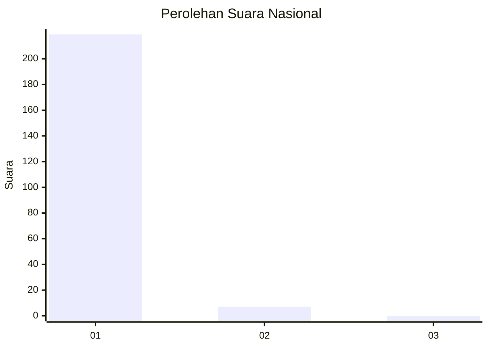
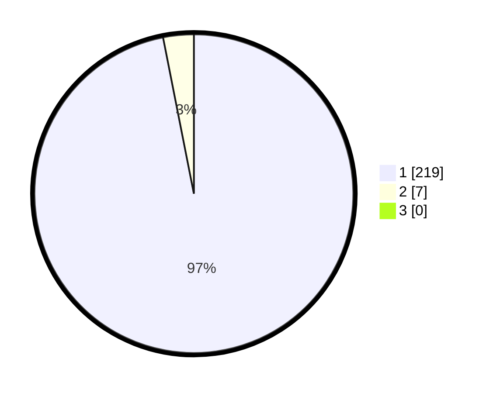

# Hasil

## Grafik

## Tabel

| No. | Nama Paslon    | Suara | Suara (raw) | Persentase |
|:--- |:-------------- | -----:| -----------:| ----------:|
| 1   | ANIES MUHAIMIN | 219   | [219][p-1]  | 96,90      |
| 2   | PRABOWO GIBRAN | 7     | [7][p-2]    | 3,10       |
| 3   | GANJAR MAHFUD  | 0     | [0][p-3]    | 0,00       |

[p-1]: https://github.com/gigit-pemilu/pemilu-2024/blob/main/pilpres/hitung-suara/sub/11-aceh/sub/03-aceh-timur/sub/06-nurussalam/sub/2036-gampong-mesjid/sub/001-tps/sub/paslon-1.txt
[p-2]: https://github.com/gigit-pemilu/pemilu-2024/blob/main/pilpres/hitung-suara/sub/11-aceh/sub/03-aceh-timur/sub/06-nurussalam/sub/2036-gampong-mesjid/sub/001-tps/sub/paslon-2.txt
[p-3]: https://github.com/gigit-pemilu/pemilu-2024/blob/main/pilpres/hitung-suara/sub/11-aceh/sub/03-aceh-timur/sub/06-nurussalam/sub/2036-gampong-mesjid/sub/001-tps/sub/paslon-3.txt

## Foto C Plano

https://sirekap-obj-formc.kpu.go.id/d3e4/pemilu/ppwp/11/03/06/20/36/1103062036001-20240214-214102--172702c9-fde2-4397-b20d-d0cda61de22f.jpg

https://sirekap-obj-formc.kpu.go.id/d3e4/pemilu/ppwp/11/03/06/20/36/1103062036001-20240215-184310--61e16e18-d466-423d-9196-e8fb4b615453.jpg

https://sirekap-obj-formc.kpu.go.id/d3e4/pemilu/ppwp/11/03/06/20/36/1103062036001-20240214-214452--b9abe95c-3c99-42e4-aedb-138fac9c3bea.jpg

## Metadata

| Key        | Value               |
| ---------- | ------------------- |
| Time Stamp | 2024-02-24 22:31:28 |

