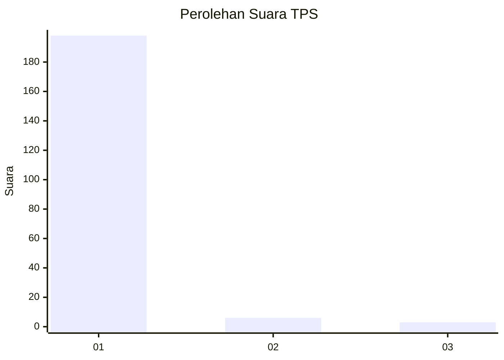
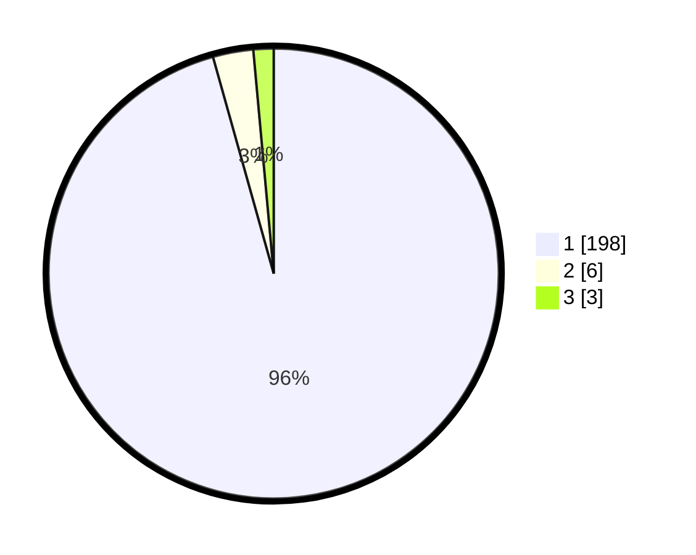

# Hasil

## Grafik

## Tabel

| No. | Nama Paslon    | Suara | Suara (raw) | Persentase |
|:--- |:-------------- | -----:| -----------:| ----------:|
| 1   | ANIES MUHAIMIN | 198   | [198][p-1]  | 95,65      |
| 2   | PRABOWO GIBRAN | 6     | [6][p-2]    | 2,90       |
| 3   | GANJAR MAHFUD  | 3     | [3][p-3]    | 1,45       |

[p-1]: https://github.com/gigit-pemilu/pemilu-2024-11-aceh/blob/main/pilpres/hitung-suara/sub/11-aceh/sub/03-aceh-timur/sub/06-nurussalam/sub/2036-gampong-mesjid/sub/002-tps/sub/paslon-1.txt
[p-2]: https://github.com/gigit-pemilu/pemilu-2024-11-aceh/blob/main/pilpres/hitung-suara/sub/11-aceh/sub/03-aceh-timur/sub/06-nurussalam/sub/2036-gampong-mesjid/sub/002-tps/sub/paslon-2.txt
[p-3]: https://github.com/gigit-pemilu/pemilu-2024-11-aceh/blob/main/pilpres/hitung-suara/sub/11-aceh/sub/03-aceh-timur/sub/06-nurussalam/sub/2036-gampong-mesjid/sub/002-tps/sub/paslon-3.txt

## Foto C Plano

https://sirekap-obj-formc.kpu.go.id/1527/pemilu/ppwp/11/03/06/20/36/1103062036002-20240215-140915--39fd5833-e803-4e71-9bef-ac98c6ab8e07.jpg

https://sirekap-obj-formc.kpu.go.id/1527/pemilu/ppwp/11/03/06/20/36/1103062036002-20240215-124414--66eecef1-2165-4f92-80a2-469b47b27248.jpg

https://sirekap-obj-formc.kpu.go.id/1527/pemilu/ppwp/11/03/06/20/36/1103062036002-20240215-124533--1bb0e4da-d614-49ad-9359-683ab0b5b251.jpg

## Metadata

| Key        | Value               |
| ---------- | ------------------- |
| Time Stamp | 2024-02-17 13:37:34 |

## DATA PEMILIH TETAP

Jumlah pemilih dalam DPT: **290**.
 * L: **142**.
 * P: **148**.

## DATA PENGGUNA HAK PILIH

Jumlah pengguna hak pilih dalam DPT: **208**.
 * L: **94**.
 * P: **114**.

Jumlah pengguna hak pilih dalam DPTb: **0**.
 * L: **0**.
 * P: **0**.

Jumlah pengguna hak pilih dalam DPK: **13**.
 * L: **8**.
 * P: **5**.

Jumlah pengguna hak pilih: **221**.
 * L: **102**.
 * P: **119**.

## JUMLAH SUARA SAH DAN TIDAK SAH

JUMLAH SELURUH SUARA SAH: **207**.

JUMLAH SUARA TIDAK SAH: **14**.

JUMLAH SELURUH SUARA SAH DAN SUARA TIDAK SAH: **221**.

