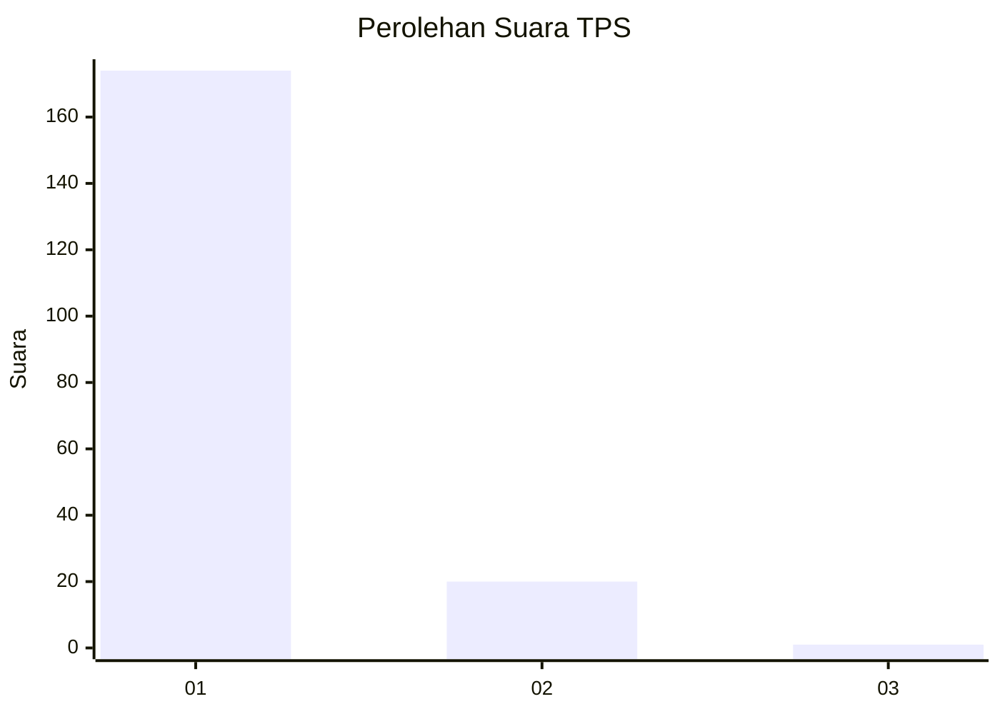
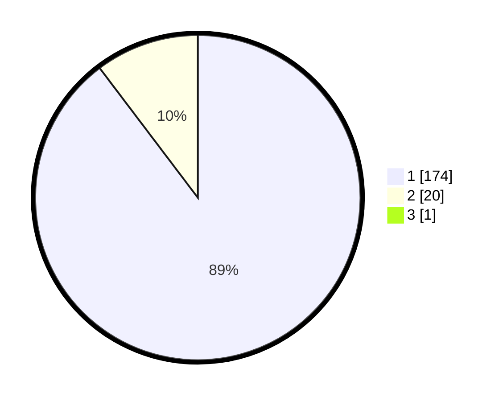

# Hasil

## Grafik

## Tabel

| No. | Nama Paslon    | Suara | Suara (raw) | Persentase |
|:--- |:-------------- | -----:| -----------:| ----------:|
| 1   | ANIES MUHAIMIN | 174   | [174][p-1]  | 89,23      |
| 2   | PRABOWO GIBRAN | 20    | [20][p-2]   | 10,26      |
| 3   | GANJAR MAHFUD  | 1     | [1][p-3]    | 0,51       |

[p-1]: https://github.com/gigit-pemilu/pemilu-2024-11-aceh/blob/main/pilpres/hitung-suara/sub/11-aceh/sub/03-aceh-timur/sub/07-peureulak/sub/2001-pasir-putih/sub/002-tps/sub/paslon-1.txt
[p-2]: https://github.com/gigit-pemilu/pemilu-2024-11-aceh/blob/main/pilpres/hitung-suara/sub/11-aceh/sub/03-aceh-timur/sub/07-peureulak/sub/2001-pasir-putih/sub/002-tps/sub/paslon-2.txt
[p-3]: https://github.com/gigit-pemilu/pemilu-2024-11-aceh/blob/main/pilpres/hitung-suara/sub/11-aceh/sub/03-aceh-timur/sub/07-peureulak/sub/2001-pasir-putih/sub/002-tps/sub/paslon-3.txt

## Foto C Plano

https://sirekap-obj-formc.kpu.go.id/53a3/pemilu/ppwp/11/03/07/20/01/1103072001002-20240214-155029--8cbba510-07ab-4af2-8a73-4485b907b5bf.jpg

https://sirekap-obj-formc.kpu.go.id/53a3/pemilu/ppwp/11/03/07/20/01/1103072001002-20240214-155819--2981aa2f-4e41-4087-8daa-8729a6e5b4b1.jpg

https://sirekap-obj-formc.kpu.go.id/53a3/pemilu/ppwp/11/03/07/20/01/1103072001002-20240214-160100--b01c7546-e5a0-489f-8b72-35f8a27b4baa.jpg

## Metadata

| Key        | Value               |
| ---------- | ------------------- |
| Time Stamp | 2024-02-19 11:00:00 |

