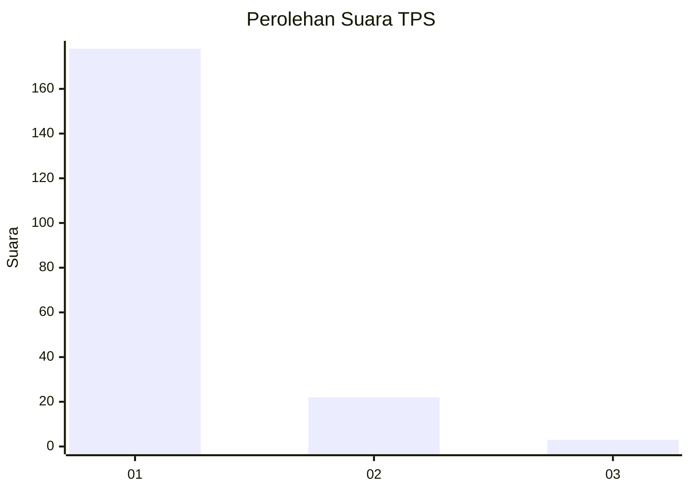
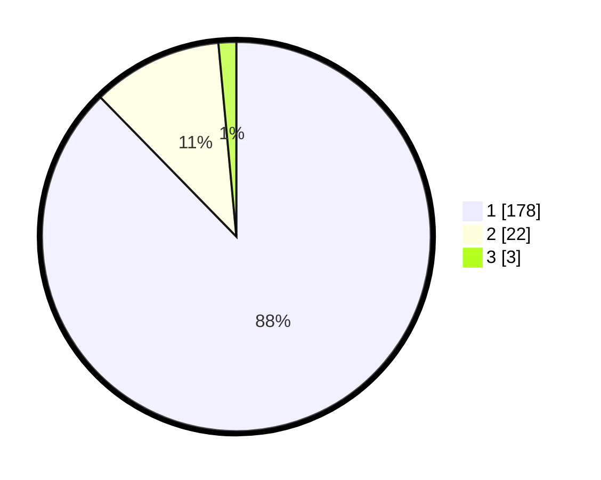

# Hasil

## Grafik

## Tabel

| No. | Nama Paslon    | Suara | Suara (raw) | Persentase |
|:--- |:-------------- | -----:| -----------:| ----------:|
| 1   | ANIES MUHAIMIN | 178   | [178][p-1]  | 87,68      |
| 2   | PRABOWO GIBRAN | 22    | [22][p-2]   | 10,84      |
| 3   | GANJAR MAHFUD  | 3     | [3][p-3]    | 1,48       |

[p-1]: https://github.com/gigit-pemilu/pemilu-2024-11-aceh/blob/main/pilpres/hitung-suara/sub/11-aceh/sub/03-aceh-timur/sub/07-peureulak/sub/2001-pasir-putih/sub/003-tps/sub/paslon-1.txt
[p-2]: https://github.com/gigit-pemilu/pemilu-2024-11-aceh/blob/main/pilpres/hitung-suara/sub/11-aceh/sub/03-aceh-timur/sub/07-peureulak/sub/2001-pasir-putih/sub/003-tps/sub/paslon-2.txt
[p-3]: https://github.com/gigit-pemilu/pemilu-2024-11-aceh/blob/main/pilpres/hitung-suara/sub/11-aceh/sub/03-aceh-timur/sub/07-peureulak/sub/2001-pasir-putih/sub/003-tps/sub/paslon-3.txt

## Foto C Plano

https://sirekap-obj-formc.kpu.go.id/b089/pemilu/ppwp/11/03/07/20/01/1103072001003-20240215-034511--95098d44-7e15-4d77-81ea-3c14da131f6b.jpg

https://sirekap-obj-formc.kpu.go.id/b089/pemilu/ppwp/11/03/07/20/01/1103072001003-20240215-034518--e6284f42-a0e4-4fca-a493-8fb6b3043e17.jpg

https://sirekap-obj-formc.kpu.go.id/b089/pemilu/ppwp/11/03/07/20/01/1103072001003-20240215-055927--803f5b2d-4c15-42f5-bfa1-2e0c74e9842d.jpg

## Metadata

| Key        | Value               |
| ---------- | ------------------- |
| Time Stamp | 2024-02-19 11:00:00 |

## DATA PEMILIH TETAP

Jumlah pemilih dalam DPT: **280**.
 * L: **125**.
 * P: **155**.

## DATA PENGGUNA HAK PILIH

Jumlah pengguna hak pilih dalam DPT: **199**.
 * L: **116**.
 * P: **83**.

Jumlah pengguna hak pilih dalam DPTb: **0**.
 * L: **0**.
 * P: **0**.

Jumlah pengguna hak pilih dalam DPK: **7**.
 * L: **4**.
 * P: **3**.

Jumlah pengguna hak pilih: **206**.
 * L: **120**.
 * P: **86**.

## JUMLAH SUARA SAH DAN TIDAK SAH

JUMLAH SELURUH SUARA SAH: **206**.

JUMLAH SUARA TIDAK SAH: **3**.

JUMLAH SELURUH SUARA SAH DAN SUARA TIDAK SAH: **209**.

