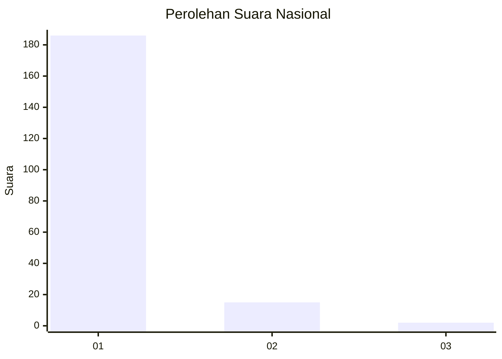
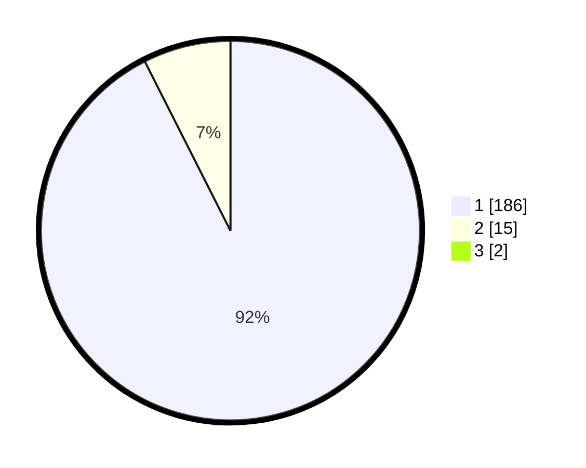

# Hasil

## Grafik

## Tabel

| No. | Nama Paslon    | Suara | Suara (raw) | Persentase |
|:--- |:-------------- | -----:| -----------:| ----------:|
| 1   | ANIES MUHAIMIN | 186   | [186][p-1]  | 91,63      |
| 2   | PRABOWO GIBRAN | 15    | [15][p-2]   | 7,39       |
| 3   | GANJAR MAHFUD  | 2     | [2][p-3]    | 0,99       |

[p-1]: https://github.com/gigit-pemilu/pemilu-2024/blob/main/pilpres/hitung-suara/sub/11-aceh/sub/03-aceh-timur/sub/07-peureulak/sub/2001-pasir-putih/sub/005-tps/sub/paslon-1.txt
[p-2]: https://github.com/gigit-pemilu/pemilu-2024/blob/main/pilpres/hitung-suara/sub/11-aceh/sub/03-aceh-timur/sub/07-peureulak/sub/2001-pasir-putih/sub/005-tps/sub/paslon-2.txt
[p-3]: https://github.com/gigit-pemilu/pemilu-2024/blob/main/pilpres/hitung-suara/sub/11-aceh/sub/03-aceh-timur/sub/07-peureulak/sub/2001-pasir-putih/sub/005-tps/sub/paslon-3.txt

## Foto C Plano

https://sirekap-obj-formc.kpu.go.id/f661/pemilu/ppwp/11/03/07/20/01/1103072001005-20240214-211654--fba3f584-0c06-4e29-b711-bb6d1c7d9ae0.jpg

https://sirekap-obj-formc.kpu.go.id/f661/pemilu/ppwp/11/03/07/20/01/1103072001005-20240214-212246--d3ef2067-05df-4737-a199-4c3cde2e27c6.jpg

## Metadata

| Key        | Value               |
| ---------- | ------------------- |
| Time Stamp | 2024-02-19 13:00:00 |

