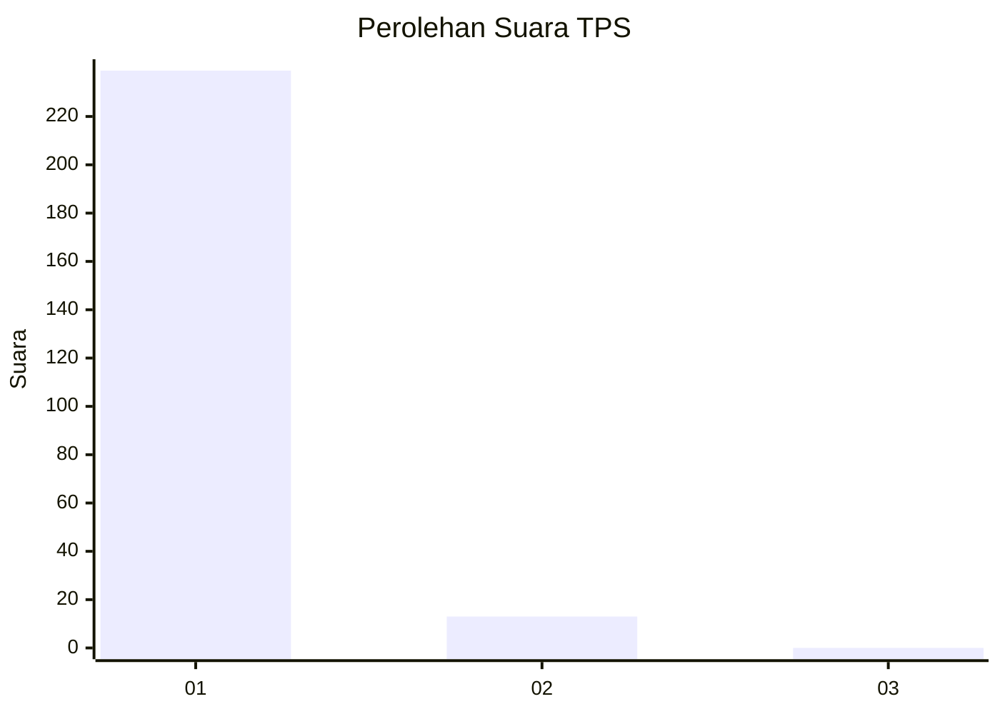
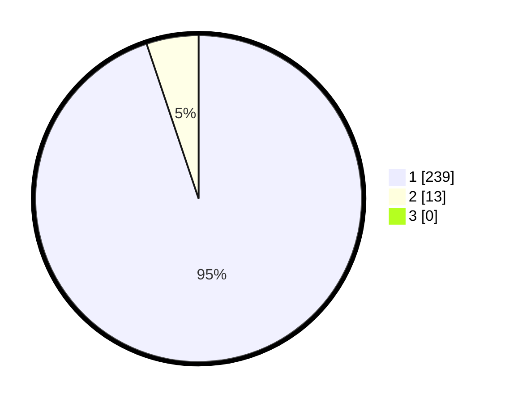

# Hasil

## Grafik

## Tabel

| No. | Nama Paslon    | Suara | Suara (raw) | Persentase |
|:--- |:-------------- | -----:| -----------:| ----------:|
| 1   | ANIES MUHAIMIN | 239   | [239][p-1]  | 94,84      |
| 2   | PRABOWO GIBRAN | 13    | [13][p-2]   | 5,16       |
| 3   | GANJAR MAHFUD  | 0     | [0][p-3]    | 0,00       |

[p-1]: https://github.com/gigit-pemilu/pemilu-2024-11-aceh/blob/main/pilpres/hitung-suara/sub/11-aceh/sub/03-aceh-timur/sub/07-peureulak/sub/2002-tualang/sub/001-tps/sub/paslon-1.txt
[p-2]: https://github.com/gigit-pemilu/pemilu-2024-11-aceh/blob/main/pilpres/hitung-suara/sub/11-aceh/sub/03-aceh-timur/sub/07-peureulak/sub/2002-tualang/sub/001-tps/sub/paslon-2.txt
[p-3]: https://github.com/gigit-pemilu/pemilu-2024-11-aceh/blob/main/pilpres/hitung-suara/sub/11-aceh/sub/03-aceh-timur/sub/07-peureulak/sub/2002-tualang/sub/001-tps/sub/paslon-3.txt

## Foto C Plano

https://sirekap-obj-formc.kpu.go.id/b4cc/pemilu/ppwp/11/03/07/20/02/1103072002001-20240215-110114--3e24c32f-2f0a-4648-a5d8-b7b0d9079bb8.jpg

https://sirekap-obj-formc.kpu.go.id/b4cc/pemilu/ppwp/11/03/07/20/02/1103072002001-20240215-110231--fa8aeb80-9e09-4a87-89c9-cc9459950c80.jpg

https://sirekap-obj-formc.kpu.go.id/b4cc/pemilu/ppwp/11/03/07/20/02/1103072002001-20240215-110535--19f6f96b-7b02-456f-9440-841d20e32b6a.jpg

## Metadata

| Key        | Value               |
| ---------- | ------------------- |
| Time Stamp | 2024-02-19 08:00:00 |

