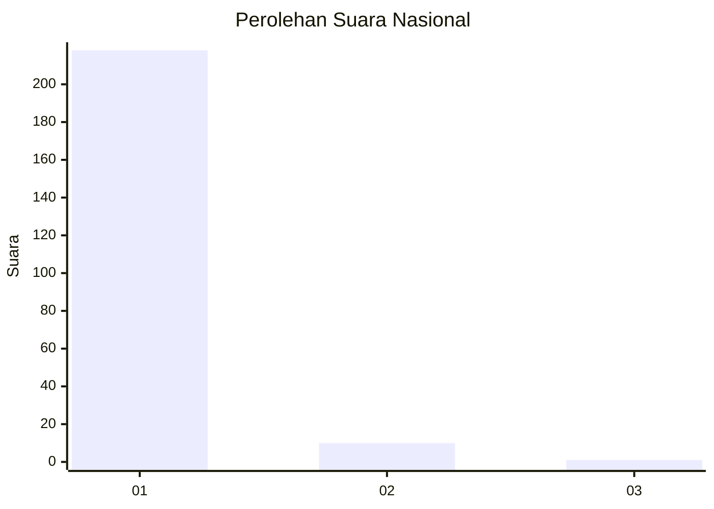
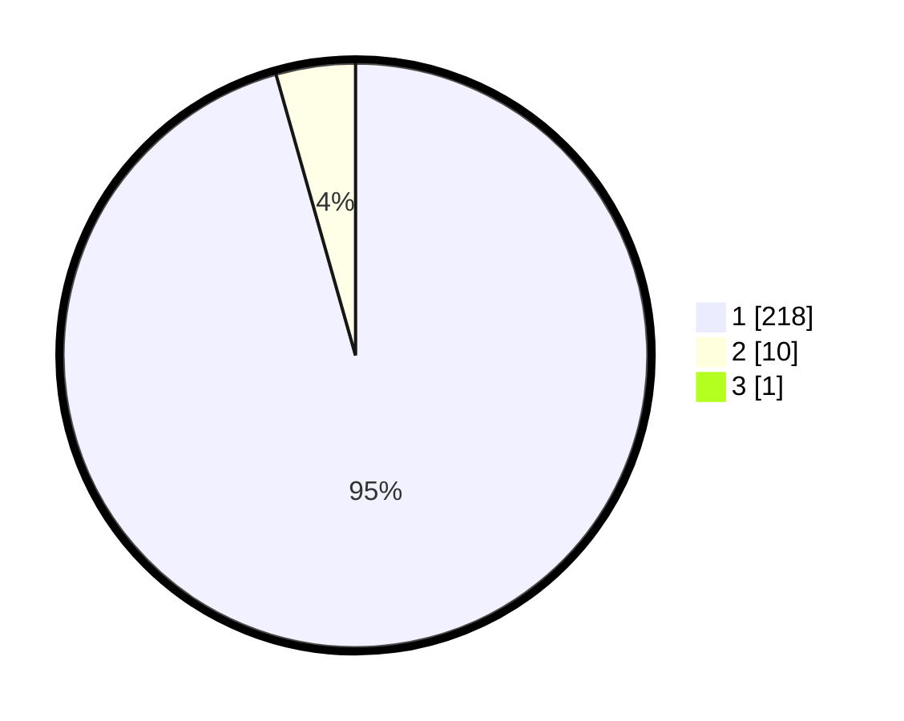

# Hasil

## Grafik

## Tabel

| No. | Nama Paslon    | Suara | Suara (raw) | Persentase |
|:--- |:-------------- | -----:| -----------:| ----------:|
| 1   | ANIES MUHAIMIN | 218   | [218][p-1]  | 95,20      |
| 2   | PRABOWO GIBRAN | 10    | [10][p-2]   | 4,37       |
| 3   | GANJAR MAHFUD  | 1     | [1][p-3]    | 0,44       |

[p-1]: https://github.com/gigit-pemilu/pemilu-2024/blob/main/pilpres/hitung-suara/sub/11-aceh/sub/03-aceh-timur/sub/07-peureulak/sub/2002-tualang/sub/003-tps/sub/paslon-1.txt
[p-2]: https://github.com/gigit-pemilu/pemilu-2024/blob/main/pilpres/hitung-suara/sub/11-aceh/sub/03-aceh-timur/sub/07-peureulak/sub/2002-tualang/sub/003-tps/sub/paslon-2.txt
[p-3]: https://github.com/gigit-pemilu/pemilu-2024/blob/main/pilpres/hitung-suara/sub/11-aceh/sub/03-aceh-timur/sub/07-peureulak/sub/2002-tualang/sub/003-tps/sub/paslon-3.txt

## Foto C Plano

https://sirekap-obj-formc.kpu.go.id/447b/pemilu/ppwp/11/03/07/20/02/1103072002003-20240215-114359--112acb98-8023-42fd-b695-618b300016f4.jpg

https://sirekap-obj-formc.kpu.go.id/447b/pemilu/ppwp/11/03/07/20/02/1103072002003-20240215-114617--c9495bff-4168-4890-a3fb-84903c6ff3f8.jpg

https://sirekap-obj-formc.kpu.go.id/447b/pemilu/ppwp/11/03/07/20/02/1103072002003-20240215-114839--651af943-a13e-4108-a266-9738636b7f19.jpg

## Metadata

| Key        | Value               |
| ---------- | ------------------- |
| Time Stamp | 2024-02-19 08:00:00 |

