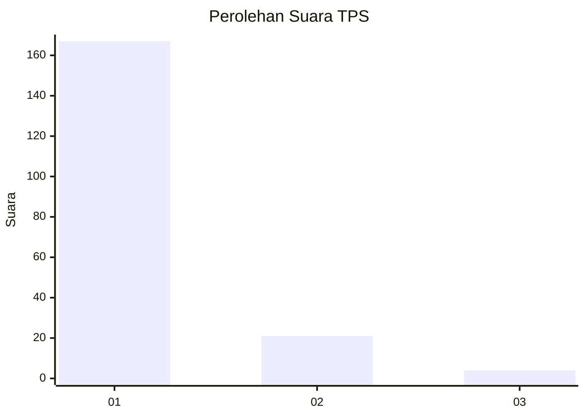
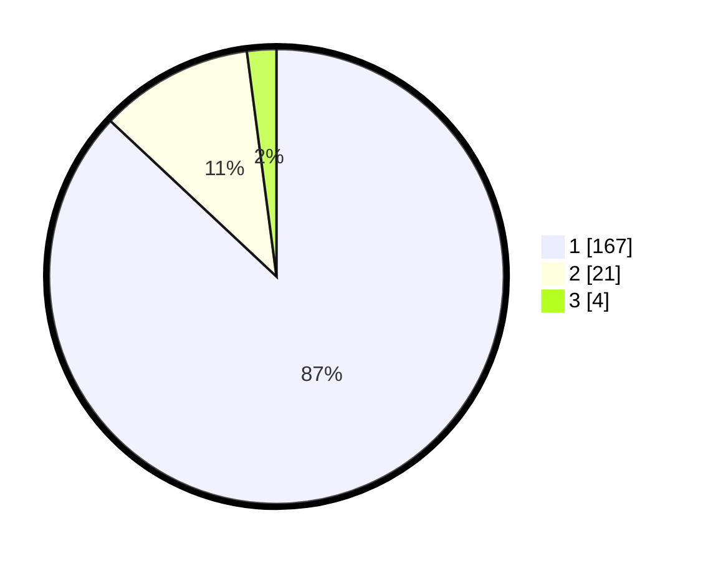

# Hasil

## Grafik

## Tabel

| No. | Nama Paslon    | Suara | Suara (raw) | Persentase |
|:--- |:-------------- | -----:| -----------:| ----------:|
| 1   | ANIES MUHAIMIN | 167   | [167][p-1]  | 86,98      |
| 2   | PRABOWO GIBRAN | 21    | [21][p-2]   | 10,94      |
| 3   | GANJAR MAHFUD  | 4     | [4][p-3]    | 2,08       |

[p-1]: https://github.com/gigit-pemilu/pemilu-2024-11-aceh/blob/main/pilpres/hitung-suara/sub/11-aceh/sub/03-aceh-timur/sub/07-peureulak/sub/2004-leuge/sub/001-tps/sub/paslon-1.txt
[p-2]: https://github.com/gigit-pemilu/pemilu-2024-11-aceh/blob/main/pilpres/hitung-suara/sub/11-aceh/sub/03-aceh-timur/sub/07-peureulak/sub/2004-leuge/sub/001-tps/sub/paslon-2.txt
[p-3]: https://github.com/gigit-pemilu/pemilu-2024-11-aceh/blob/main/pilpres/hitung-suara/sub/11-aceh/sub/03-aceh-timur/sub/07-peureulak/sub/2004-leuge/sub/001-tps/sub/paslon-3.txt

## Foto C Plano

https://sirekap-obj-formc.kpu.go.id/5068/pemilu/ppwp/11/03/07/20/04/1103072004001-20240215-110330--6f6c2deb-41a8-4417-bceb-389139c8185c.jpg

https://sirekap-obj-formc.kpu.go.id/5068/pemilu/ppwp/11/03/07/20/04/1103072004001-20240215-110536--b835697c-2c1a-4566-a560-ab501c525bd5.jpg

https://sirekap-obj-formc.kpu.go.id/5068/pemilu/ppwp/11/03/07/20/04/1103072004001-20240215-110752--451bbfab-edc1-4877-acac-e5bc72b6c364.jpg

## Metadata

| Key        | Value               |
| ---------- | ------------------- |
| Time Stamp | 2024-02-19 08:00:00 |

