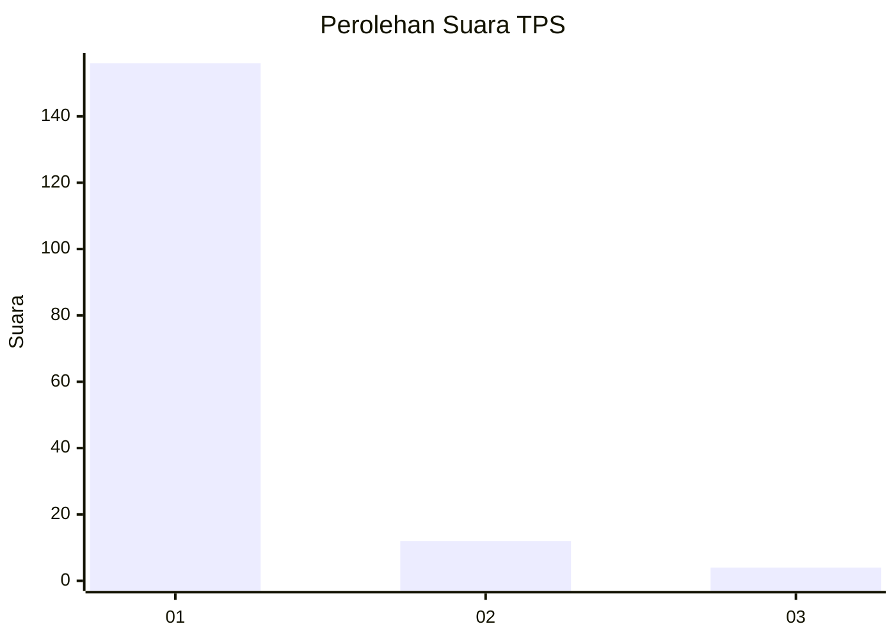
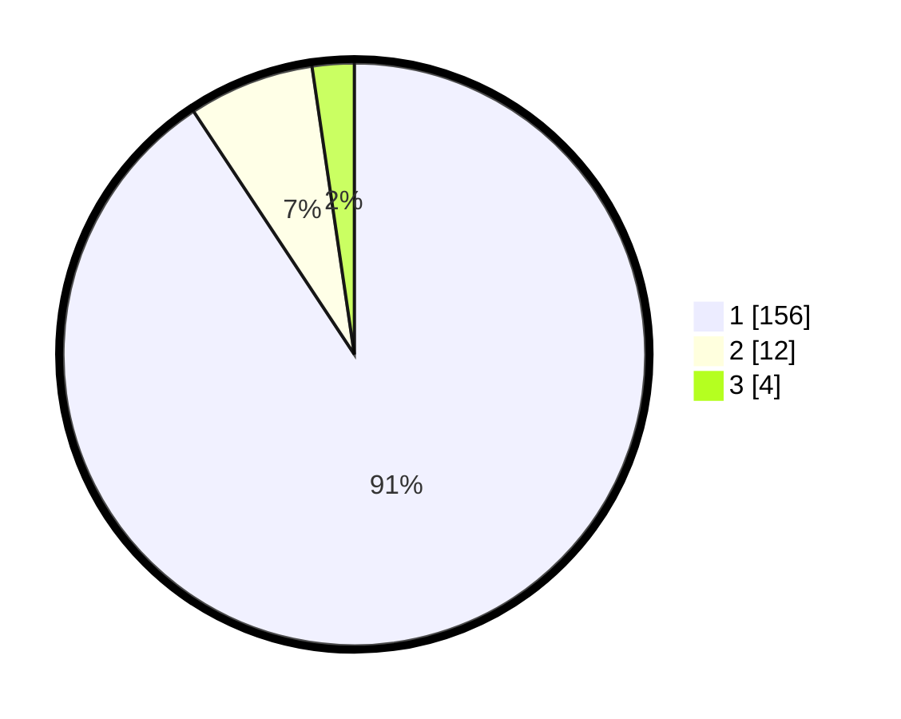

# Hasil

## Grafik

## Tabel

| No. | Nama Paslon    | Suara | Suara (raw) | Persentase |
|:--- |:-------------- | -----:| -----------:| ----------:|
| 1   | ANIES MUHAIMIN | 156   | [156][p-1]  | 90,70      |
| 2   | PRABOWO GIBRAN | 12    | [12][p-2]   | 6,98       |
| 3   | GANJAR MAHFUD  | 4     | [4][p-3]    | 2,33       |

[p-1]: https://github.com/gigit-pemilu/pemilu-2024-11-aceh/blob/main/pilpres/hitung-suara/sub/11-aceh/sub/03-aceh-timur/sub/07-peureulak/sub/2004-leuge/sub/002-tps/sub/paslon-1.txt
[p-2]: https://github.com/gigit-pemilu/pemilu-2024-11-aceh/blob/main/pilpres/hitung-suara/sub/11-aceh/sub/03-aceh-timur/sub/07-peureulak/sub/2004-leuge/sub/002-tps/sub/paslon-2.txt
[p-3]: https://github.com/gigit-pemilu/pemilu-2024-11-aceh/blob/main/pilpres/hitung-suara/sub/11-aceh/sub/03-aceh-timur/sub/07-peureulak/sub/2004-leuge/sub/002-tps/sub/paslon-3.txt

## Foto C Plano

https://sirekap-obj-formc.kpu.go.id/3a03/pemilu/ppwp/11/03/07/20/04/1103072004002-20240215-140801--b1c549e3-1ce8-401a-9f84-abeb39ee27fe.jpg

https://sirekap-obj-formc.kpu.go.id/3a03/pemilu/ppwp/11/03/07/20/04/1103072004002-20240215-140839--c475f297-8bd7-4d44-a2a7-35faeda8b61f.jpg

https://sirekap-obj-formc.kpu.go.id/3a03/pemilu/ppwp/11/03/07/20/04/1103072004002-20240215-140906--c4ee9080-1b7b-456e-b472-3d0de3b7753a.jpg

## Metadata

| Key        | Value               |
| ---------- | ------------------- |
| Time Stamp | 2024-02-19 11:00:00 |

