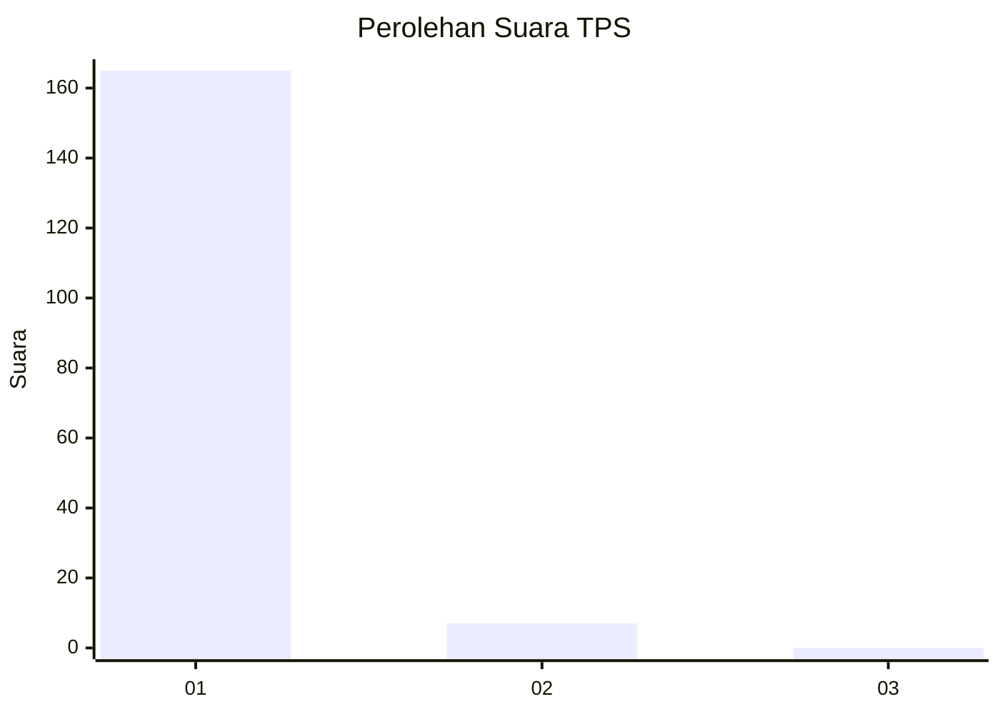
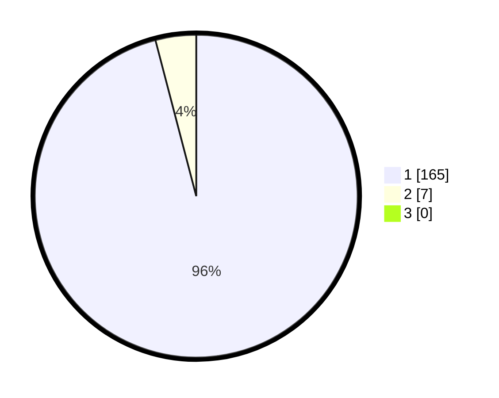

# Hasil

## Grafik

## Tabel

| No. | Nama Paslon    | Suara | Suara (raw) | Persentase |
|:--- |:-------------- | -----:| -----------:| ----------:|
| 1   | ANIES MUHAIMIN | 165   | [165][p-1]  | 95,93      |
| 2   | PRABOWO GIBRAN | 7     | [7][p-2]    | 4,07       |
| 3   | GANJAR MAHFUD  | 0     | [0][p-3]    | 0,00       |

[p-1]: https://github.com/gigit-pemilu/pemilu-2024-11-aceh/blob/main/pilpres/hitung-suara/sub/11-aceh/sub/03-aceh-timur/sub/07-peureulak/sub/2004-leuge/sub/003-tps/sub/paslon-1.txt
[p-2]: https://github.com/gigit-pemilu/pemilu-2024-11-aceh/blob/main/pilpres/hitung-suara/sub/11-aceh/sub/03-aceh-timur/sub/07-peureulak/sub/2004-leuge/sub/003-tps/sub/paslon-2.txt
[p-3]: https://github.com/gigit-pemilu/pemilu-2024-11-aceh/blob/main/pilpres/hitung-suara/sub/11-aceh/sub/03-aceh-timur/sub/07-peureulak/sub/2004-leuge/sub/003-tps/sub/paslon-3.txt

## Foto C Plano

https://sirekap-obj-formc.kpu.go.id/37e2/pemilu/ppwp/11/03/07/20/04/1103072004003-20240215-102009--e6904de5-13d9-4d7c-bcc4-cf698362ff99.jpg

https://sirekap-obj-formc.kpu.go.id/37e2/pemilu/ppwp/11/03/07/20/04/1103072004003-20240215-102102--19479995-c4c5-439f-9db4-14ba5a0aa636.jpg

https://sirekap-obj-formc.kpu.go.id/37e2/pemilu/ppwp/11/03/07/20/04/1103072004003-20240215-102200--f52a051c-7279-4d02-9061-81d62456d791.jpg

## Metadata

| Key        | Value               |
| ---------- | ------------------- |
| Time Stamp | 2024-02-19 11:00:00 |

